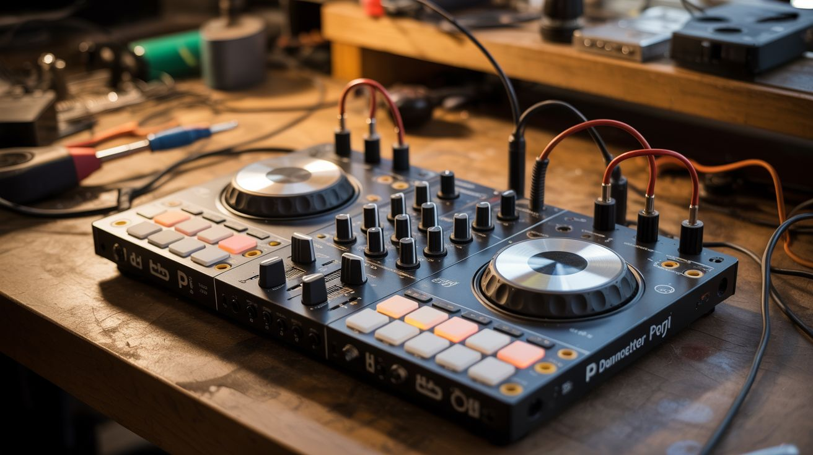

# #131 — Pi DJ Controller

  

> Rotary encoders, potentiometers, and buttons wired to a Pi running Python audio processing — a full DJ setup from e-waste.

## Ratings

     

## 🧪 What Is It?

A DJ controller is just knobs, sliders, and buttons connected to audio software. Every one of those components exists in dead electronics — rotary encoders from old stereos, potentiometers from mixers and amplifiers, buttons from keyboards and remotes. Wire them to a Raspberry Pi running Python audio libraries (pydub, pygame, or Mixxx), and you have a fully functional DJ controller. Two virtual decks, crossfader, EQ knobs, cue buttons, and pitch control — all built from junk. The software handles beat detection, looping, and effects. The hardware gives you tactile control. Drop beats at your next party with a controller you pulled out of a dumpster.

<strong>🧰 Ingredients</strong>

- [ ] Raspberry Pi 3 or 4 *(electronics supplier)*
- [ ] Rotary encoders — 2, for jog wheels/track scrubbing *(salvaged from old stereos, electronics supplier)*
- [ ] Potentiometers/sliders — 5-8, for volume, EQ, crossfader *(salvaged from old audio equipment)*
- [ ] Push buttons — 8-12, for cue, play, loop, effects *(salvaged, electronics supplier)*
- [ ] MCP3008 ADC — to read analog pots on the Pi *(electronics supplier)*
- [ ] USB sound card — for better audio output quality *(electronics supplier)*
- [ ] Enclosure — project box, cigar box, or custom *(thrift store, workshop)*
- [ ] LED indicators — for beat sync, deck active, etc. *(electronics supplier)*
- [ ] Knob caps — from the same salvaged equipment *(e-waste)*

## 🔨 Build Steps

1. **Salvage components.** Pull rotary encoders, pots, sliders, and knobs from dead stereos, mixers, and audio equipment. Test each one with a multimeter — pots should show smooth resistance change, encoders should produce clean clicks.
2. **Design the layout.** Sketch the controller face: two jog wheels (encoders) on left and right, crossfader slider in the middle, EQ knobs above each deck, play/cue/loop buttons for each deck. Mark drill holes and cutouts on your enclosure.
3. **Build the control surface.** Mount all components in the enclosure. Pots and encoders mount through drilled holes. Buttons through smaller holes. Sliders need rectangular cutouts. Attach salvaged knob caps for a professional look.
4. **Wire the analog controls.** Potentiometers and sliders are analog — they output a variable voltage. Connect them to the MCP3008 ADC chip, which communicates with the Pi via SPI. The Pi reads each pot's position as a 0-1023 value.
5. **Wire the digital controls.** Rotary encoders and buttons are digital — connect directly to the Pi's GPIO pins. Use pull-up resistors (or enable internal pull-ups) for clean signals. Encoders need two data pins each for direction detection.
6. **Install DJ software.** For the simplest approach, install Mixxx (open-source DJ software) on the Pi. It handles audio loading, beat detection, mixing, and effects. For a custom solution, write Python scripts using pydub for audio manipulation and pygame for playback.
7. **Map controls to software.** In Mixxx, use the MIDI mapping system to assign each physical control to a software function. If using custom Python, write a control loop that reads all inputs and adjusts playback parameters accordingly.
8. **Add visual feedback.** Wire LEDs to GPIO outputs. Flash them on the beat (the software knows the BPM). Light up deck indicators, clipping warnings, and effect status. A small OLED display can show track info and waveforms.
9. **Test and perform.** Load tracks, practice mixing, and refine the control mapping. Adjust dead zones on pots, encoder sensitivity, and button debounce timing until everything feels responsive and natural.

## ⚠️ Safety Notes

- Audio output should go through a proper amplifier to speakers. The Pi's built-in audio is noisy; use a USB sound card for cleaner output. Start at low volume to avoid blowing speakers with unexpected audio glitches.
- Salvaged potentiometers can be scratchy or have dead spots. Test each one thoroughly before mounting. A scratchy pot creates audio pops and clicks that can damage speakers at high volume.
- If using this at a live event, bring a backup audio source. Raspberry Pis can crash or freeze if pushed hard on audio processing. A phone with a DJ app makes a reliable backup.

## 🔗 See Also

- [Arduino Guitar Pedal](124-arduino-guitar-pedal.md)
- [Music Visualizer LED Wall](../python-projects/145-music-visualizer-led-wall.md)

**References:**
- [Appliance Teardown Guide](../../reference/appliance-teardown-guide.md)
- [Technical Glossary](../../reference/glossary.md)
- [Electronics & Microcontrollers Guide](../../reference/electronics-and-microcontrollers.md)
