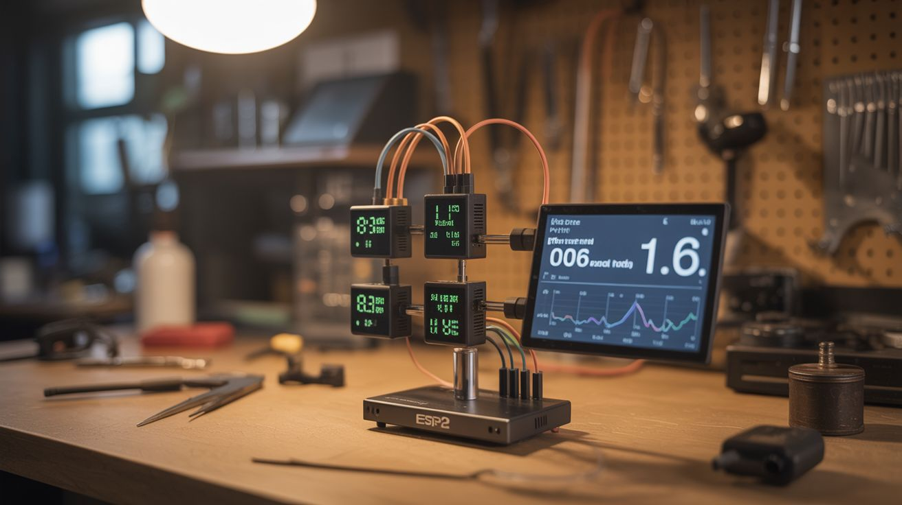

# #132 — ESP32 Weather Station

  

> Multiple sensor nodes measuring temp, humidity, pressure, wind, and UV — predict weather from your own data on a Grafana dashboard.

## Ratings

     

## 🧪 What Is It?

Commercial weather stations give you current conditions. A DIY ESP32 weather station network gives you current conditions, historical data, trend analysis, and the ability to predict weather changes from your own barometric pressure curves. Multiple ESP32 nodes with different sensors (BME280 for temperature/humidity/pressure, anemometer for wind, UV sensor for solar radiation, rain gauge) report data over WiFi to a Raspberry Pi running InfluxDB and Grafana. Beautiful real-time dashboards show hyperlocal weather data — not the airport 20 miles away, but YOUR backyard right now.

<strong>🧰 Ingredients</strong>

- [ ] ESP32 boards — 1-3 nodes *(electronics supplier)*
- [ ] BME280 sensor — temperature, humidity, barometric pressure *(electronics supplier)*
- [ ] Anemometer — wind speed sensor (can be salvaged or built from cups + reed switch) *(online, or build)*
- [ ] UV sensor (VEML6075 or similar) *(electronics supplier)*
- [ ] Rain gauge — tipping bucket type (can be salvaged from cheap weather station) *(online, thrift store)*
- [ ] Raspberry Pi — for the data server *(electronics supplier)*
- [ ] Solar panels + LiPo batteries — for remote nodes (optional) *(electronics supplier)*
- [ ] Weatherproof enclosures *(hardware store)*
- [ ] Radiation shield — ventilated housing for temperature sensor (to avoid sun heating) *(3D print or build from plates)*

## 🔨 Build Steps

1. **Build the primary sensor node.** Wire the BME280 to an ESP32 via I2C. The BME280 provides temperature, humidity, and barometric pressure in a single $3 chip. Test with a simple sketch that prints readings to serial.
2. **Add wind measurement.** Build or mount an anemometer. A simple version: 3 ping pong ball halves on arms attached to a motor shaft with a magnet and reed switch. Each rotation triggers the reed switch; count pulses per second to calculate wind speed. Connect to an ESP32 GPIO interrupt pin.
3. **Add UV and rain sensors.** Wire the UV sensor via I2C (can share the bus with BME280). Connect the rain gauge (tipping bucket with reed switch) to another GPIO interrupt pin. Each tip represents a fixed volume of rainfall.
4. **Write the firmware.** ESP32 code reads all sensors at a configurable interval (every 30-60 seconds), formats the data as JSON, and posts it to the Pi server via HTTP or MQTT. Include battery voltage reading if running on solar power.
5. **Set up the Pi server.** Install InfluxDB (time-series database) and Grafana (visualization) on the Pi. Create an InfluxDB database for weather data. Set up a simple Python Flask endpoint or Mosquitto MQTT broker to receive data from ESP32 nodes.
6. **Build Grafana dashboards.** Create panels showing temperature over time, humidity trends, barometric pressure (key for weather prediction — falling pressure means storms coming), wind speed and direction, UV index, and rainfall accumulation.
7. **Weatherproof the nodes.** Mount outdoor sensors in ventilated radiation shields (prevents direct sun from heating the temperature sensor). Use weatherproof enclosures for the electronics. Seal cable entry points with silicone.
8. **Add solar power (optional).** For remote nodes, connect a small solar panel to a TP4056 charging board and LiPo battery. The ESP32 can deep-sleep between readings to extend battery life dramatically — waking every 5 minutes uses minimal power.
9. **Calibrate and validate.** Compare your readings against a known weather source for a few days. Apply correction factors if needed. Barometric pressure needs altitude calibration — your raw reading must be adjusted for your elevation above sea level.

## ⚠️ Safety Notes

- Outdoor electronics must be properly sealed against rain and moisture. Water ingress causes short circuits and corrosion. Test waterproofing before deploying electronics by spraying the empty enclosure with a hose.
- Lightning strikes near sensor nodes can send voltage spikes through the wiring. If your area has frequent thunderstorms, add surge protection (TVS diodes) to sensor input lines, especially the anemometer and rain gauge connections.
- Solar-powered nodes with LiPo batteries should never be left in direct sun without shade over the battery. LiPo batteries swell and can ignite if overheated beyond 140°F.

## 🔗 See Also

- [Auto Plant Watering](127-auto-plant-watering.md)
- [Earthquake Detector](../python-projects/146-earthquake-detector.md)

**References:**
- [Appliance Teardown Guide](../../reference/appliance-teardown-guide.md)
- [Technical Glossary](../../reference/glossary.md)
- [Electronics & Microcontrollers Guide](../../reference/electronics-and-microcontrollers.md)
