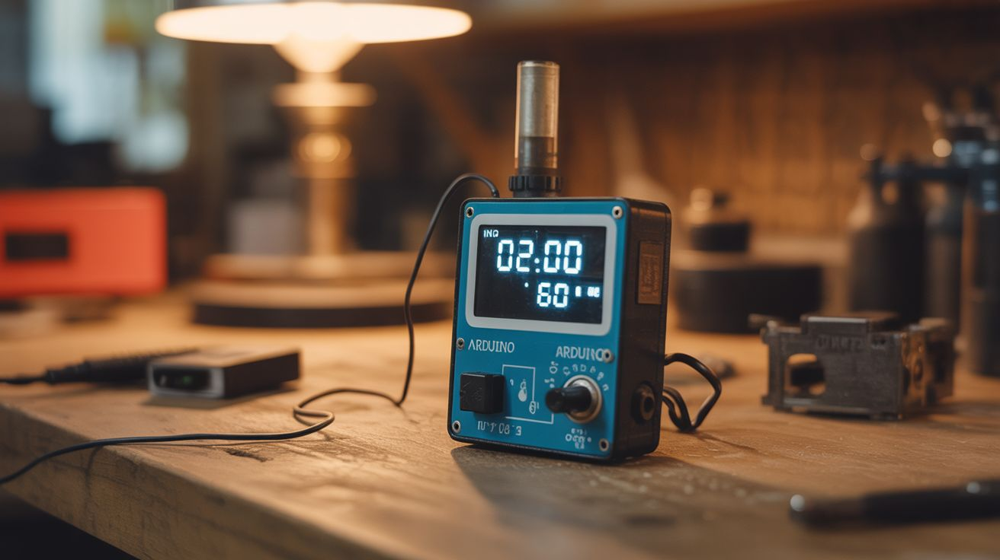

# #133 — Arduino Breathalyzer

  

> An MQ-3 alcohol sensor with an Arduino and OLED display — blow and get a BAC reading. The ultimate party gadget.

## Ratings

     

## 🧪 What Is It?

The MQ-3 is a gas sensor specifically tuned to detect ethanol vapor — the alcohol in your breath. Connect it to an Arduino with an OLED display, calibrate it against known standards, and you've got a breathalyzer that shows approximate BAC (Blood Alcohol Content). Blow into a tube aimed at the sensor, and the reading appears on the screen with a color-coded warning (green/yellow/red). It's the life of any party — everyone wants to test themselves. It's also genuinely useful as a personal check before deciding whether to drive. Not as precise as a police-grade unit, but remarkably close for a $5 sensor.

<strong>🧰 Ingredients</strong>

- [ ] Arduino Nano or Uno *(electronics supplier)*
- [ ] MQ-3 alcohol gas sensor — on a breakout board *(electronics supplier, ~$3)*
- [ ] 0.96" OLED display — I2C, SSD1306 *(electronics supplier)*
- [ ] Push button — to start the test cycle *(electronics supplier)*
- [ ] Buzzer — for audio feedback *(electronics supplier)*
- [ ] Short tube or funnel — to direct breath at the sensor *(hardware store, junk drawer)*
- [ ] Project enclosure *(electronics supplier, 3D print)*
- [ ] 9V battery + clip — for portable operation *(grocery store)*
- [ ] RGB LED — for color-coded results *(electronics supplier)*

## 🔨 Build Steps

1. **Wire the MQ-3 sensor.** Connect the sensor's analog output to an Arduino analog pin. Power it from the Arduino's 5V pin. The MQ-3 needs a 24-hour burn-in period when first used — leave it powered on for a day so the internal heater stabilizes.
2. **Wire the OLED display.** Connect the SSD1306 OLED via I2C (SDA and SCL pins). Install the Adafruit SSD1306 library. Test with a "Hello World" sketch to verify the display works.
3. **Build the breath intake.** Attach a short tube or funnel to direct breath onto the sensor surface. The tube should be close to but not touching the sensor. A consistent distance between mouth and sensor improves reading repeatability.
4. **Write the test cycle code.** When the button is pressed: display "Blow Now" for 5 seconds while sampling the sensor, take the peak reading, convert the analog value to an approximate BAC using a calibration curve, display the result on the OLED, and trigger the RGB LED (green = sober, yellow = buzzed, red = over legal limit).
5. **Calibrate the sensor.** The MQ-3 output is non-linear. Ideally, test against a known breathalyzer at various alcohol levels to create a lookup table. At minimum, record the baseline reading (sober) and the response to rubbing alcohol vapor at known distances for a rough calibration curve.
6. **Add audio feedback.** Wire a buzzer for audio cues: a beep when the test starts, a tone while sampling, and a result sound (ascending tones for low BAC, warning buzz for high BAC).
7. **Package it up.** Mount everything in a project box. The sensor and breath tube should be accessible from outside. The display, button, and LED visible on top. Battery compartment accessible for replacement.
8. **Add a warm-up indicator.** The MQ-3 needs 1-2 minutes to warm up after power-on before readings are accurate. Display a warm-up countdown on the OLED and disable the test button until warm-up is complete.

## ⚠️ Safety Notes

- This is NOT a legal or medically certified breathalyzer. Do not rely on it to determine fitness to drive. It provides approximate readings for entertainment purposes. When in doubt, don't drive. Period.
- The MQ-3 sensor contains a heater element that reaches 200°C+ during operation. Do not touch the sensor surface while powered on. Keep the sensor away from flammable materials.
- Alcohol gas sensors can also respond to other vapors (acetone, gasoline, etc.). Results may be skewed by recent use of mouthwash, hand sanitizer, or perfume near the sensor. Wait 15 minutes after drinking before testing for more accurate results.

## 🔗 See Also

- [EMF Ghost Detector](140-emf-ghost-detector.md)
- [Voice Home Automation](../python-projects/149-voice-home-automation.md)

**References:**

- [Electronics & Microcontrollers Guide](../../docs/reference/electronics-and-microcontrollers.md)
