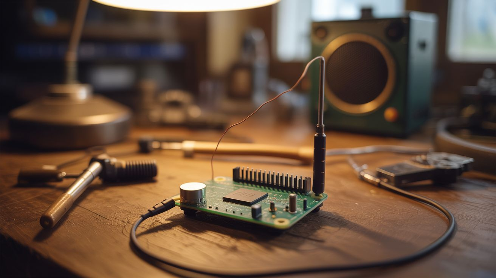

# #134 — Pirate Radio

  

> A Raspberry Pi with a wire on a GPIO pin becomes an FM transmitter — broadcast to any FM radio within 100 feet.

## Ratings

     

## 🧪 What Is It?

The Raspberry Pi can generate FM radio signals directly from a GPIO pin — no additional hardware needed. A short wire soldered to GPIO 4 acts as the antenna. Run the PiFmRds software and the Pi broadcasts audio on any FM frequency you choose, complete with RDS data (station name and song info on car radios). Every FM radio within range picks it up. Set up a Python auto-DJ script that plays music files from a folder, and you've got your own radio station running 24/7 from a $15 computer. The range is about 30-100 feet with the wire antenna — enough to cover your house, yard, or a small event.

<strong>🧰 Ingredients</strong>

- [ ] Raspberry Pi (any model — even a Pi Zero works) *(electronics supplier)*
- [ ] Short wire — 6-12 inches, any single-core wire, acts as antenna *(junk drawer)*
- [ ] MicroSD card with Raspberry Pi OS *(electronics supplier)*
- [ ] Audio files — MP3, WAV, whatever you want to broadcast *(already have)*
- [ ] FM radio — any portable, car, or phone FM radio for testing *(already own)*
- [ ] Soldering iron — to attach antenna wire to GPIO header (or just wrap it on) *(workshop)*

## 🔨 Build Steps

1. **Set up the Pi.** Flash Raspberry Pi OS to the MicroSD card. Boot and configure WiFi. Update the system with apt update/upgrade.
2. **Attach the antenna.** Solder or wrap a 6-12 inch wire to GPIO pin 4 (physical pin 7). A 75cm wire is the ideal quarter-wave antenna for FM frequencies (~100 MHz), but even a short jumper wire works at reduced range.
3. **Install PiFmRds.** Clone the PiFmRds repository from GitHub. Compile it with make. It's a C program that generates FM signals by toggling the GPIO pin at radio frequencies using the Pi's clock hardware.
4. **Test the broadcast.** Run PiFmRds with a WAV file and a target frequency (choose an unused FM frequency in your area): `sudo ./pi_fm_rds -freq 87.9 -audio your_song.wav -ps "MY RADIO" -rt "Now Playing: Song Name"`. Tune an FM radio to 87.9 and listen.
5. **Set up the auto-DJ.** Write a Python script that shuffles through a folder of audio files, converting each to WAV format (if needed) and piping it to PiFmRds. Add announcements between songs, schedule different playlists for different times of day.
6. **Configure RDS.** PiFmRds supports Radio Data System — the text that appears on car radio displays. Set the station name (PS), radio text (RT), and program type. Your car radio will show your custom station name.
7. **Add a web interface (optional).** Build a simple Flask web app that lets you queue songs, change the frequency, and see what's currently playing from your phone. This turns the Pi into a remotely controllable radio station.
8. **Optimize range.** For maximum range, use a proper antenna: a 75cm wire cut to quarter-wavelength, mounted vertically. Add a ground plane (4 wires radiating horizontally from the base). This can push range to 100+ feet.

## ⚠️ Safety Notes

- Broadcasting on FM frequencies without a license is ILLEGAL in most countries. In the US, FCC Part 15 allows extremely low-power FM transmitters (field strength under 200 feet), but exceeding this limit carries fines. Keep your antenna short and power minimal. This is for personal/educational use only, not for setting up a real radio station.
- The Pi generates a square wave on the GPIO pin, which produces harmonics at multiples of the broadcast frequency. These harmonics can interfere with other radio services. A low-pass filter between the GPIO pin and antenna eliminates harmonics and makes the transmission cleaner.
- Never broadcast on frequencies used by emergency services, aviation, or other critical communications. Stick to the commercial FM band (87.5-108 MHz) and choose an unused frequency in your area.

## 🔗 See Also

- [ESP32 Mesh Walkie-Talkie](125-esp32-mesh-walkie-talkie.md)
- [Pi DJ Controller](131-pi-dj-controller.md)

**References:**
- [Appliance Teardown Guide](../../reference/appliance-teardown-guide.md)
- [Technical Glossary](../../reference/glossary.md)
- [Electronics & Microcontrollers Guide](../../reference/electronics-and-microcontrollers.md)
