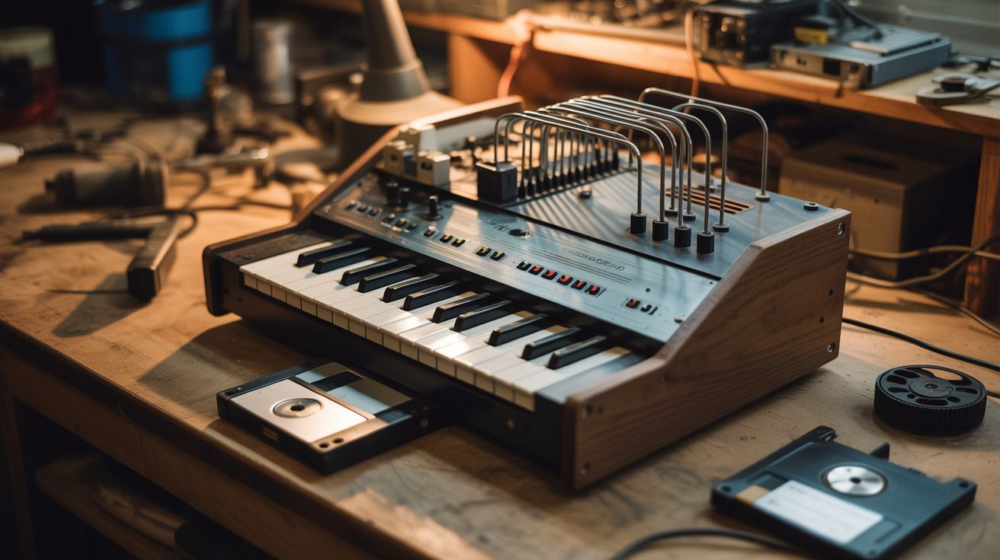

# #135 — MIDI Stepper Organ

  

> Stepper motors whine at frequencies controlled by step rate — send MIDI notes and the motors play music. Floppy drives work too.

## Ratings

| Jaw Drop Rating | Brain Melt Level | Wallet Damage | Spicy Level | Clout Potential | Time to Build |
|---|---|---|---|---|---|
| ⭐⭐⭐⭐ | ⭐⭐⭐ | ⭐⭐ | ⭐ | ⭐⭐⭐⭐⭐ | ⭐⭐⭐ |

## What Is It?

Every stepper motor makes a whining noise when it runs — it's the sound of the motor coils energizing in sequence. The pitch of that whine is directly proportional to the step rate. Double the step rate, and the pitch goes up an octave. Map MIDI note numbers to step rates, and each stepper motor becomes a buzzy, robotic musical instrument. With 4-8 motors, you have polyphonic music. Old floppy drives work the same way — the head stepper motor whines as it seeks back and forth. The sound is unique: part mechanical, part electronic, entirely alien. YouTube videos of floppy drive orchestras playing movie themes and classical music have hundreds of millions of views. Build yours with printer motors, floppy drives, or any stepper you can salvage.

## Ingredients

- [ ] Stepper motors — 4-8, salvaged from printers, scanners, or floppy drives *(e-waste bin)*
- [ ] Floppy drives — optional alternative, 3.5" or 5.25" *(e-waste, thrift store)*
- [ ] Arduino Mega — enough pins and timers for multiple motors *(electronics supplier)*
- [ ] Stepper driver boards (A4988 or ULN2003) — one per motor *(electronics supplier)*
- [ ] 12V power supply *(old laptop charger)*
- [ ] USB MIDI interface — or use serial MIDI from a computer *(electronics supplier)*
- [ ] MIDI keyboard or sequencer software — to play notes *(already own, or free software like LMMS)*
- [ ] Mounting board — wood or acrylic to mount the motors *(workshop)*
- [ ] Rubber feet or damping material — motors vibrate *(hardware store)*

## Build Steps

1. **Salvage the motors.** Pull stepper motors from dead printers, scanners, and floppy drives. For floppy drives, you can use the entire drive as-is — the head stepper motor inside produces the musical tone. For standalone steppers, you just need the motor and driver.
2. **Wire the drivers.** Connect each stepper motor to its own driver board (A4988 for bipolar steppers, ULN2003 for unipolar). Connect the STEP and DIR pins of each driver to separate Arduino digital pins. Power all drivers from the 12V supply.
3. **Build the MIDI-to-frequency lookup table.** MIDI note numbers map to frequencies: note 69 = A4 = 440 Hz. Convert each MIDI note to a step frequency using the formula: frequency = 440 * 2^((note - 69) / 12). Pre-calculate this table for all 128 MIDI notes.
4. **Write the firmware.** The Arduino listens for MIDI messages on serial (or USB MIDI). When a Note On message arrives, it starts stepping the assigned motor at the frequency corresponding to that note number. Note Off stops the motor. Use timer interrupts for precise frequency generation — loop-based timing won't be accurate enough.
5. **Assign channels.** Map MIDI channels 1-8 to motors 1-8. Each motor plays its own monophonic line. A MIDI file with 8 tracks gives you 8-voice polyphony. One motor per voice.
6. **Mount the motors.** Secure all motors to a mounting board with screws. The board acts as a resonating surface that amplifies the motor whine. Different board materials (wood, acrylic, metal) produce different tonal qualities. Add rubber feet to reduce table vibration.
7. **Test with simple melodies.** Play a scale on a MIDI keyboard to verify pitch accuracy. Adjust the frequency lookup if notes sound flat or sharp. Stepper motor pitch accuracy depends on the driver's microstepping setting — full steps are loudest, microstepping is smoother but quieter.
8. **Play full arrangements.** Load MIDI files of popular songs into a sequencer and route each track to a different motor. Movie themes (Star Wars, Imperial March, Pirates of the Caribbean) and classical pieces (Für Elise, Flight of the Bumblebee) are crowd favorites for stepper motor performances.
9. **Film the performance.** The visual of motors twitching and drives seeking while playing recognizable music is inherently viral. Film close-up with good audio. Slow-motion captures the mechanical movement beautifully.

## Safety Notes

- Stepper motors get hot during sustained operation, especially at high frequencies. Don't touch motor casings during or immediately after a performance. Let them cool between long pieces.
- The 12V power supply needs to handle the current draw of all motors simultaneously. Undersized power supplies sag under load, causing missed steps and wrong notes. Calculate total current: each stepper draws 0.5-1.5A depending on the model.
- Floppy drive head mechanisms have limited travel (about 80 tracks). The firmware must reverse direction at the travel limits. Crashing the head into the end stop repeatedly damages the drive mechanism.

## See Also

- [Arduino Guitar Pedal](124-arduino-guitar-pedal.md)
- [LED Cube 8x8x8](122-led-cube-8x8x8.md)

**References:**
- [Appliance Teardown Guide](../../reference/appliance-teardown-guide.md)
- [Technical Glossary](../../reference/glossary.md)
- [Electronics & Microcontrollers Guide](../../reference/electronics-and-microcontrollers.md)
