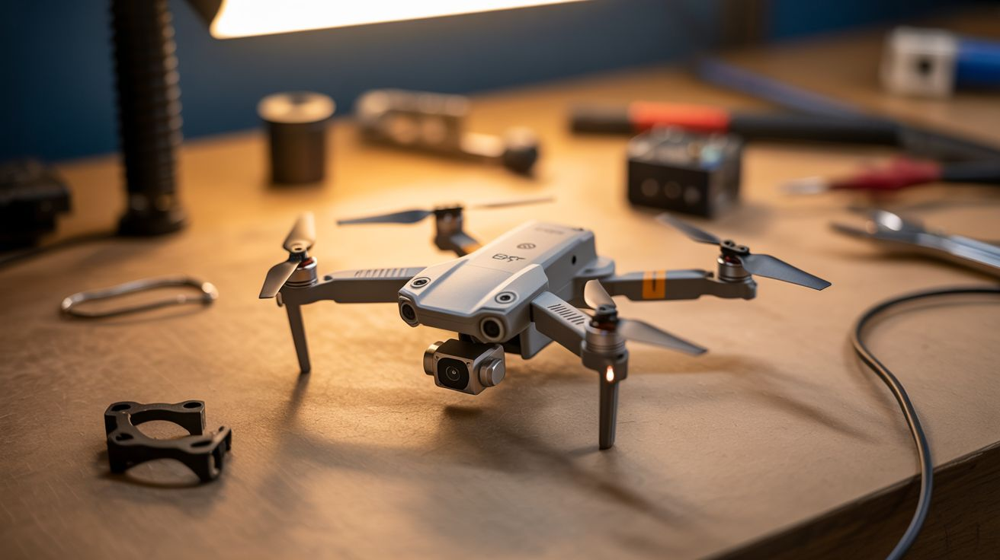

# #136 — ESP32 Micro Drone

  

> An ESP32 as flight controller with an MPU6050 IMU and 4 brushless motors — build a phone-controlled drone from scratch for under $30.

## Ratings

| Jaw Drop Rating | Brain Melt Level | Wallet Damage | Spicy Level | Clout Potential | Time to Build |
|---|---|---|---|---|---|
| ⭐⭐⭐⭐ | ⭐⭐⭐⭐⭐ | ⭐⭐ | ⭐⭐⭐ | ⭐⭐⭐⭐ | ⭐⭐⭐⭐ |

## What Is It?

Commercial drones are marvels of engineering — but the core technology isn't that complicated. An IMU (Inertial Measurement Unit) measures orientation. A PID control loop calculates motor speed corrections. Four motors adjust their speeds to keep the craft level. An ESP32 has enough processing power to run the PID loop at 1000Hz while simultaneously hosting a WiFi control interface. Add an MPU6050 6-axis IMU ($1), four brushless motors with ESCs, a LiPo battery, and a 3D-printed or balsa wood frame, and you've built a flyable drone from scratch for under $30. Control it from your phone via WiFi. It's the most challenging build in this section and the most rewarding when it lifts off.

## Ingredients

- [ ] ESP32 dev board *(electronics supplier)*
- [ ] MPU6050 IMU module — 6-axis accelerometer + gyroscope *(electronics supplier, ~$1)*
- [ ] Brushless motors — 4x 8520 or 0720 coreless motors for micro drones *(electronics supplier)*
- [ ] ESCs (Electronic Speed Controllers) — 4x, matched to motors, or use MOSFETs for coreless motors *(electronics supplier)*
- [ ] Propellers — 2x CW, 2x CCW *(electronics supplier)*
- [ ] LiPo battery — 1S 3.7V 500-1000mAh *(electronics supplier)*
- [ ] 3D printed frame — or built from popsicle sticks/balsa wood *(workshop)*
- [ ] LiPo charger *(electronics supplier)*
- [ ] Propeller guards — 3D printed (recommended for first flights) *(workshop)*

## Build Steps

1. **Build or print the frame.** A micro drone frame needs to be as light as possible. 3D print one from the many free quadcopter designs online, or build from popsicle sticks and hot glue. The frame should hold four motors at equal distances from center, with a flat mounting area for the ESP32 and battery.
2. **Mount the motors.** Press-fit or glue the motors into the frame arms. Two diagonal motors spin clockwise, two spin counter-clockwise (this eliminates yaw torque). Attach matching propellers — CW props on CW motors, CCW props on CCW motors.
3. **Wire the motor drivers.** For coreless motors, use N-channel MOSFETs (one per motor) driven by the ESP32's PWM outputs. For brushless motors, connect ESCs to the PWM pins. Either way, the ESP32 controls each motor's speed independently via PWM duty cycle.
4. **Connect the IMU.** Wire the MPU6050 to the ESP32 via I2C. Mount the IMU at the center of the frame, as flat as possible. Any tilt offset can be calibrated in software. The IMU provides accelerometer and gyroscope data that tells the controller which way is up.
5. **Implement the PID controller.** This is the brain of the drone. Three PID loops (pitch, roll, yaw) each compare the desired angle to the measured angle from the IMU and compute a correction value. The correction is added/subtracted from the four motor speeds to level the craft. Start with conservative PID gains and tune from there.
6. **Implement sensor fusion.** Raw accelerometer data is noisy, raw gyro data drifts. Combine them using a complementary filter or Madgwick filter to get a stable orientation estimate. The Madgwick filter runs efficiently on the ESP32 at 1000Hz.
7. **Build the WiFi controller.** The ESP32 hosts a web page with virtual joysticks (or accepts UDP packets from a phone app). Left stick controls throttle and yaw. Right stick controls pitch and roll. The web interface should update at 50Hz minimum for responsive control.
8. **First flight test.** Tether the drone with a string to limit altitude for initial testing. Start with very low throttle and verify the drone tries to level itself. If it flips immediately, check motor spin directions and propeller orientation. Tune PID gains: start with P only, add D for stability, then I to eliminate steady-state error.
9. **Iterate and refine.** PID tuning is an iterative process. Adjust gains in small increments. A well-tuned drone should hover stably with minimal stick input. Add altitude hold using the barometer data from a BMP280 sensor for extra credit.

## Safety Notes

- Spinning propellers can cut skin and are dangerous to eyes. Always use propeller guards during development. Never reach toward a drone with spinning props. Keep fingers, hair, and loose clothing clear.
- LiPo batteries are dangerous if mistreated. Never discharge below 3.0V (damages the cells permanently). Never charge unattended. Never use a puffy or damaged battery. Store in a fireproof LiPo bag.
- First flights WILL crash. Start over soft surfaces (grass) and at low altitude. Tether with a light string until the PID is tuned. A poorly tuned PID loop will flip the drone violently — this happens in milliseconds, faster than you can react.

## See Also

- [Star Tracker](137-star-tracker.md)
- [Nerf Sentry Turret](138-nerf-sentry-turret.md)

**References:**
- [Appliance Teardown Guide](../../reference/appliance-teardown-guide.md)
- [Technical Glossary](../../reference/glossary.md)
- [Electronics & Microcontrollers Guide](../../reference/electronics-and-microcontrollers.md)
