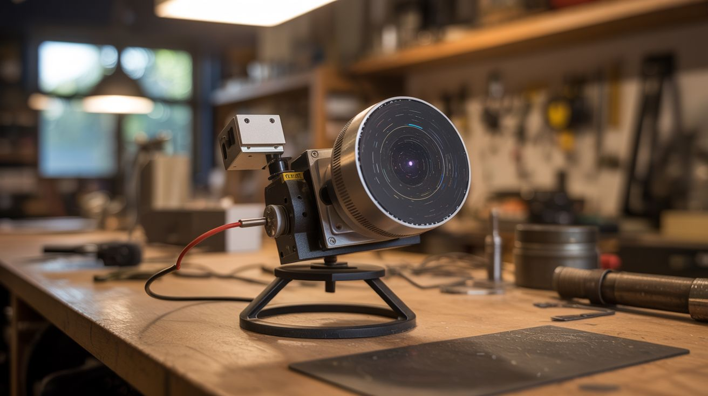

# #137 — Star Tracker

  

> A stepper motor and Pi rotate your camera at exactly Earth's rotation speed — stars become pinpoints instead of trails.

## Ratings

| Jaw Drop Rating | Brain Melt Level | Wallet Damage | Spicy Level | Clout Potential | Time to Build |
|---|---|---|---|---|---|
| ⭐⭐⭐⭐ | ⭐⭐⭐ | ⭐⭐ | ⭐ | ⭐⭐⭐⭐ | ⭐⭐⭐ |

## What Is It?

The Earth rotates once every 24 hours. Point a camera at the sky and take a long exposure, and the stars streak into trails because the Earth moved during the shot. A star tracker counteracts Earth's rotation by slowly rotating the camera at the same speed but in the opposite direction, keeping the stars perfectly still in the frame. Commercial star trackers cost $300-500. Build one with a stepper motor driven by a Raspberry Pi, and you can take 2-5 minute exposures where the stars are perfect pinpoints. Suddenly, your consumer camera captures the Milky Way, nebulae, and galaxies that are invisible to the naked eye. The images rival telescope photography.

## Ingredients

- [ ] Stepper motor — NEMA 17 with a high gear ratio (a geared stepper or stepper + worm gear) *(electronics supplier)*
- [ ] Stepper driver (A4988 or TMC2209) — TMC2209 for silent operation *(electronics supplier)*
- [ ] Raspberry Pi Zero W — lightweight, fits on the tracker *(electronics supplier)*
- [ ] Ball head or camera mount — attaches camera to the tracker *(camera store, online)*
- [ ] Hinge or bearing — the rotation axis *(hardware store)*
- [ ] Counterweight — to balance the camera *(hardware store)*
- [ ] 12V battery — portable power *(electronics supplier)*
- [ ] Protractor or inclinometer — to set polar alignment *(hardware store, phone app)*
- [ ] Tripod — for the base *(already own)*
- [ ] Camera with manual exposure mode *(already own)*

## Build Steps

1. **Calculate the rotation speed.** Earth rotates 360 degrees in 23 hours 56 minutes 4 seconds (a sidereal day). That's 15.041 arcseconds per second, or one revolution per 1436 minutes. Your stepper motor must rotate at exactly this rate. Calculate the step rate: (steps per revolution * gear ratio) / 1436 minutes = steps per minute.
2. **Build the barn door mount.** The simplest star tracker is a "barn door" design: two boards hinged together, with a stepper-driven threaded rod pushing them apart. The hinge axis points at Polaris (the North Star). As the rod extends, the top board tilts at the sidereal rate, carrying the camera with it.
3. **Mount the stepper motor.** Attach the stepper motor to the bottom board with the drive shaft connected to a threaded rod (M6 or 1/4-20). The rod pushes against the top board, opening the "barn door" slowly. The thread pitch and distance from the hinge determine the rotation rate.
4. **Wire the electronics.** Connect the stepper driver to the Pi Zero. The driver STEP pin connects to a GPIO pin. A Python script generates precise step pulses using hardware PWM or precise timing. Power the driver from the 12V battery.
5. **Write the tracking software.** A Python script outputs step pulses at the calculated rate. Include a start/stop button, speed fine-tuning (to correct for mechanical inaccuracies), and a half-speed mode for Southern Hemisphere use. The timing must be precise to within 0.1% for good tracking.
6. **Polar align.** Set up the tripod and tracker. Tilt the hinge axis to your latitude angle using an inclinometer, and point it at Polaris. This aligns the tracker's rotation axis with Earth's axis. The more precise the alignment, the longer your exposures can be without trailing.
7. **Mount the camera.** Attach a ball head to the top board and mount your camera. Balance the weight with a counterweight on the opposite side. An unbalanced load causes the stepper to work harder and can introduce vibration.
8. **Take test exposures.** Start with 30-second exposures and examine the stars at full zoom. If they're round, increase to 60 seconds, then 2 minutes, then 5 minutes. Trailing means your polar alignment or tracking speed needs adjustment.
9. **Stack images.** For maximum detail, take multiple 2-3 minute exposures and stack them using free software like DeepSkyStacker or Sequator. Stacking reduces noise and reveals faint details invisible in a single exposure.

## Safety Notes

- Do not look at the sun through the camera during setup. Star trackers are used at night, but if you're setting up at dusk, be mindful of camera alignment near the sun.
- Working in the dark with equipment, cables, and a tripod on uneven ground creates trip hazards. Use a red headlamp (preserves night vision) and organize cables before it gets dark.
- Battery-powered operation in cold weather drains batteries faster. Keep spare batteries warm in your pockets. A dead battery mid-exposure means missed shots and a wasted night.

## See Also

- [Generative Art Plotter](../python-projects/142-generative-art-plotter.md)
- [ESP32 Weather Station](132-esp32-weather-station.md)
