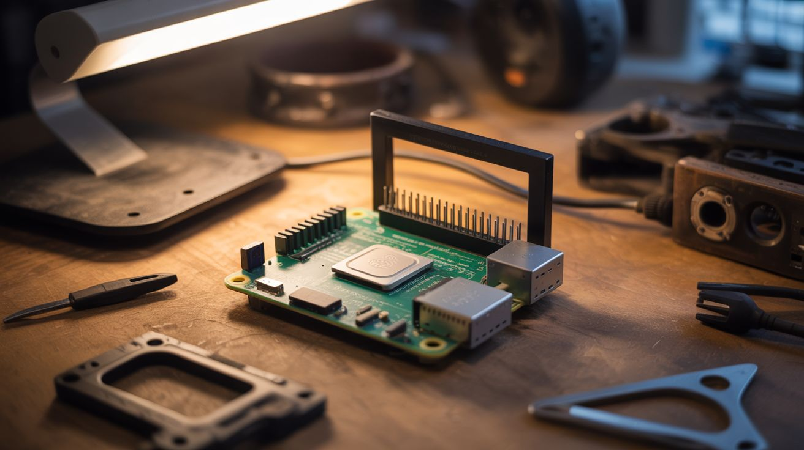

# #139 — Pi-hole Ad Blocker

  

> A Raspberry Pi running Pi-hole becomes a network-level DNS sinkhole that blocks ads on every device — 5-minute setup.

## Ratings

     

## 🧪 What Is It?

Every ad on every website starts with a DNS lookup — your device asks "what's the IP address of ads.tracker.com?" A Pi-hole intercepts these DNS requests and responds with nothing for known ad and tracker domains. The ad never loads. This happens at the network level, meaning every device on your WiFi — phones, tablets, smart TVs, game consoles — gets ad blocking without installing anything on the device itself. Your smart TV stops showing ads. Your phone games stop showing ads between levels. Your web browsing becomes noticeably faster. Setup takes about 5 minutes, and a Pi Zero handles the entire household.

<strong>🧰 Ingredients</strong>

- [ ] Raspberry Pi (any model — Pi Zero W is plenty) *(electronics supplier)*
- [ ] MicroSD card 8GB+ *(electronics supplier)*
- [ ] Ethernet cable — wired connection recommended for DNS server *(junk drawer)*
- [ ] Power supply for the Pi *(phone charger)*
- [ ] Access to your router's DHCP settings — to point DNS to the Pi *(your router admin page)*

## 🔨 Build Steps

1. **Flash the OS.** Write Raspberry Pi OS Lite (no desktop needed) to the MicroSD card using the Raspberry Pi Imager. Enable SSH and configure WiFi during the imaging process if using WiFi instead of Ethernet.
2. **Boot and connect.** Insert the card, plug in Ethernet and power. Find the Pi's IP address from your router's connected devices list. SSH into it: `ssh pi@<ip-address>`.
3. **Install Pi-hole.** Run the one-line installer: `curl -sSL https://install.pi-hole.net | bash`. Follow the prompts. Choose your upstream DNS provider (Cloudflare 1.1.1.1 or Google 8.8.8.8 are good choices). Set a static IP for the Pi when prompted.
4. **Set a static IP.** If the installer didn't do it, configure a static IP for the Pi in `/etc/dhcpcd.conf`. Your DNS server needs a fixed address so devices always know where to find it.
5. **Point your network to Pi-hole.** Log into your router's admin page. In the DHCP/DNS settings, set the primary DNS server to the Pi's static IP address. All devices on the network will now use Pi-hole for DNS resolution.
6. **Verify it works.** Visit the Pi-hole admin dashboard at `http://<pi-ip>/admin`. Browse the web normally and watch the dashboard light up — it shows every DNS query and every blocked domain in real time. The block percentage is typically 15-30% of all queries.
7. **Add more blocklists.** The default blocklist catches most ads, but you can add community-maintained lists for tracking, malware, and adult content filtering. The Pi-hole admin page has a simple interface for adding list URLs.
8. **Whitelist essentials.** Some services break when their tracking domains are blocked. Pi-hole makes it easy to whitelist specific domains. Common whitelists needed: certain Microsoft, Google, and Apple services. The Pi-hole community maintains recommended whitelists.

## ⚠️ Safety Notes

- If the Pi goes down, DNS resolution stops and your entire network loses internet access. Set a secondary DNS in your router settings (your ISP's DNS or 1.1.1.1) as a fallback. Alternatively, configure the Pi with a UPS or battery backup.
- Pi-hole sees every DNS query from every device on your network. This is a privacy tool, but it's also a surveillance capability. If you share the network, be transparent about running Pi-hole.
- Some websites detect ad blockers and refuse to load content. Pi-hole's whitelist feature handles individual cases, or you can temporarily disable blocking for a single device through the admin page.

## 🔗 See Also

- [ESP32-CAM Security](128-esp32-cam-security/)
- [Smart Mirror](123-smart-mirror/)

