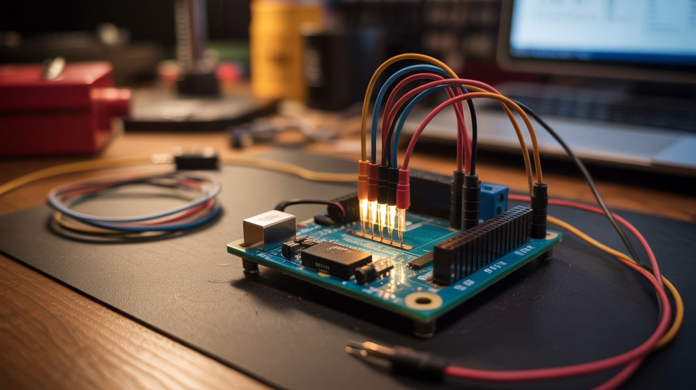

# 🤖 Pi & Arduino

  

  

> Microcontrollers and single-board computers turn junk into smart junk.

A Raspberry Pi is a full Linux computer the size of a credit card. An Arduino is a microcontroller that can read sensors and control motors. An ESP32 is a wireless Arduino with WiFi and Bluetooth built in. Together, these boards are the nervous system you can graft onto anything. Old printers become robot arms. Webcams become security systems. Speakers become DJ controllers. Stepper motors become musical instruments.

The cost of entry is almost nothing — a Pi Zero is $5, an Arduino Nano is $3, an ESP32 is $4. The limiting factor isn't money, it's imagination. And if you're reading this, imagination isn't your problem.

---

## Builds

| # | Build | Jaw Drop | Brain Melt | Wallet | Spicy | Clout | Time |
|---|---|---|---|---|---|---|---|
| 121 | [Fireworks Sequencer](121-fireworks-sequencer.md) | ⭐⭐⭐⭐⭐ | ⭐⭐⭐ | ⭐⭐ | ⭐⭐⭐⭐ | ⭐⭐⭐⭐⭐ | ⭐⭐ |
| 122 | [LED Cube 8x8x8](122-led-cube-8x8x8.md) | ⭐⭐⭐⭐⭐ | ⭐⭐⭐⭐ | ⭐⭐ | ⭐ | ⭐⭐⭐⭐⭐ | ⭐⭐⭐⭐ |
| 123 | [Smart Mirror](123-smart-mirror.md) | ⭐⭐⭐⭐ | ⭐⭐⭐ | ⭐⭐⭐ | ⭐ | ⭐⭐⭐⭐ | ⭐⭐⭐ |
| 124 | [Arduino Guitar Pedal](124-arduino-guitar-pedal.md) | ⭐⭐⭐ | ⭐⭐⭐ | ⭐⭐ | ⭐ | ⭐⭐⭐ | ⭐⭐ |
| 125 | [ESP32 Mesh Walkie-Talkie](125-esp32-mesh-walkie-talkie.md) | ⭐⭐⭐⭐ | ⭐⭐⭐⭐ | ⭐⭐ | ⭐ | ⭐⭐⭐⭐ | ⭐⭐⭐ |
| 126 | [Retro Arcade Cabinet](126-retro-arcade-cabinet.md) | ⭐⭐⭐⭐ | ⭐⭐ | ⭐⭐ | ⭐ | ⭐⭐⭐⭐ | ⭐⭐⭐ |
| 127 | [Auto Plant Watering](127-auto-plant-watering.md) | ⭐⭐ | ⭐⭐ | ⭐ | ⭐ | ⭐⭐ | ⭐⭐ |
| 128 | [ESP32-CAM Security](128-esp32-cam-security.md) | ⭐⭐ | ⭐⭐⭐ | ⭐⭐ | ⭐ | ⭐⭐ | ⭐⭐⭐ |
| 129 | [Printer Robot Arm](129-printer-robot-arm.md) | ⭐⭐⭐⭐ | ⭐⭐⭐⭐ | ⭐⭐ | ⭐ | ⭐⭐⭐⭐ | ⭐⭐⭐⭐ |
| 130 | [AI Doorbell](130-ai-doorbell.md) | ⭐⭐⭐ | ⭐⭐⭐ | ⭐⭐ | ⭐ | ⭐⭐⭐ | ⭐⭐⭐ |
| 131 | [Pi DJ Controller](131-pi-dj-controller.md) | ⭐⭐⭐ | ⭐⭐⭐ | ⭐⭐ | ⭐ | ⭐⭐⭐⭐ | ⭐⭐⭐ |
| 132 | [ESP32 Weather Station](132-esp32-weather-station.md) | ⭐⭐ | ⭐⭐⭐ | ⭐⭐ | ⭐ | ⭐⭐ | ⭐⭐⭐ |
| 133 | [Arduino Breathalyzer](133-arduino-breathalyzer.md) | ⭐⭐⭐ | ⭐⭐ | ⭐ | ⭐ | ⭐⭐⭐⭐ | ⭐⭐ |
| 134 | [Pirate Radio](134-pirate-radio.md) | ⭐⭐⭐ | ⭐⭐ | ⭐ | ⭐⭐ | ⭐⭐⭐⭐ | ⭐ |
| 135 | [MIDI Stepper Organ](135-midi-stepper-organ.md) | ⭐⭐⭐⭐ | ⭐⭐⭐ | ⭐⭐ | ⭐ | ⭐⭐⭐⭐⭐ | ⭐⭐⭐ |
| 136 | [ESP32 Micro Drone](136-esp32-micro-drone.md) | ⭐⭐⭐⭐ | ⭐⭐⭐⭐⭐ | ⭐⭐ | ⭐⭐⭐ | ⭐⭐⭐⭐ | ⭐⭐⭐⭐ |
| 137 | [Star Tracker](137-star-tracker.md) | ⭐⭐⭐⭐ | ⭐⭐⭐ | ⭐⭐ | ⭐ | ⭐⭐⭐⭐ | ⭐⭐⭐ |
| 138 | [Nerf Sentry Turret](138-nerf-sentry-turret.md) | ⭐⭐⭐⭐ | ⭐⭐⭐ | ⭐⭐ | ⭐ | ⭐⭐⭐⭐⭐ | ⭐⭐⭐ |
| 139 | [Pi-hole Ad Blocker](139-pi-hole-ad-blocker.md) | ⭐⭐⭐ | ⭐ | ⭐ | ⭐ | ⭐⭐⭐ | ⭐ |
| 140 | [EMF Ghost Detector](140-emf-ghost-detector.md) | ⭐⭐⭐ | ⭐ | ⭐ | ⭐ | ⭐⭐⭐⭐ | ⭐ |

---

### Suggested Build Order

Start with software-only projects, progress toward complex robotics:

1. **[#139 — Pi-hole Ad Blocker](139-pi-hole-ad-blocker.md)** — Software-only DNS sinkhole. Minimal hardware.
2. **[#140 — EMF Ghost Detector](140-emf-ghost-detector.md)** — Basic sensor + LED. Intro to microcontrollers.
3. **[#134 — Pirate Radio](134-pirate-radio.md)** — Simple FM transmission.
4. **[#133 — Arduino Breathalyzer](133-arduino-breathalyzer.md)** — Gas sensor + threshold alarm.
5. **[#127 — Auto Plant Watering](127-auto-plant-watering.md)** — Moisture sensor + solenoid valve.
6. **[#126 — Retro Arcade Cabinet](126-retro-arcade-cabinet.md)** — Emulation setup + joystick wiring.
7. **[#121 — Fireworks Sequencer](121-fireworks-sequencer.md)** — Relay sequencing. Introduces power delivery.
8. **[#124 — Arduino Guitar Pedal](124-arduino-guitar-pedal.md)** — Audio processing and DSP.
9. **[#123 — Smart Mirror](123-smart-mirror.md)** — Display integration + software UI.
10. **[#128 — ESP32-CAM Security](128-esp32-cam-security.md)** — Camera streaming + motion detection.
11. **[#130 — AI Doorbell](130-ai-doorbell.md)** — Vision processing + notifications.
12. **[#131 — Pi DJ Controller](131-pi-dj-controller.md)** — USB audio + MIDI integration.
13. **[#132 — ESP32 Weather Station](132-esp32-weather-station.md)** — Multi-sensor fusion + data logging.
14. **[#135 — MIDI Stepper Organ](135-midi-stepper-organ.md)** — Stepper motor control + MIDI parsing.
15. **[#137 — Star Tracker](137-star-tracker.md)** — Celestial mechanics + servo control.
16. **[#138 — Nerf Sentry Turret](138-nerf-sentry-turret.md)** — Motion detection + motorized targeting.
17. **[#125 — ESP32 Mesh Walkie-Talkie](125-esp32-mesh-walkie-talkie.md)** — Mesh networking + encryption.
18. **[#122 — LED Cube 8x8x8](122-led-cube-8x8x8.md)** — Multiplexing 512 LEDs + 3D animation.
19. **[#129 — Printer Robot Arm](129-printer-robot-arm.md)** — Stepper coordination + inverse kinematics.
20. **[#136 — ESP32 Micro Drone](136-esp32-micro-drone.md)** — Flight dynamics + inertial stabilization. The endgame.

### Related Categories

- [Junk Instruments](../junk-instruments/) — MIDI and audio-driven builds
- [Mechanical & Kinetic](../mechanical-and-kinetic/) — Motor control and robotic actuators
- [Light & Visual](../light-and-visual/) — LED displays and POV projects
