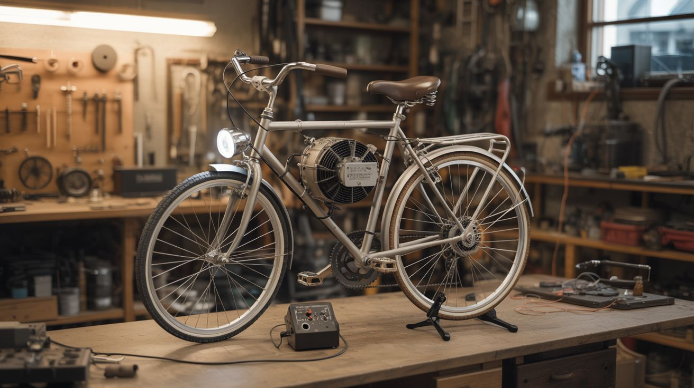

# #050 — Bicycle Generator

  

> An old bicycle, a salvaged motor used as a generator, and a charge controller. Pedal power that charges batteries, runs lights, and powers small electronics.

## Ratings

     

## 🧪 What Is It?

Every motor is a generator. Spin the shaft of a DC motor and it produces voltage. The same scooter motors, treadmill motors, and car alternators that power other builds in this book can be driven by pedal power to produce electricity. Mount a bike on a stand so the rear wheel spins freely, press a motor's friction roller or belt against the rear wheel, and pedaling generates electricity.

A fit cyclist produces about 75-150 watts sustained. That's enough to charge a phone (5W) in 20 minutes, run a string of LED lights indefinitely, power a laptop (45-65W) while pedaling, or charge a 12V battery for later use. It's a visceral lesson in energy — you feel in your legs exactly how much effort goes into every watt. A minute of hard pedaling to run a blender makes you profoundly grateful for the power grid.

<strong>🧰 Ingredients</strong>

- [ ] Bicycle — any adult-size bike with a functional drivetrain *(garage, thrift store, curbside)*
- [ ] Bike trainer stand — or build one from angle iron/wood to hold the rear wheel off the ground *(thrift store, or fabricate)*
- [ ] DC motor/generator — a scooter motor, treadmill motor, or car alternator *(e-waste, junkyard)*
- [ ] Friction roller or belt drive — to couple the rear wheel to the generator shaft *(fabricated, or use a belt and pulleys)*
- [ ] Charge controller — prevents overcharging the battery *(electronics supplier, ~$10)*
- [ ] 12V deep-cycle battery — stores the generated electricity *(auto parts, marine supply)*
- [ ] Diode — blocking diode to prevent the battery from back-driving the motor *(electronics supplier)*
- [ ] Voltmeter and ammeter — to monitor output *(electronics supplier, multimeter)*
- [ ] 12V inverter (optional) — to power AC devices from the battery *(auto parts, ~$20)*
- [ ] Mounting hardware — brackets, bolts, hose clamps *(hardware store)*

## 🔨 Build Steps

1. **Set up the bike stand.** Mount the bicycle so the rear wheel spins freely off the ground. A commercial bike trainer stand is simplest. To build one: weld or bolt a frame from angle iron that clamps to the rear axle, with the rear wheel elevated 2-3 inches. The frame must be heavy enough or floor-mounted so it doesn't tip while pedaling hard.
2. **Mount the generator.** Position the motor/generator so its shaft or friction roller contacts the rear tire. For a friction drive: press a small-diameter roller on the motor shaft against the tire's sidewall or tread surface. For a belt drive: install pulleys on the motor shaft and rear wheel hub, connected by a V-belt. Belt drive is more efficient and quieter; friction drive is simpler to set up.
3. **Calculate the gear ratio.** The rear wheel rotates at about 150-300 RPM during moderate pedaling. Most generators produce useful voltage at 1000-3000 RPM. The gear ratio (large wheel to small generator roller) provides this speed multiplication. A 26" wheel turning a 2" roller gives a ~13:1 ratio, turning 200 RPM input into 2600 RPM at the generator.
4. **Wire the electrical system.** Connect the generator's output through a blocking diode to the charge controller. Connect the charge controller to the battery. The diode prevents the battery from spinning the motor when you stop pedaling. The charge controller prevents overcharging.
5. **Add monitoring.** Install a voltmeter across the battery and an ammeter in series with the charge line. This tells you how much power you're producing and when the battery is full. A watt meter (voltage x current) is even better — it shows exactly how many watts your legs are generating.
6. **Test and calibrate.** Pedal at a moderate pace and verify voltage output on the multimeter. Adjust the friction roller pressure or belt tension until the generator produces 13-14V under load (the charging voltage for a 12V battery). Too little contact pressure and the roller slips; too much and pedaling becomes unnecessarily hard.
7. **Add loads.** Connect LED lights, phone chargers, or a small inverter to the battery. Pedal and watch the ammeter — you'll see the charging current drop as loads draw power. When load exceeds pedal output, the battery makes up the difference. When you pedal harder than the load needs, the excess charges the battery.
8. **Build a power dashboard (optional).** Mount the meters, a switch panel, and USB charging ports on a small board attached to the handlebars or frame. Add a 12V cigarette lighter socket for car accessories. Label everything. Now you've got a pedal-powered charging station.

## ⚠️ Safety Notes

- The bicycle chain, gears, and friction roller are pinch and entanglement hazards. Keep loose clothing and fingers away from the drivetrain. Long pants are advisable.
- A 12V deep-cycle battery contains sulfuric acid. Keep it upright, in a ventilated area (batteries produce hydrogen gas while charging), and away from sparks. Use a charge controller to prevent overcharging — a boiling battery releases toxic fumes and can explode in extreme cases.
- If using an inverter, do not exceed its rated wattage. Overloading a cheap inverter can cause it to overheat, melt, or catch fire. Start with low loads and monitor the inverter's temperature.

## 🔗 See Also

- [Campfire Thermoelectric Charger](049-campfire-thermoelectric-charger.md)
- [DIY Powerwall](052-diy-powerwall.md)

**References:**
- [Appliance Teardown Guide](../../reference/appliance-teardown-guide.md)
- [Technical Glossary](../../reference/glossary.md)
