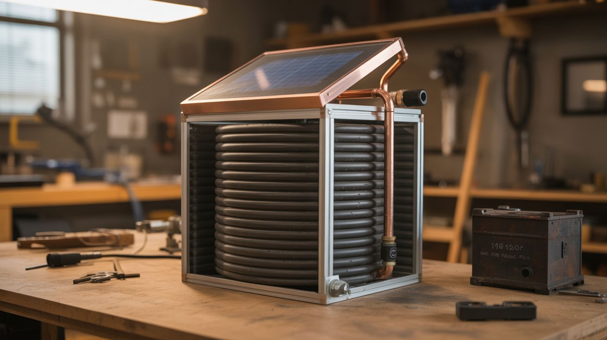

# #051 — Solar Water Heater

  

> Black-painted copper pipe coiled in an insulated box with a glass top. Sunlight heats water to 120-150°F. Free hot water, zero moving parts.

## Ratings

| Jaw Drop Rating | Brain Melt Level | Wallet Damage | Spicy Level | Clout Potential | Time to Build |
|---|---|---|---|---|---|
| ⭐⭐⭐ | ⭐⭐ | ⭐⭐ | ⭐ | ⭐⭐ | ⭐⭐ |

## What Is It?

A solar water heater is one of the most practical things you can build from salvage. Black-painted copper tubing absorbs sunlight and transfers the heat to water flowing through it. An insulated box with a glass or polycarbonate top traps the heat like a greenhouse, keeping the collector temperature well above ambient. Cold water in, hot water out — no electricity, no moving parts (in a passive thermosiphon design), no ongoing costs.

A well-built collector measuring 4'x8' can heat 20-40 gallons of water to 120-150°F on a sunny day — enough for showers, washing dishes, and general household hot water. Commercial solar water heaters cost $2000-$5000 installed. A salvage-built one costs $50-$100 in materials if you source the copper tubing, glass, and insulation from demolition sites and junk piles.

## Ingredients

- [ ] Copper tubing — 1/2" or 3/4" diameter, 50-100 feet for the absorber coil *(plumbing salvage, hardware store)*
- [ ] Sheet metal or copper sheet — for the absorber plate backing *(HVAC duct, hardware store)*
- [ ] Flat black high-heat paint — for the absorber surface *(hardware store)*
- [ ] Plywood — 3/4", for the collector box frame, ~4'x8' *(hardware store)*
- [ ] Glass or polycarbonate sheet — to cover the collector box *(salvaged window, glass shop, hardware store)*
- [ ] Rigid foam insulation — 2" thick, for the back and sides of the collector box *(hardware store)*
- [ ] Plumbing fittings — copper tees, elbows, unions, and solder *(hardware store)*
- [ ] Insulated water tank — old water heater tank (electric, with element removed), or a large insulated container *(curbside, plumber, hardware store)*
- [ ] Pipe insulation — for the supply and return lines *(hardware store)*
- [ ] Mounting hardware — brackets, lag screws, for roof or wall mounting *(hardware store)*
- [ ] Propane torch and solder — for sweating copper joints *(hardware store)*

## Build Steps

1. **Build the collector box.** Construct a shallow plywood box, approximately 4'x8'x6" deep. Line the back and sides with 2" rigid foam insulation. The box should be airtight when the glass cover is installed — air leaks let heat escape.
2. **Build the absorber.** Lay the copper tubing in a serpentine pattern (back and forth) across the inside of the box, with tubes spaced 3-4 inches apart. Solder the return bends at each end. Alternatively, create a header/riser design: two horizontal header pipes at top and bottom, connected by many vertical riser tubes. The header design has lower pressure drop.
3. **Attach the absorber to the backing.** Lay the copper tubing against the sheet metal backing and secure with wire ties, clamps, or solder. Good thermal contact between the tubes and the backing plate is critical — the plate absorbs sunlight and transfers heat to the tubes. Some builders solder the tubes directly to a copper sheet for maximum heat transfer.
4. **Paint everything black.** Paint the absorber plate, tubing, and inside of the box with flat black high-heat paint. Flat black absorbs the most solar radiation. Glossy surfaces reflect light. Let the paint cure fully before assembly.
5. **Install the glass cover.** Lay the glass or polycarbonate sheet over the top of the box and seal the edges with silicone caulk. The glass creates a greenhouse effect — shortwave sunlight passes through, hits the black absorber, and re-radiates as longwave infrared that can't pass back through the glass. This trapped heat is what makes the collector work.
6. **Install the storage tank.** Position the storage tank above the collector (for thermosiphon — hot water rises naturally, no pump needed) or at the same level with a small circulation pump. An old electric water heater tank with the heating element removed is ideal — it's already insulated and has plumbing connections.
7. **Connect the plumbing.** Run insulated copper pipe from the bottom of the storage tank to the bottom inlet of the collector (cold supply), and from the top outlet of the collector to the top of the storage tank (hot return). In a thermosiphon system, the plumbing must slope upward continuously from collector to tank — any dip creates an air trap that stops flow.
8. **Fill and test.** Fill the system with water, bleed all air from the lines, and check for leaks. On a sunny day, the collector should heat up within 30 minutes. Water returning to the tank from the collector should be noticeably warm. Full tank temperature of 120°F+ should be achieved in 3-5 hours of good sun.

## Safety Notes

- An unattended solar collector on a sunny day with no water flow can reach temperatures above 300°F internally — hot enough to melt solder joints and degrade insulation. Never leave the system drained on a sunny day. If the system must be drained, cover the collector with an opaque tarp.
- Copper soldering with a propane torch on a roof is a fire hazard. Have a fire extinguisher on hand. Keep the torch flame away from wood framing and roofing materials. Use a heat shield (sheet metal) behind joints near combustible materials.
- In freezing climates, water in the collector and exposed pipes will freeze and burst. Drain the system before winter, or use a heat-exchange design with antifreeze solution in the collector loop and a heat exchanger to transfer heat to the domestic water.

## See Also

- [Campfire Thermoelectric Charger](049-campfire-thermoelectric-charger.md)
- [Bicycle Generator](050-bicycle-generator.md)
