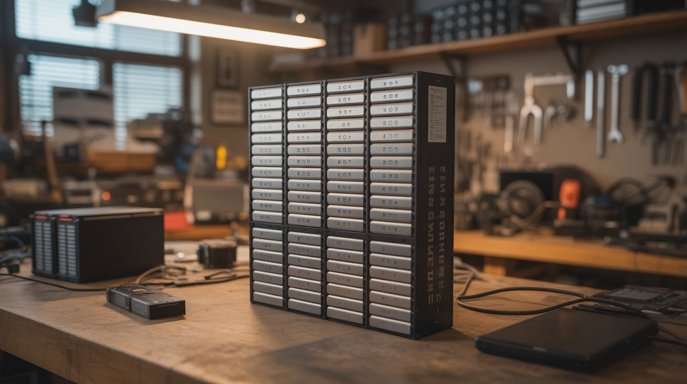

# #052 — DIY Powerwall

  

> Hundreds of salvaged 18650 lithium cells from dead laptop batteries, tested, graded, and assembled into a home battery storage system. The Tesla Powerwall for scavengers.

## Ratings

     

## 🧪 What Is It?

Every dead laptop battery pack contains 4-9 individual 18650 lithium-ion cells. The pack usually dies because one or two cells degrade, triggering the pack's protection circuit. The remaining cells are often perfectly healthy, with 60-90% of their original capacity. Salvage enough of these cells, test each one individually, sort them by capacity, and assemble them into a large battery bank — a home energy storage system that can power lights, charge devices, run a refrigerator, or store energy from solar panels.

A Tesla Powerwall stores 13.5 kWh and costs $10,000+. A DIY powerwall built from salvaged 18650 cells can store 5-15 kWh for the cost of a BMS (battery management system), a few hundred cell holders, and a lot of patience. The community around DIY powerwalls is huge — thousands of people worldwide have built them, with detailed documentation of cell testing, pack building, and system integration.

This is a serious project. It takes weeks to months of cell collection and testing. But the result is a functional home battery system built from e-waste that would otherwise sit in a landfill.

<strong>🧰 Ingredients</strong>

- [ ] 18650 lithium cells — 200-500+ salvaged from dead laptop battery packs *(e-waste recyclers, IT departments, laptop repair shops)*
- [ ] Cell capacity tester — charges and discharges each cell while measuring capacity (LiitoKala Lii-500, OPUS BT-C3100, or similar) *(electronics supplier, ~$25-$50)*
- [ ] 18650 cell holders — modular PCB-style holders that snap together *(online, ~$0.10-$0.30 each)*
- [ ] BMS (Battery Management System) — monitors voltage of each cell group, prevents overcharge/overdischarge *(electronics supplier, $20-$100 depending on configuration)*
- [ ] Nickel strip — for tab welding cells in series/parallel *(electronics supplier)*
- [ ] Spot welder — see [Spot Welder](../functional-machines/027-spot-welder.md) *(build your own)*
- [ ] Bus bars and heavy-gauge wire — for pack-to-pack connections *(electrical supplier)*
- [ ] Fuses — one per cell or per parallel group *(electronics supplier)*
- [ ] Inverter — pure sine wave, 1000W-3000W, to convert battery DC to household AC *(electronics supplier, ~$100-$300)*
- [ ] Charge controller — MPPT for solar input, or a battery charger for grid charging *(electronics supplier)*
- [ ] Enclosure — metal cabinet or purpose-built wooden box with ventilation *(hardware store, salvage)*
- [ ] Multimeter and IR thermometer *(workshop)*

## 🔨 Build Steps

1. **Collect cells.** Source dead laptop battery packs from e-waste recyclers, IT departments, repair shops, or online. You need hundreds of cells for a useful powerwall. Each laptop pack yields 4-9 cells. Plan for 30-50% of cells being unusable (too degraded, too low voltage, or dead).
2. **Extract cells from packs.** Carefully pry open each battery pack case. Cut or desolder the nickel tabs connecting the cells. Do not short the cells or puncture them. Test each cell's voltage immediately — cells below 1V are likely damaged and should be recycled, not reused.
3. **Test and grade every cell.** Using a capacity tester, charge each cell to 4.2V, then discharge to 2.8V while measuring capacity in mAh. Record the capacity of every cell. This is the most time-consuming step — a 4-bay tester processes about 16 cells per day. Sort cells into groups by capacity (e.g., 1500-1800 mAh, 1800-2100 mAh, 2100-2400 mAh). Discard cells below 1500 mAh.
4. **Design the pack configuration.** Determine your target voltage and capacity. A common configuration: 7S (7 cells in series = 29.4V fully charged) with however many parallel cells you have. Each parallel group should contain cells of matched capacity. A 7S80P pack (7 series, 80 parallel per group = 560 cells) at 2000 mAh average stores about 3.2 kWh.
5. **Assemble parallel groups.** Place matched cells into holders with all positives aligned. Spot-weld nickel strip across the positive ends and across the negative ends of each parallel group. Each group becomes a single large cell with the voltage of one cell and the capacity of all cells combined. Install a fuse on each cell (or each parallel group) to prevent a shorted cell from dumping the entire group's energy. Size the fuse at approximately 2x the maximum expected discharge current — typically a 5A fuse for each 18650 cell in a home storage application. Too small and it blows during normal operation; too large and it fails to protect during a short.
6. **Connect groups in series.** Stack the parallel groups in series — the positive bus of group 1 connects to the negative bus of group 2, and so on. This multiplies the voltage. Use thick nickel strip or copper bus bars for the series connections — these carry the full pack current.
7. **Install the BMS.** Connect the BMS balance leads to each series junction point. The BMS monitors individual group voltages and balances them during charging. It also cuts the output if any group drops too low (protecting from over-discharge) or rises too high (protecting from overcharge). The BMS is not optional — it prevents fires.
8. **Wire the system.** Connect the pack output through a main fuse and disconnect switch to the inverter. Connect the charge controller input to your charging source (solar panels, grid charger, or both). Install the voltmeter, ammeter, and any monitoring hardware.
9. **Mount and enclose.** Mount the completed packs in a ventilated metal enclosure. The enclosure should be fire-resistant (metal, not wood) and located in a well-ventilated area (garage, shed) — not inside living spaces. Label everything. Post a wiring diagram on the enclosure door.
10. **Commission and monitor.** Charge the system fully and verify the BMS balances all groups. Connect a test load and monitor voltage drop, temperature, and BMS behavior. Run the system for a week with light loads before connecting anything critical. Check cell temperatures with an IR thermometer — any hot spots indicate a problem.

## ⚠️ Safety Notes

> **Spicy Level 3 build.** Read the [Safety Guide](../../safety/README.md) and [High Voltage Safety](../../safety/high-voltage.md) before starting.

- Lithium-ion batteries can catch fire or explode if shorted, overcharged, or physically damaged. A powerwall contains enough energy to cause a serious fire. The BMS is your primary safety system — never bypass it. Install smoke detectors near the powerwall. Keep a Class D fire extinguisher (or sand bucket) nearby. Do not install inside living spaces.
- Individual cell testing is tedious but non-negotiable. A single weak cell in a parallel group can be forced into reverse polarity by the stronger cells, leading to venting and thermal runaway. Matched capacity groups prevent this. The fuse on each cell or group is the second line of defense.
- The assembled pack stores significant energy. A 7S80P pack at full charge can deliver thousands of amps into a short circuit. The main fuse must be rated to interrupt this fault current. Use a proper DC-rated fuse, not an AC fuse. Disconnect the pack before working on any wiring.

## 🔗 See Also

- [Spot Welder](../functional-machines/027-spot-welder.md)
- [Capacitor Discharge Welder](../functional-machines/032-capacitor-discharge-welder.md)
