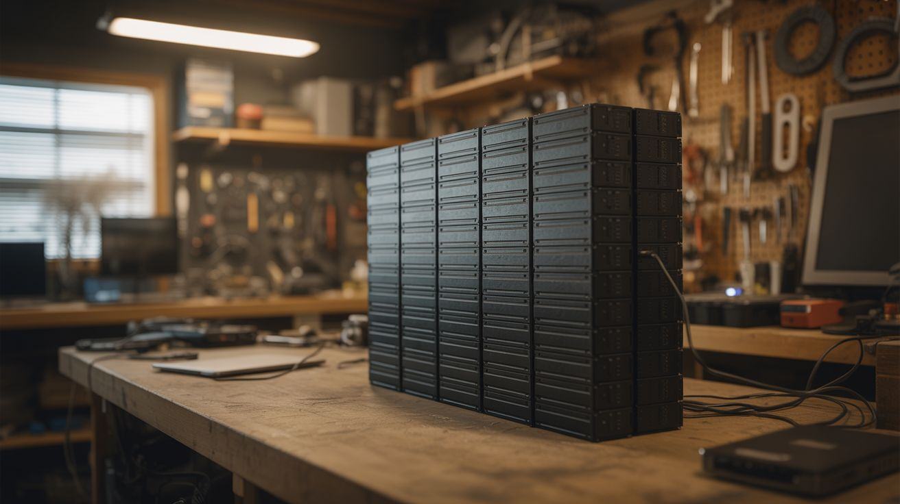

# #288 — Laptop Battery Powerwall

  

> Fifty dead laptops walk into a garage. None of them leave. Their batteries become a wall of stored energy that keeps your lights on when the grid goes dark.

## Ratings

| Jaw Drop Rating | Brain Melt Level | Wallet Damage | Spicy Level | Clout Potential | Time to Build |
|---|---|---|---|---|---|
| ⭐⭐⭐⭐ | ⭐⭐⭐⭐ | ⭐⭐⭐ | ⭐⭐⭐ | ⭐⭐⭐⭐ | ⭐⭐⭐⭐⭐ |

## What Is It?

A laptop battery pack is a plastic shell wrapped around 4-8 cylindrical 18650 lithium-ion cells wired in series and parallel. The pack usually dies because one cell degrades below the protection circuit's threshold, and the whole thing gets marked as dead. But the other cells? Still perfectly fine. Crack open 50 dead laptop batteries and you'll harvest 200-400 individual cells, most of them with 60-80% of their original capacity. That's not trash — that's a home energy storage system waiting to be assembled.

The concept is the same as the [DIY Powerwall](052-diy-powerwall.md), but this build focuses on the full pipeline: sourcing laptop batteries in bulk, the cell extraction and testing workflow, grading cells into matched groups, and assembling them into modular battery packs with proper management electronics. Each module holds a manageable number of cells, and modules stack together to scale the system. Fifty laptops yields roughly 5-10 kWh of storage depending on cell health — enough to run LED lighting, a refrigerator, and charge devices through a multi-hour power outage.

The time investment is no joke. Testing cells is a bottleneck — a 4-bay tester processes about 16 cells per day. You're looking at weeks of testing before you even start building packs. But every cell you save is one that doesn't end up in a landfill, and the cost per kWh of storage is a fraction of buying new lithium-ion packs. If you've got patience and a steady supply of dead laptops, this is one of the most practical large-scale salvage builds you can do.

## Ingredients

- [ ] Dead laptop batteries — 50+ packs, yielding 200-400 individual 18650 cells *(IT departments, e-waste recyclers, laptop repair shops, universities — often free)*
- [ ] 18650 cell holders — modular snap-together PCB-style holders for organizing cells into packs *(online electronics supplier, ~$0.15-$0.30 each)*
- [ ] Cell capacity tester — charges and discharges each cell while measuring mAh capacity (LiitoKala Lii-500, OPUS BT-C3100, or similar 4-bay unit) *(electronics supplier, ~$25-$50)*
- [ ] BMS (Battery Management System) — one per module, monitors cell group voltages, handles balancing, prevents overcharge/overdischarge *(electronics supplier, ~$15-$40 per module depending on configuration)*
- [ ] Spot welder — for tab-welding nickel strip to cell terminals *(build one — see [Spot Welder](../functional-machines/027-spot-welder.md) — or buy, ~$50-$150)*
- [ ] Nickel strip — 0.15mm or 0.2mm thick, for connecting cells in series and parallel *(electronics supplier, ~$10-$20 per roll)*
- [ ] Fuse holders and fuses — inline fuses for each parallel group or each cell, rated for the expected current *(electronics supplier, ~$0.10-$0.20 per fuse wire)*
- [ ] Power inverter — pure sine wave, 1000-3000W, converts battery DC to household AC *(electronics supplier, ~$100-$300)*
- [ ] Charge controller — MPPT for solar input or a CC/CV charger for grid charging *(electronics supplier, ~$20-$60)*
- [ ] Voltage display — panel-mount volt/amp meter to monitor pack state *(electronics supplier, ~$5-$10)*
- [ ] Heavy gauge wire — 10-12 AWG for module interconnects and main bus *(electrical supplier, ~$15-$25)*
- [ ] Enclosure — metal cabinet or plywood box with ventilation cutouts for the assembled modules *(hardware store, salvage, ~$20-$50)*

## Build Steps

1. **Source the batteries.** Contact IT departments at schools, hospitals, and offices — they cycle through laptops every 3-5 years and the old battery packs go straight to recycling. E-waste recyclers often have bins of dead packs. Laptop repair shops pull dead batteries daily. Ask nicely, explain what you're building, and most places will happily hand them over for free. You need volume — target at least 50 packs to make the build worthwhile.

2. **Extract the cells.** Work in a well-ventilated area on a non-flammable surface. Pry open each battery pack along its seam with a flat-head screwdriver or plastic spudger. Inside you'll find 4-8 cylindrical 18650 cells connected by spot-welded nickel tabs. Carefully peel or cut the nickel tabs from each cell terminal. Do not short the cells against each other or against tools. Do not puncture cells. Immediately measure each cell's resting voltage with a multimeter. Cells below 1V are likely internally damaged — set them aside for proper recycling.

3. **Initial sort by voltage.** Group extracted cells by resting voltage: above 3.5V (healthy, probably good capacity), 2.5-3.5V (marginal, need testing), below 2.5V (likely degraded, low priority for testing). Cells below 1V go to the recycling pile. This initial sort lets you prioritize your testing queue — start with the high-voltage cells that are most likely to have good capacity.

4. **Test and grade every cell.** Load cells into the capacity tester. The tester charges each cell to 4.2V, then discharges to 2.8V while measuring total capacity in mAh. Record every cell's capacity. This is the slowest part of the entire project — a 4-bay tester does about 16 cells per day. Buy two testers if you can. Sort tested cells into capacity bins: Grade A (2000+ mAh), Grade B (1500-2000 mAh), Grade C (1000-1500 mAh). Discard anything below 1000 mAh.

5. **Design your module configuration.** Each module should be a manageable size — 7S (7 groups in series, ~25.2V nominal) is common because it pairs well with standard 24V inverters and charge controllers. The number of parallel cells per group depends on your cell inventory and capacity targets. A 7S10P module (70 cells) at 2000 mAh average stores about 350 Wh. Build multiple identical modules and wire them in parallel for higher total capacity.

6. **Assemble parallel groups.** Place capacity-matched cells into holders with all positive terminals facing the same direction. Every cell in a parallel group must be from the same capacity grade — mismatched cells cause the stronger ones to stress the weaker ones, reducing lifespan. Spot-weld nickel strip across the positive ends, then across the negative ends. Install a fuse wire on each cell or each parallel group to prevent a shorted cell from dumping the entire group's energy.

7. **Connect groups in series.** Link the parallel groups in series — positive bus of group 1 to negative bus of group 2, and so on through all 7 groups. Use doubled-up nickel strip or copper bus bars for the series connections. These carry the full pack current and need to handle it without excessive voltage drop or heating.

8. **Install the BMS.** Connect the BMS balance leads to each series junction point (7S = 8 wires). The BMS monitors individual group voltages, actively balances them during charging, and cuts the output if any group drops below the safe minimum or rises above the safe maximum. Do not skip this. The BMS is what prevents thermal runaway. Verify all connections before powering up — a reversed balance wire can destroy the BMS.

9. **Wire the system bus.** Connect module outputs through individual fuses to a main bus bar. Install the master disconnect switch, main fuse, and voltage/current display. Wire the bus to the inverter output and the charge controller input. Use appropriately rated connectors — Anderson Powerpoles or ring terminals on bolted bus bars work well. No wire nuts, no twist-and-tape.

10. **Build the enclosure.** Mount the completed modules in a ventilated metal cabinet or a plywood box with generous ventilation cutouts. Modules should be spaced at least 1 inch apart for airflow. Mount a small fan for forced ventilation if the enclosure is enclosed. The enclosure goes in a garage, shed, or utility room — never in a bedroom or living space. Label every module, fuse, and connection. Post a wiring diagram on the enclosure door.

11. **Commission and monitor.** Charge the full system and verify the BMS on each module is balancing properly — check individual group voltages with a multimeter. Connect a test load (a lamp, a fan) and monitor voltage drop, current draw, and module temperatures. Run for at least a week with light loads before trusting it with anything critical. Check for hot spots with an IR thermometer or your hand — warmth is normal, hot means a problem.

## Safety Notes

- Lithium-ion cells can vent, catch fire, or explode if shorted, overcharged, punctured, or physically crushed. You're building a system that stores kilowatt-hours of energy. Respect it. The BMS is not optional — it is the primary safety system. Never bypass it for any reason.
- Test every single cell. A weak cell hiding in a parallel group gets reverse-charged by its neighbors, leading to thermal runaway. Matched capacity groups and per-cell fuses are your defense against this failure mode.
- The assembled system can deliver thousands of amps into a short circuit. Use properly rated DC fuses on every module and on the main bus. AC fuses are not rated to interrupt DC arcs. Use a master disconnect switch and open it before touching any wiring.
- Install a smoke detector directly above the powerwall. Keep a Class D fire extinguisher or a bucket of dry sand within arm's reach. Do not store flammable materials near the powerwall.
- Dispose of dead and degraded cells properly — most hardware stores and battery retailers accept them for recycling. Do not throw lithium cells in the trash.

## See Also

- [DIY Powerwall](052-diy-powerwall.md)
- [Laptop Battery Power Bank](../computer-and-phone/067-laptop-battery-power-bank.md)
