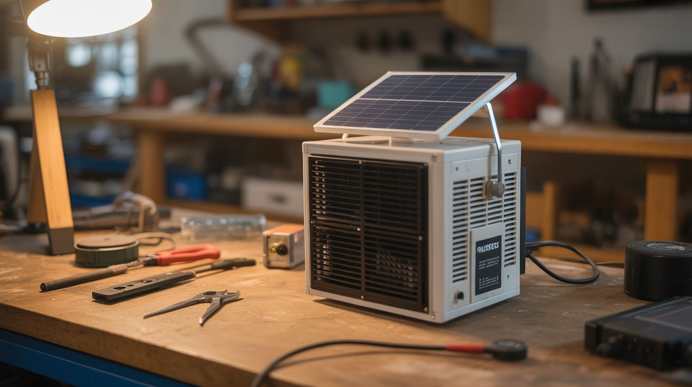

# #289 — Peltier Solar Cooler

  

> A solar panel, some thermoelectric modules from dead mini-fridges, and a cooler box. No compressor, no refrigerant, no noise. Just silent, sun-powered cold.

## Ratings

     

## 🧪 What Is It?

Peltier modules (thermoelectric coolers, TECs) are the solid-state devices inside those small wine coolers, mini-fridges, and portable car coolers that never worked very well. Pass DC current through a Peltier module and one side gets cold while the other side gets hot. No moving parts except the fans that dissipate the heat. The module itself is a thin ceramic square about 40mm on a side — two wires in, heat pumping out. They're terrible at large-scale refrigeration (which is why your dorm mini-fridge was always lukewarm), but they're perfect for a small, portable cooler that just needs to keep drinks cold and food below danger zone temps.

The twist here: power them with a solar panel. A 50-100W panel produces more than enough current to run 2-4 Peltier modules at full tilt. Add a small 12V buffer battery and a charge controller so the system doesn't die every time a cloud passes, and you've got an off-grid cooler that runs indefinitely as long as the sun is up. No generator, no ice runs, no fuel. It won't freeze anything — expect 15-25°C below ambient temperature, which means 30-40°F in typical summer conditions. That's cold enough for drinks, lunch meat, cheese, and medication that needs to stay cool.

Source the Peltier modules from dead mini-fridges and wine coolers — they show up at thrift stores and curbside all the time. The modules almost always survive even when the fridge itself is dead (usually the fan or thermostat failed, not the module). Heatsinks and fans come from dead desktop PCs. The solar panel is the only thing you'll probably need to buy new, and a 50W panel runs about $40.

<strong>🧰 Ingredients</strong>

- [ ] Peltier modules — 2-4 units, TEC1-12706 or similar, salvaged from dead mini-fridges or wine coolers *(thrift stores, curbside, electronics supplier as backup, ~$5 each new)*
- [ ] Solar panel — 50-100W, 12V output *(solar supplier, ~$40-$80)*
- [ ] Heatsinks — large aluminum finned heatsinks for the hot side of each module *(dead desktop PCs, server equipment, electronics bins)*
- [ ] Fans — 80mm or 120mm 12V fans for hot-side heatsink cooling *(dead PCs, ~$2-$5 each new)*
- [ ] Insulated cooler box — hard-sided cooler, Coleman-style, or build from foam board and plywood *(garage, thrift store, ~$10-$20)*
- [ ] Temperature controller module — W1209 or similar, turns modules on/off at set temperature *(electronics supplier, ~$3-$5)*
- [ ] 12V battery — small sealed lead-acid or lithium, 7-20Ah, acts as buffer for cloud cover *(auto parts, electronics supplier, ~$15-$40)*
- [ ] Charge controller — basic PWM solar charge controller for 12V battery *(electronics supplier, ~$10-$15)*
- [ ] Thermal paste — high-quality compound for module-to-heatsink interfaces *(electronics supplier, hardware store, ~$5)*
- [ ] Wire — 14-16 AWG, for power runs from panel to controller to modules *(hardware store, ~$10)*
- [ ] Mounting hardware — bolts, nuts, brackets, and gasket material for mounting modules into cooler wall *(hardware store, ~$5-$10)*

## 🔨 Build Steps

1. **Harvest the Peltier modules.** Open up dead mini-fridges and wine coolers by removing the back panel screws. The Peltier module is sandwiched between two heatsinks — one inside the cabinet (cold side) and one outside (hot side, usually with a fan). Unbolt the heatsinks and carefully separate the module. Clean off the old thermal paste with isopropyl alcohol. Test each module by connecting it to a 12V source and checking if one side gets cold within 10 seconds. Save the heatsinks and fans too — you'll use them.

2. **Prep the cooler box.** Choose a hard-sided insulated cooler or build one from 2-inch rigid foam insulation sandwiched between thin plywood. Thicker insulation means less cooling power wasted fighting heat infiltration. Mark the locations where you'll mount the Peltier modules — ideally on one side wall or the lid, spaced at least 4 inches apart so the hot-side heatsinks have room for airflow. Cut rectangular holes slightly smaller than the Peltier modules at each marked location.

3. **Mount the Peltier modules.** Apply fresh thermal paste to both sides of each module. Press the cold side of the module against a small aluminum cold plate or heatsink inside the cooler. Press the hot side against the large salvaged heatsink outside the cooler. Bolt through the cooler wall with the module sandwiched in between, using compression springs or rubber washers to maintain firm pressure. Seal around each module with silicone caulk or closed-cell foam tape to prevent air leaks and condensation dripping.

4. **Install hot-side fans.** Mount a 12V fan onto each hot-side heatsink, blowing air across the fins and away from the cooler. The hot side must shed heat efficiently or the module's performance collapses — a Peltier module with an inadequately cooled hot side will actually heat the cooler instead of cooling it. The fans are critical. Wire them to run whenever the modules are running.

5. **Wire the temperature controller.** Mount the W1209 temperature controller on the outside of the cooler. Thread its temperature probe through the cooler wall (seal the hole with silicone) and position it in the center of the cooler interior. Set the target temperature — 40°F (4°C) is good for food safety. The controller switches the Peltier modules on when the temperature rises above the setpoint and off when it drops below, preventing overcooling and saving power.

6. **Set up the solar power system.** Connect the solar panel to the charge controller input. Connect the 12V buffer battery to the charge controller's battery terminals. Connect the temperature controller and Peltier modules to the load output (or directly to the battery through a fuse). The charge controller keeps the battery topped up from the solar panel, and the battery provides steady power to the cooler even during brief cloud cover. Size the battery for about 2-4 hours of runtime without sun — a 12Ah battery running two TEC1-12706 modules at full power lasts roughly 1.5-2 hours.

7. **Test the system.** Place a thermometer inside the cooler, close the lid, and run the system in full sun. Monitor the interior temperature over an hour. With two modules on a 90°F day, expect the interior to reach 40-50°F — roughly 40-50 degrees below ambient. If it's not cooling well, check thermal paste contact, hot-side fan operation, and insulation integrity. Add a third or fourth module if you need more cooling power, but you'll need a larger solar panel to match.

8. **Add a drain.** Peltier modules produce condensation on the cold side — water beads on the cold plate and drips down. Drill a small drain hole in the bottom corner of the cooler and run a short tube out to prevent pooling inside. This is especially important in humid climates where condensation can be substantial.

9. **Make it portable.** Bundle the solar panel, cooler, and battery into a kit. Coil the wiring with quick-disconnect connectors (Anderson Powerpoles or XT60 connectors) so setup at a campsite takes under five minutes. Strap the solar panel to the cooler lid for transport if you want a single-carry solution.

## ⚠️ Safety Notes

- Peltier modules draw significant current — two TEC1-12706 modules pull about 10-12 amps total at 12V. Use appropriately sized wire (14 AWG minimum for the main power runs) and fuse the circuit. Undersized wire overheats.
- The hot-side heatsinks get genuinely hot — 140°F+ in summer conditions. Don't touch them, and keep the hot side away from anything flammable. The fans must run whenever the modules are on. A module running without hot-side cooling can reach temperatures that damage itself and melt surrounding materials.
- Sealed lead-acid batteries produce hydrogen gas when overcharging. The charge controller prevents this under normal operation, but don't defeat or bypass it. If using lithium batteries, use a lithium-compatible charge controller.
- This cooler is good for keeping drinks cold and short-term food storage. It is not a replacement for a real refrigerator for long-term food safety. Use a thermometer and follow food safety guidelines — if the interior can't stay below 40°F consistently, treat it as a cooler for drinks only.

## 🔗 See Also

- [Campfire Thermoelectric Charger](049-campfire-thermoelectric-charger.md)
- [Solar Water Heater](051-solar-water-heater.md)
