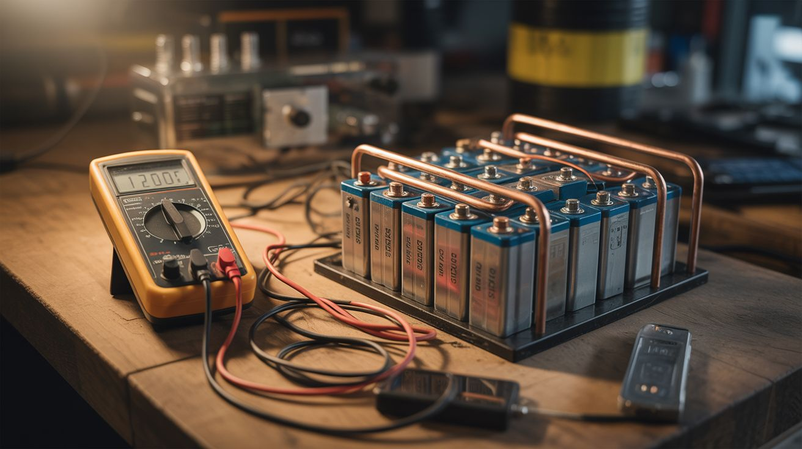

# 🔋 Power & Energy

  

  

> Generate, store, and harvest energy from sources most people throw away.

Campfire heat becomes USB power through thermoelectric modules. Old bicycles become pedal-powered generators. Scrap pipe and glass become solar water heaters. Hundreds of salvaged 18650 cells become home battery storage that rivals commercial powerwalls at a fraction of the cost.

Energy is everywhere — in heat differentials, in mechanical motion, in sunlight, in the hundreds of lithium cells people throw in the trash every day. These builds capture it, store it, and put it to work.

---

## Builds

| # | Build | Jaw Drop | Brain Melt | Wallet | Spicy | Clout | Time |
|---|---|---|---|---|---|---|---|
| 049 | [Campfire Thermoelectric Charger](049-campfire-thermoelectric-charger.md) | ⭐⭐⭐ | ⭐⭐ | ⭐⭐ | ⭐⭐ | ⭐⭐⭐ | ⭐ |
| 050 | [Bicycle Generator](050-bicycle-generator.md) | ⭐⭐⭐ | ⭐⭐ | ⭐⭐ | ⭐ | ⭐⭐⭐ | ⭐⭐ |
| 051 | [Solar Water Heater](051-solar-water-heater.md) | ⭐⭐⭐ | ⭐⭐ | ⭐⭐ | ⭐ | ⭐⭐ | ⭐⭐ |
| 052 | [DIY Powerwall](052-diy-powerwall.md) | ⭐⭐⭐⭐ | ⭐⭐⭐⭐ | ⭐⭐⭐ | ⭐⭐⭐ | ⭐⭐⭐⭐ | ⭐⭐⭐⭐ |
| 288 | [Laptop Battery Powerwall](288-laptop-battery-powerwall.md) | ⭐⭐⭐⭐ | ⭐⭐⭐⭐ | ⭐⭐⭐ | ⭐⭐⭐ | ⭐⭐⭐⭐ | ⭐⭐⭐⭐⭐ |
| 289 | [Peltier Solar Cooler](289-peltier-solar-cooler.md) | ⭐⭐⭐ | ⭐⭐⭐ | ⭐⭐⭐ | ⭐ | ⭐⭐⭐ | ⭐⭐ |
| 290 | [Hand-Crank Generator](290-hand-crank-generator.md) | ⭐⭐⭐ | ⭐⭐ | ⭐⭐ | ⭐ | ⭐⭐⭐ | ⭐⭐ |
| 291 | [Capacitor Bank Flash Charger](291-capacitor-bank-flash-charger.md) | ⭐⭐⭐ | ⭐⭐⭐⭐ | ⭐⭐ | ⭐⭐⭐⭐ | ⭐⭐⭐ | ⭐⭐ |

---

### Suggested Build Order

Start with low-danger energy harvesting and work toward high-capacity storage:

1. **[#290 — Hand-Crank Generator](290-hand-crank-generator.md)** — Mechanical to electrical. Simplest energy conversion.
2. **[#049 — Campfire Thermoelectric Charger](049-campfire-thermoelectric-charger.md)** — Heat to electrical. Learn the Seebeck effect.
3. **[#050 — Bicycle Generator](050-bicycle-generator.md)** — Larger-scale mechanical generation.
4. **[#051 — Solar Water Heater](051-solar-water-heater.md)** — Passive solar thermal. No electronics needed.
5. **[#289 — Peltier Solar Cooler](289-peltier-solar-cooler.md)** — Active solar + thermoelectric modules.
6. **[#052 — DIY Powerwall](052-diy-powerwall.md)** — Battery assembly and management. Higher stakes.
7. **[#288 — Laptop Battery Powerwall](288-laptop-battery-powerwall.md)** — Large-scale battery harvesting and assembly.
8. **[#291 — Capacitor Bank Flash Charger](291-capacitor-bank-flash-charger.md)** — High-energy storage. Respect the discharge.

### Related Categories

- [Fridge & Cooling](../fridge-and-cooling/) — Thermal energy recovery and Peltier modules
- [Scooter & Motor](../scooter-and-motor/) — Motors as generators and energy conversion
- [Survival & Off-Grid](../survival-off-grid/) — Solar, wind, and off-grid power systems

---

## 📚 Reference Guides

- [Tools Needed](../../reference/tools-needed.md)
- [Sourcing Guide](../../reference/sourcing-guide.md)
- [Difficulty & Ratings Guide](../../reference/difficulty-guide.md)
