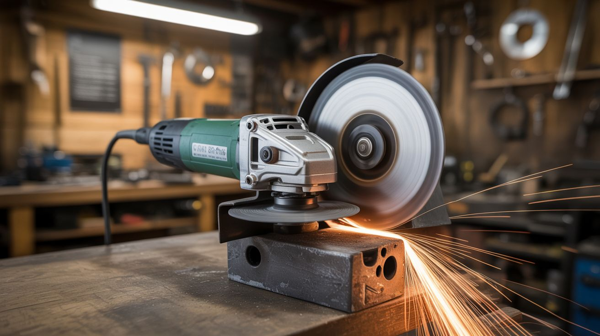

# #079 — Angle Grinder Forge Blower

  

> Remove the grinding disc. Attach a fan blade. 10,000+ RPM airflow ducted into a forge. Way more air than a hair dryer.

## Ratings

     

## 🧪 What Is It?

A forge needs forced air to reach welding and forging temperatures — the fire needs more oxygen than natural draft provides. Commercial forge blowers cost $50-150. A hair dryer works in a pinch but doesn't move enough air for serious forge work. An angle grinder, however, spins at 10,000-12,000 RPM — attach a fan blade or impeller wheel to the spindle, duct the output into your forge tuyere (air inlet pipe), and you have a blower that absolutely screams. The airflow is adjustable by varying the grinder's speed (if it has a variable speed dial) or by partially blocking the duct. This is a 10-minute conversion that turns a $20 tool into a forge-grade blower.

<strong>🧰 Ingredients</strong>

- [ ] Angle grinder — 4.5" or 5", any brand *(already own or thrift store)*
- [ ] Fan blade or impeller — 3D printed, cut from sheet metal, or salvaged from a blower fan *(workshop or hardware store)*
- [ ] Duct pipe — 2" PVC or flexible duct hose to direct air to the forge *(hardware store)*
- [ ] Sheet metal or tin can — to build a housing around the fan blade *(recycling bin)*
- [ ] Hose clamps or bolts — for securing the housing *(hardware store)*
- [ ] Angle grinder mounting bolt — to attach the fan blade to the spindle *(use the existing flange nut)*

## 🔨 Build Steps

1. **Remove the grinding disc and guard.** Unscrew the flange nut and remove the grinding disc. Remove the safety guard to make room for the fan housing. Keep the inner flange washer on the spindle — you'll use it to mount the fan blade.
2. **Select or make a fan blade.** A small centrifugal impeller (from a furnace blower or dryer vent booster) works best, as it concentrates air into a duct. Alternatively, cut a simple 2-3 blade propeller from sheet aluminum, or 3D print one (keep it away from the hot forge end). The blade needs a center hole matching the grinder's spindle diameter.
3. **Mount the fan blade.** Slide the blade onto the grinder spindle against the inner flange washer. Secure with the grinder's original flange nut. The blade must be centered and balanced — an imbalanced blade at 10,000 RPM creates dangerous vibration. Spin it by hand first and check for wobble.
4. **Build the fan housing.** For a centrifugal impeller: build a scroll housing from sheet metal or a large tin can that encloses the impeller with a tangential outlet port. For a propeller: create a simple cylindrical shroud around the blade with an outlet port.
5. **Attach the duct.** Connect 2" PVC pipe or flexible duct hose from the fan housing outlet to your forge's tuyere (air inlet). The pipe should be long enough to keep the grinder away from forge heat — at least 2-3 feet. Seal connections with duct tape or hose clamps.
6. **Mount and secure.** The grinder needs to be held in a fixed position while the blower runs. Clamp it to a workbench or build a simple bracket. The grinder's handle provides a stable mounting point.
7. **Test airflow.** Power on the grinder at low speed (if variable speed). Feel the air output at the forge end of the duct. Even at low speed, the air volume should exceed a hair dryer. Adjust speed to control forge temperature — more air = hotter fire.

## ⚠️ Safety Notes

- The fan blade spins at 10,000+ RPM. An imbalanced or cracked blade can shatter and launch fragments. Ensure the blade is properly balanced, undamaged, and securely mounted. Never use plastic or brittle materials for the blade without testing at speed first in a safe enclosure.
- Keep the angle grinder body away from forge heat. Hot air, sparks, and radiant heat will damage the motor and cord. Maintain 2+ feet of distance via the duct pipe.
- This setup runs the grinder without its safety guard. Treat the exposed spinning blade with extreme caution. Keep hands, loose clothing, and hair well clear.

## 🔗 See Also

- [Sawzall Power Hammer](081-sawzall-power-hammer.md)
- [Circular Saw Table Saw](082-circular-saw-table-saw.md)

**References:**
- [Appliance Teardown Guide](../../docs/reference/appliance-teardown-guide.md)
- [Technical Glossary](../../docs/reference/glossary.md)
