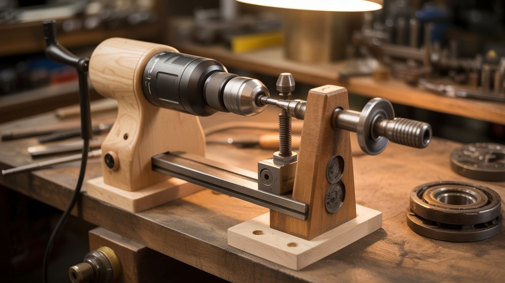

# #306 — Drill-Powered Lathe

  

> Hand drill clamped in a wooden cradle + tailstock from a bolt and bearing. Functional wood lathe. Variable speed via the trigger.

## Ratings

     

## 🧪 What Is It?

A wood lathe is a motor, a headstock that spins the workpiece, a tailstock that supports the other end, and a tool rest.
That's the whole machine.
A hand drill is already the motor and headstock — the chuck grips a drive center or the workpiece itself, and the trigger gives you variable speed control from 0 to max RPM.
The only missing pieces are a way to hold the drill rigid, a tailstock to support the far end of the workpiece, and a tool rest to brace your chisel against.
All three are scrap wood and a couple of bolts.

Build a cradle from 2x4s and plywood that clamps the drill body horizontally, perfectly aligned with a tailstock at the other end of a plywood bed.
The tailstock is a bearing pressed into a wood block, with a bolt through the center acting as a live center point.
Slide the tailstock along the bed to accommodate different workpiece lengths, lock it with a wing nut.
Add a tool rest — a piece of flat steel on an adjustable post — between the headstock and tailstock.
The entire assembly clamps to your workbench and stores flat against a wall when you're done.

This won't replace a dedicated lathe for production work.
The drill's bearings aren't designed for sustained lateral loads, and the motor will overheat if you hog material aggressively.
But for pen turning, small bowls, handles, knobs, chess pieces, bottle stoppers, and spindle work under about 12 inches?
It works shockingly well.
The whole rig costs essentially nothing if you have a drill and a scrap pile, versus $150-400 for even a cheap benchtop lathe.
And when you're done, pull the drill out of the cradle and it's a hand drill again — no permanent modifications.

<strong>🧰 Ingredients</strong>

- [ ] Hand drill — corded preferred for sustained RPM, cordless works for short sessions *(already own)*
- [ ] 2x4 lumber — about 4 feet total for cradle blocks, tailstock block, and tool rest post *(scrap pile)*
- [ ] 3/4" plywood — about 30"x8" for the bed, plus scraps for the cradle cap *(scrap pile)*
- [ ] Skateboard bearing or 608ZZ bearing — for the live center in the tailstock *(salvage or ~$2 online)*
- [ ] 5/16" or 3/8" bolt, 3" long — tailstock center point *(hardware store, ~$1)*
- [ ] Nut and washer — to retain the tailstock bolt *(hardware store, ~$0.50)*
- [ ] Spur drive center or large wood screw (#14 x 2") — to grip the workpiece headstock end *(hardware store, ~$3-8)*
- [ ] Hose clamps — two, sized to fit your drill body *(hardware store, ~$4)*
- [ ] Flat steel bar — 1/8" x 1" x 14" for the tool rest surface *(hardware store, ~$5)*
- [ ] Carriage bolts (5/16" x 3") + wing nuts + washers — four sets for adjustable slots *(hardware store, ~$5)*
- [ ] Wood screws + wood glue *(workshop)*
- [ ] Sandpaper — 80, 120, 220, 400 grit *(hardware store, ~$5)*
- [ ] Optional: lathe chisels — roughing gouge, skew, parting tool *(woodworking store, $15-40 for a set)*
- [ ] Optional: paste wax or friction polish — for finishing turned pieces *(woodworking store, ~$8)*
- [ ] Optional: plug-in variable speed controller — precise RPM without holding the trigger *(online, ~$15-20)*

## 🔨 Build Steps

1. **Build the bed.**
Cut a 3/4" plywood base about 28-30" long and 8" wide.
It needs to be flat and stiff — laminate two pieces together if your plywood is warped.
Draw a centerline down the full length. Every other component references this line.

2. **Build the drill cradle.**
Cut two matching U-shaped cradle blocks from 2x4 that hug the drill body just ahead of the handle.
Trace the drill profile onto the end grain, cut the curves with a jigsaw, sand smooth.
Screw and glue both blocks to the bed at one end, spaced about 4" apart.
The chuck center should sit about 3-4" above the bed surface — this sets your swing (max workpiece diameter).

3. **Add a cradle cap.**
Cut a plywood strip that bridges the cradle blocks on top, with a matching curved cutout.
Bolt it down with wing nuts for quick drill removal.
The cap prevents upward movement while hose clamps prevent rotation — together they lock the drill completely rigid.

4. **Clamp the drill.**
Set the drill in the cradle, wrap hose clamps at each block, tighten, then bolt the cap.
Try to wiggle the drill with force — it must not move at all. Any wobble ruins turned surfaces.
Keep the trigger and speed switch accessible. Some builders lock the trigger on and use a plug-in speed controller instead.

5. **Build the tailstock.**
Cut a 2x4 block about 4" tall. Drill a hole through the center at the exact same height as the drill chuck center.
Measure from the bed surface with a combination square — even 1/16" of misalignment causes visible wobble.
Press-fit a 608ZZ bearing into the hole (wrap in masking tape if the fit is loose).

6. **Install the live center.**
Thread a bolt through the bearing. Grind the tip to a 60-degree cone point.
The bearing lets the bolt spin freely with the workpiece while the tailstock block stays stationary.
Add a nut and washer on the outside to prevent the bolt from sliding through.

7. **Make the tailstock adjustable.**
Cut a slot in the bed along the centerline, from about 8" from the headstock to 3" from the far end.
A carriage bolt drops through the slot from underneath, the tailstock sits on top, and a wing nut locks it.
Slide to match workpiece length, tighten, done. Accommodates pieces from about 3" to 18".

8. **Build the tool rest.**
Cut a 2x4 vertical post about 5" tall. Mount it to the bed with the same slot system, offset 2" from center toward the operator.
Bolt a flat steel bar horizontally through the top of the post — this is the rest surface your chisel rides on.
The bar's top edge must be filed smooth. A nicked tool rest catches your chisel and causes dig-ins.
Position about 1/2" below workpiece center height and 1" from the workpiece surface.

9. **Set up a drive center.**
Chuck a spur drive center into the drill — sharpened prongs bite into the workpiece end grain and spin it.
No spur center? A #14 wood screw chucked into the drill works for small pieces.
For wider faceplate work, screw a plywood disc to the workpiece, then chuck a bolt through the disc.

10. **Mount a workpiece and test.**
Start with a softwood blank about 2"x2"x8". Find center on both ends with diagonal lines, punch a dimple at each.
Mount between the spur center and tailstock. Tighten until firm but the piece still spins freely by hand.
Set the tool rest with a 1" gap. Rotate by hand to check clearance. Power on at low speed.

11. **Round the blank.**
At 500-800 RPM, rest a roughing gouge on the tool rest with the handle low and bevel rubbing.
Gently advance the edge into the spinning corners. Work from center toward each end in light passes.
Within minutes, the square blank becomes a cylinder. This is the most satisfying step in woodturning.

12. **Shape, sand, and finish.**
Once round, increase speed to 1000-2000 RPM. Use a skew for smooth cuts, parting tool for grooves, gouge for curves.
Sand while spinning: 120, then 220, then 400 grit. Hold folded sandpaper against the piece — never wrap it around (it'll grab your fingers).
Apply paste wax or friction polish while spinning for a uniform coat.

13. **Dial in speeds for different work.**
Larger diameter = slower RPM: 4" bowl at 300-500, 2" spindle at 800-1200, 1" pen blank at 2000-3000.
If the workpiece vibrates or the drill bogs down, you're going too fast or cutting too aggressively. Back off.

## ⚠️ Safety Notes

- A spinning workpiece catches loose clothing, hair, jewelry, and gloves faster than you can react.
Roll up sleeves, tie back hair, remove rings, and never wear gloves while the lathe runs.

- Wear a face shield, not just safety glasses. Wood blanks can crack and fly apart with zero warning — especially stock with hidden knots or internal stress cracks.

- Never leave the chuck key in. If you power on with the key in, it launches across the shop.

- Keep the tool rest close to the workpiece. A large gap lets the chisel dip, catch, and get ripped from your hands. Stop the lathe to reposition — never adjust the rest while spinning.

- The drill motor heats up during sustained use. Take 5-minute breaks every 15-20 minutes. If it's too hot to hold, stop and cool it completely before resuming.

- Inspect every workpiece before mounting. Cracks, loose knots, bark pockets, and rot are structural weaknesses that can cause the piece to explode at speed. Start slow and increase RPM gradually.

- Clamp the entire jig to your workbench. Turning forces during roughing can walk it across the bench or tip it.

## 🔗 See Also

- [Hand Drill Press](080-hand-drill-press.md)
- [Circular Saw Table Saw](082-circular-saw-table-saw.md)

**References:**

- [Appliance Teardown Guide](../../docs/reference/appliance-teardown-guide.md)
- [Technical Glossary](../../docs/reference/glossary.md)
