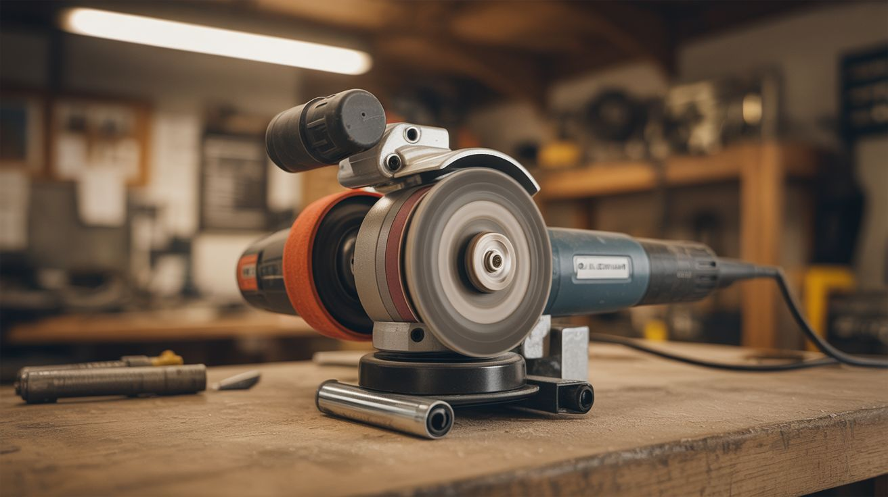

# #308 — Angle Grinder Belt Sander

  

> Bolt-on belt sander attachment for an angle grinder. Two rollers, a sanding belt, 10,000 RPM. Converts in 30 seconds.

## Ratings

     

## 🧪 What Is It?

A belt sander attachment bolts to an angle grinder's guard mounting holes and turns it into a compact, viciously aggressive belt sander.
The attachment is a metal bracket holding two rollers — a drive roller on the grinder's spindle and an idler roller on a spring-loaded tensioning arm.
A standard sanding belt loops around both rollers.
The grinder's motor spins the drive roller at up to 10,000 RPM, driving the belt at a surface speed that embarrasses most dedicated belt sanders.
The result is a handheld tool that shapes, grinds, deburrs, sharpens, and finishes metal, wood, and plastic with ridiculous efficiency.

You can buy these attachments pre-made for $15-30 online (search "angle grinder belt sander attachment"), or fabricate one from flat steel bar, two bearings, and a few bolts.
The pre-made ones are honestly worth the money — CNC-machined, fit standard 4.5" grinders, accept common 1"x15" or 30x330mm belts.
The attachment uses the threaded guard mounting holes every angle grinder has.
Swap it on in 30 seconds, swap the grinding disc back in 30 seconds. No permanent modification.

The advantage over a grinding disc is control and versatility.
A sanding belt gives you a flat contact surface instead of a convex disc, so you can flatten surfaces, hold consistent bevel angles, and blend welds with precision a disc can't match.
Different grit belts go from brutal stock removal (36 grit) to mirror polish (400+) with a 5-second belt change.
Sharpen knives on a flat platen. Round edges on steel tubing. Clean up MIG welds. Strip paint. Shape wood handles. Profile blade bevels.
The grinder's size means you bring the sander to the workpiece instead of the other way around — which matters when the workpiece is a welded gate or a staircase railing.

<strong>🧰 Ingredients</strong>

- [ ] Angle grinder — 4.5" (115mm), any brand, variable speed preferred *(already own or thrift store)*
- [ ] Belt sander attachment — commercial bracket with drive roller, idler roller, tensioning arm *(online, ~$15-30)*
- [ ] Sanding belts — 1"x15" or 30x330mm, assorted grits: 36, 60, 120, 240, 400 *(online, ~$8-15 for a variety pack)*
- [ ] OR for DIY: flat steel bar (3/16" x 1") — about 14" total for bracket and tensioner *(hardware store, ~$5)*
- [ ] OR for DIY: two 608ZZ bearings *(online, ~$2 for a 10-pack)*
- [ ] OR for DIY: two roller cylinders — aluminum or steel, 1" OD x 1" wide, bored to 22mm *(machine shop, ~$5-10)*
- [ ] OR for DIY: compression spring, bolts, shoulder bolt, set screws, lock nuts *(hardware store, ~$7)*
- [ ] OR for DIY: spindle adapter — threaded coupling matching your spindle (M10 or 5/8"-11) *(hardware store, ~$3)*
- [ ] Safety glasses + face shield *(workshop)*
- [ ] Leather work gloves *(workshop)*
- [ ] Optional: flat steel platen — hardened steel plate behind the belt for dead-flat sanding *(scrap or supplier, ~$10)*
- [ ] Optional: belt cleaning stick — rubber/crepe stick that cleans loaded belts *(woodworking store, ~$6)*

## 🔨 Build Steps

### Option A: Commercial Attachment (Recommended)

1. **Get the right attachment.**
Match to your grinder: spindle thread (M10 x 1.5 is most common, some American brands use 5/8"-11), guard mounting pattern, and neck diameter (typically 42-44mm for 4.5" grinders).
Read reviews — cheap ones sometimes have soft rollers that wear flat or sloppy tracking. The attachment includes a drive roller, bracket with guard-mount clamp, idler roller, tensioning mechanism, and tracking adjustment.

2. **Remove the grinding disc and guard.**
Press the spindle lock, unscrew the flange nut, remove the disc and outer flange washer.
Loosen the guard clamp and remove the guard. Keep everything together — you'll be swapping back and forth.

3. **Thread on the drive roller.**
The roller screws directly onto the spindle thread, replacing the disc. Press the spindle lock and tighten by hand, then a quarter turn with a wrench.
Spin by hand to confirm it turns concentrically. Any wobble means erratic belt tracking.

4. **Bolt on the bracket.**
The bracket clamps to the grinder's neck using the guard mounting holes. Position so the idler roller aligns with the drive roller — axes parallel and coplanar.
Tighten firmly. The bracket must be rigid; any flex kills tracking and amplifies vibration. Wrap the neck in electrical tape first if the clamp fit is loose.

5. **Install a sanding belt.**
Loop around both rollers, grit side out. Check the directional arrow on the belt's inside and match it to rotation direction.
Adjust tension until the belt deflects about 1/4" with firm finger pressure at the midpoint. Not guitar-string tight, not floppy.

6. **Adjust belt tracking.**
Power on at lowest speed. Watch the belt for 5 seconds.
If it drifts to one side, power off. Turn the tracking screw 1/8 turn toward the side the belt is moving away from. Re-test. Repeat until it tracks center at both low and full speed.
A belt that runs off the roller shreds in two seconds and can fly off the tool. This step is non-negotiable.

7. **Practice on scrap.**
Hold with both hands — body and side handle. Side handle is mandatory with this attachment.
Touch the belt lightly to scrap metal or wood. Light pressure — the belt speed is extreme and removes material fast.
Flat span between rollers for flat surfaces. Belt wrap around the idler roller for concave curves. Drive roller contact for convex.
Keep moving in smooth passes. Standing still gouges instantly.

8. **Learn your grits.**
36 ceramic: heavy stock removal, weld grinding, rust stripping.
60 aluminum oxide: general shaping, bevel grinding.
120: finish blending, pre-paint prep.
240: fine finishing, scratch removal.
400 silicon carbide: polishing, knife blade final pass.
Ceramic belts last longest on metal. Zirconia is a good cost/life balance. Aluminum oxide is cheapest but wears fastest.

### Option B: DIY Fabrication

9. **Cut the bracket.**
Cut 3/16" flat steel bar about 6" long. Drill guard-mounting holes to match your grinder.
Deburr edges and round corners. The bracket must resist belt tension without flexing — double up or go to 1/4" if 3/16" feels flimsy.

10. **Make the drive roller.**
Machine or buy an aluminum cylinder: 1" diameter, 1" wide, internally threaded to match the spindle.
A slight crown on the surface (0.010" higher at center than edges) helps the belt self-center.
Surface should be matte, not polished — the belt needs grip.

11. **Make the idler roller.**
Press a 608ZZ bearing into each end of a second 1" aluminum cylinder (22mm bore, interference fit — use a vise, not a hammer).
Mount on a shoulder bolt at the end of the tensioning arm. Should spin freely and coast for several seconds.

12. **Build the tensioning arm.**
Cut a 3" arm from flat steel. Pivot on the main bracket at one end, hold the idler at the other.
A compression spring between bracket and arm provides outward pressure. An adjustment bolt controls tension by compressing the spring more or less.
Push the arm inward against the spring to slack the belt for changes.

13. **Add tracking adjustment.**
Tap a small hole (M6 or 1/4"-20) in the idler mount. Thread in a set screw with a lock nut.
The screw tip tilts the idler axis by a fraction of a degree, steering the belt left or right.
Without this, the belt walks off the rollers within seconds. Lock the nut once tracking is dialed in.

14. **Add a platen (optional, recommended for knife work).**
Mount a flat steel plate behind the belt span between rollers. The belt slides over the platen face, and pressing the workpiece against it gives you dead-flat sanding.
An old file ground flat makes an excellent platen. Mount with countersunk screws.

15. **Assemble and test.**
Mount everything. Install a 120-grit belt. Adjust tension and tracking per steps 5-6.
Let the belt run 30 seconds at low speed, watching tracking. Test on scrap metal with light pressure. The removal rate will be faster than you expect.

## ⚠️ Safety Notes

- The belt runs at extreme surface speed — faster than any benchtop belt sander. Material removal is instant on contact.
A moment of inattention gouges the workpiece, grinds through thin material, or catches skin. Light pressure, keep moving, never hold stationary.

- Wear safety glasses AND a face shield when sanding metal. Hot sparks and abrasive particles launch at high velocity. Metal dust in your eye is an ER visit.

- Leather gloves are appropriate here (unlike lathes) — no rotating shaft to catch them. Gloves protect against heat, sparks, and accidental belt contact.

- Sanding belts break, especially worn or nicked belts at high speed. A failure at 10,000 RPM sends the belt whipping outward.
Inspect before every use. Replace any belt that's cracked, frayed, or has missing abrasive. Belts cost under a dollar — don't gamble.

- The motor runs hotter under sanding loads than grinding disc loads due to belt friction and tension drag.
If the body gets too hot through your glove, stop for 10 minutes. Corded grinders handle sustained use better than cordless.

- The attachment shifts the grinder's balance compared to a disc. It handles differently. Always use the side handle for two-handed control.
Practice on scrap before real work.

- Keep the area clear of flammables. Metal sparks ignite sawdust, oily rags, and solvent fumes.
Wood sanding dust is itself a fire hazard at high concentrations. Work in a clean, ventilated space with a fire extinguisher within arm's reach.

## 🔗 See Also

- [Angle Grinder Forge Blower](079-angle-grinder-forge-blower.md)
- [Sawzall Power Hammer](081-sawzall-power-hammer.md)

**References:**
- [Appliance Teardown Guide](../../docs/reference/appliance-teardown-guide.md)
- [Technical Glossary](../../docs/reference/glossary.md)
