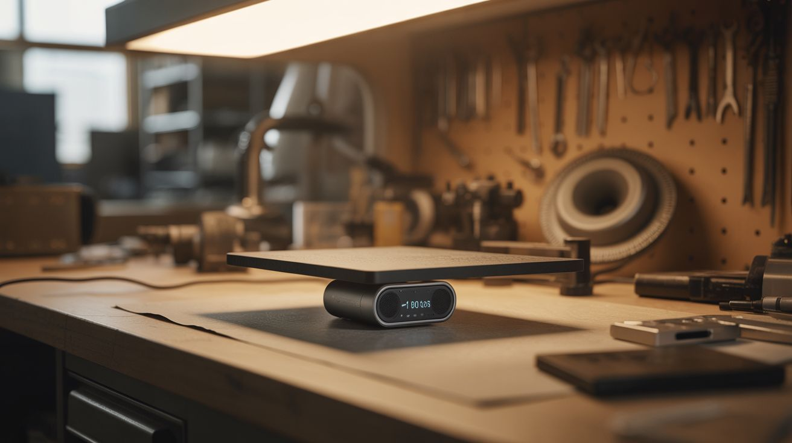

# #254 — Invisible Bluetooth Speaker

  

> Bone conduction transducer + Bluetooth module hidden under a table. Any surface becomes a speaker. Nobody can find it.

## Ratings

     

## 🧪 What Is It?

A surface transducer (also called an exciter or bone conduction speaker) doesn't have a cone or a diaphragm like a normal speaker. Instead, it vibrates whatever surface you bolt or tape it to, turning that surface into the speaker. Stick one under a table and the table talks. Stick one on a window and the window sings. Tape one inside a cardboard box and the box becomes a boom box. The transducer itself is completely invisible — it's a small puck about the size of a hockey puck, hidden on the underside or inside of the surface. Pair it with a Bluetooth audio receiver module and a small amplifier, and you can stream audio from your phone to any surface in the room from the next room over.

The effect is deeply disorienting for anyone who doesn't know what's happening. Sound appears to emanate from the table, the wall, or the countertop itself. There's no visible speaker. No cone, no grille, no enclosure. People will put their ear to the table trying to understand what's happening. They'll look under it and see nothing (if you mounted it well). The acoustic properties change dramatically with the surface material — wood produces warm, rich bass; metal gives a bright, tinny quality; glass creates an eerie, crystalline tone. Each surface has its own natural resonances that color the sound in unique ways.

The prank applications are obvious: whisper someone's name through a table at 2 AM. Play a faint heartbeat through a wall. Stream barely audible carnival music from a bookshelf. But the legitimate audio applications are real too — surface transducers are used in museum exhibits, commercial displays, and high-end audio installations where visible speakers would ruin the aesthetic. You're just building the same thing from $20 in parts.

<strong>🧰 Ingredients</strong>

- [ ] Surface transducer / exciter — 20W or higher for decent volume *(electronics supplier, $8-15)*
- [ ] Bluetooth audio receiver module — small board with 3.5mm or bare wire output *(electronics supplier, $3-5)*
- [ ] Small class-D amplifier board — PAM8610, TPA3116, or similar *(electronics supplier, $3-8)*
- [ ] 12V power supply — old laptop charger works perfectly *(e-waste bin, junk drawer — free)*
- [ ] Double-sided mounting tape — thick foam VHB type for permanent mount, or removable poster strips for temporary *(hardware store, $3)*
- [ ] Wire — 18-22 gauge speaker wire for connecting amp to transducer *(junk drawer)*
- [ ] Optional: 3.5mm audio cable — if Bluetooth module uses a 3.5mm jack *(junk drawer)*
- [ ] Optional: USB battery bank — for fully wireless operation *(already own)*

## 🔨 Build Steps

1. **Test the transducer by hand first.** Wire the transducer directly to any amplified audio source — even a portable Bluetooth speaker's headphone output works. Press the transducer's flat face firmly against a table, countertop, or wooden door and play music. You should hear the surface produce sound. Try different surfaces: hollow-core doors are loud, thick oak tables have deep bass, metal filing cabinets ring, glass windows produce ethereal highs. Pick your target surface based on what sounds best (or creepiest).

2. **Wire the Bluetooth module to the amplifier.** Connect the audio output of the Bluetooth receiver to the audio input of the amplifier board. Most Bluetooth modules output line-level audio on a 3.5mm jack or bare pads — match to your amp's input. If the Bluetooth module needs 5V power and the amp provides a 5V auxiliary output, connect them. Otherwise, power the Bluetooth module from a separate USB source.

3. **Wire the amplifier to the transducer.** Connect the amplifier's speaker output terminals to the transducer's leads. Polarity doesn't matter for audio signals — it's an AC waveform. Use short, solid connections — loose speaker wire creates buzzing at high volume.

4. **Power the amplifier.** Connect your 12V power supply to the amp board's power input. Verify the full signal chain: phone pairs with Bluetooth module, audio passes to the amp, amp drives the transducer, sound comes from the surface. Adjust volume from both the phone and the amp's gain control (if it has one). Start low — surface transducers can get surprisingly loud on resonant surfaces.

5. **Find the sweet spot on the surface.** Before permanently mounting, test different positions on your target surface. The center of a large flat panel produces the most bass. Edges and corners emphasize higher frequencies. Experiment by pressing the transducer to different spots while playing music and listening for the fullest, richest sound. On a table, dead center of the underside is usually ideal. On a wall, find a spot between studs where the drywall has the most flex.

6. **Mount the transducer.** Clean the target surface with rubbing alcohol. Apply thick double-sided VHB tape to the transducer's flat face and press firmly onto the surface. Hold pressure for 30 seconds. For permanent installations, bolt through a drilled hole for maximum coupling — the tighter the mechanical contact, the better the sound transfer. For temporary pranks, removable adhesive strips work but sacrifice some bass response.

7. **Hide the electronics.** Tuck the amp board, Bluetooth module, and power supply behind furniture, inside a drawer, or under the surface alongside the transducer. Route the power cable along the wall, table leg, or baseboard where it won't be noticed. For a fully wireless setup, replace the wall power supply with a USB battery bank — you'll get 4-8 hours of playback depending on volume and battery size.

8. **Pair and test from the next room.** Pair your phone with the Bluetooth module from another room to verify range. Most cheap Bluetooth modules reach 20-30 feet through walls. Queue up your audio, start playback from out of sight, and listen to the surface come alive. Adjust volume so it's just barely audible at first — the goal is confusion, not a concert.

9. **Deploy for maximum effect.** For pranks: whispering voices, slow breathing sounds, someone saying the target's name at low volume, or faint music that sounds like it's coming from inside the walls. Play at low volume so they question whether they're hearing anything at all. Gradually increase over 30 minutes. For parties: mount under a coffee table and stream music. Guests will spend the first 20 minutes looking for the speaker.

## ⚠️ Safety Notes

- Surface transducers can damage delicate surfaces if driven at high power for extended periods. Antique tables, thin glass, veneered furniture, and instrument soundboards can crack, delaminate, or buzz. Test at low volume first and increase gradually. If you hear rattling or distortion, back off.
- The transducer gets warm during extended high-volume use. On heat-sensitive surfaces (lacquered wood, plastic laminate, acrylic), keep sessions under an hour at high volume, or run at moderate levels for longer sessions.
- VHB tape creates a near-permanent bond on smooth surfaces. Removing it may pull up paint, veneer, or finish. Use removable adhesive strips on surfaces you care about.

## 🔗 See Also

- [Motion-Activated Jump Scare](255-motion-jump-scare/)
- [Fake Security Camera That Roasts You](257-insult-camera/)
- [Laser Voice Communicator](../laser-lab/265-laser-communicator/)

