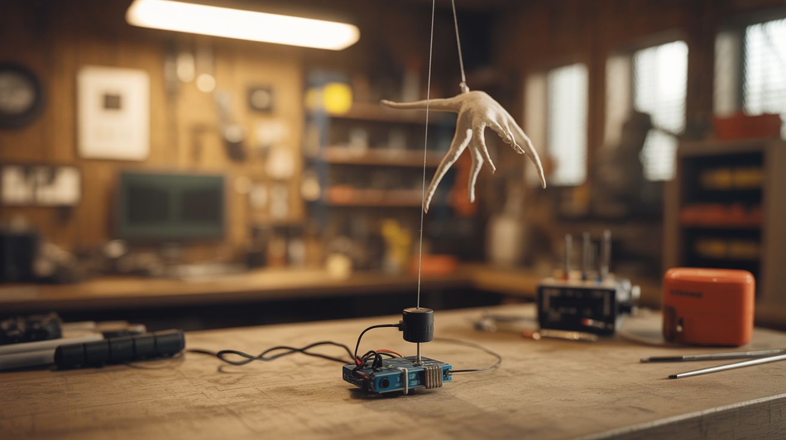

# #255 — Motion-Activated Jump Scare

  

> PIR sensor + Arduino + servo yanks a prop on fishing line. Resets itself, never gets tired. Halloween essential.

## Ratings

| Jaw Drop Rating | Brain Melt Level | Wallet Damage | Spicy Level | Clout Potential | Time to Build |
|---|---|---|---|---|---|
| ⭐⭐⭐⭐ | ⭐⭐ | ⭐ | ⭐ | ⭐⭐⭐⭐⭐ | ⭐⭐ |

## What Is It?

A passive infrared (PIR) sensor detects the body heat of anyone walking through its field of view. An Arduino reads the sensor's trigger signal and fires a servo motor. The servo yanks a fishing line attached to a lightweight scare prop — a hanging ghost, a spring-loaded skeleton arm, a dangling spider — making it lunge toward the victim at exactly the wrong moment. Add a sound module for a scream or growl, and you've got an automated jump scare machine that resets itself after every trigger and never gets bored of its job.

The magic is in the timing. A static Halloween decoration is furniture. A decoration that explodes toward you the instant you walk past it is a core memory. The PIR sensor has adjustable sensitivity and range (up to 7 meters), so you can tune exactly where in the approach path the trigger fires. Too early and the victim sees the prop move from a distance — startling but not terrifying. Too late and they've already walked past. The sweet spot is 3-4 feet — close enough that the prop enters their peripheral vision before their brain can process what's happening. That's when the fight-or-flight reflex fires and you get the full-body flinch.

Commercial motion-activated scare props cost $50-100 and have fixed, predictable movements. This one costs $8-15 in parts, has infinitely adjustable timing, speed, and intensity, and can yank any prop of any size in any direction. It's also reusable year after year — swap the prop for a new theme and the mechanism stays the same.

## Ingredients

- [ ] Arduino Nano or Uno *(electronics supplier, $5-15)*
- [ ] PIR motion sensor module — HC-SR501 is the standard *(electronics supplier, $2)*
- [ ] Servo motor — SG90 for lightweight props, MG996R for heavier ones *(electronics supplier, $2-5)*
- [ ] Fishing line — 20-30lb test, clear monofilament *(sporting goods or dollar store, $2)*
- [ ] Scare prop — lightweight skeleton, ghost, spider, mask, whatever fits your theme *(dollar store, thrift store, DIY — $1-5)*
- [ ] Screw-eye hooks — small ones for routing the fishing line around corners *(hardware store, $1)*
- [ ] Optional: DFPlayer Mini MP3 module + small speaker — for sound effects *(electronics supplier, $3 + salvaged speaker)*
- [ ] Optional: micro SD card — for storing sound effect MP3 files *(junk drawer)*
- [ ] 9V battery + snap connector, or USB battery bank — for power *(junk drawer)*
- [ ] Zip ties, tape, screws — for mounting *(junk drawer)*
- [ ] Jumper wires or hookup wire *(electronics bin)*

## Build Steps

1. **Wire the PIR sensor to the Arduino.** Connect the HC-SR501 module: VCC to 5V, GND to GND, OUT to digital pin 2. The sensor has two trim potentiometers on the back — the left one controls sensitivity (detection range, adjustable up to about 7 meters) and the right one controls hold time (how long the output stays HIGH after triggering, from 3 seconds to 5 minutes). For a jump scare, set sensitivity to medium-high and hold time to minimum.

2. **Wire the servo motor.** Connect the servo's signal wire (usually orange or white) to Arduino digital pin 9 (PWM-capable), power wire (red) to 5V, and ground (brown or black) to GND. Important: if using a larger servo like the MG996R, do NOT power it from the Arduino's 5V pin — it draws too much current and will brown out the Arduino, causing erratic behavior. Instead, power large servos directly from the battery with a shared ground to the Arduino.

3. **Write the trigger code.** Program the Arduino: when pin 2 reads HIGH (motion detected), rapidly sweep the servo from 0 to 180 degrees (the yank), hold at 180 for 500 milliseconds, then slowly sweep back to 0 (the reset). Add a cooldown variable — after triggering, ignore the PIR sensor for 5-10 seconds so it doesn't rapid-fire on the same person. This also gives the prop time to settle back to its resting position.

4. **Optional: add sound.** Wire a DFPlayer Mini module to the Arduino: module TX to Arduino pin 10, module RX to Arduino pin 11 through a 1K resistor (protects the module's 3.3V logic from the Arduino's 5V). VCC and GND to power. Connect a small speaker (salvaged from an old laptop, phone, or toy) to the module's speaker output pins. Load scream, growl, or creepy laugh MP3 files onto a micro SD card. In the code, trigger playback simultaneously with the servo sweep for maximum impact.

5. **Rig the fishing line path.** Tie fishing line to the servo horn (the plastic arm that rotates). Route the line through screw-eye hooks mounted along the ceiling, wall, or door frame to redirect the pull direction toward your prop. The line should be taut when the servo is at 0 degrees (resting position). When the servo sweeps to 180 degrees, the line pulls the prop 1-3 feet in whatever direction the screw-eyes route it. Plan the path so the prop lunges toward the victim's walking path, not away from it.

6. **Attach and position the prop.** Mount your scare prop on a hinge, pivot, or dangling cord at the end of the fishing line. Lightweight props work best — a foam skull on a spring arm, a fabric ghost on a pivoting mount, a rubber spider on a drop line. Heavy props stall the servo and move too slowly to startle. The prop should hang or rest naturally in its "loaded" position and lunge, drop, or swing when the line pulls.

7. **Hide the electronics.** Package the Arduino, PIR sensor, servo, battery, and optional sound module in a small box, bag, or container. Mount it behind a wall, above a door frame, inside a hollow decoration, or in the ceiling. Only the PIR sensor's white dome needs a line of sight to the approach path — everything else can be hidden. Paint or cover the box to match the surroundings. The fishing line is nearly invisible in dim Halloween lighting.

8. **Aim the PIR sensor.** Position the sensor so it detects people walking toward the prop, not walking parallel to it. PIR sensors are most sensitive to lateral motion (side to side across the sensor's view) but you want to trigger when the victim is approaching head-on, so aim the sensor down the approach corridor. Test by walking the path yourself from various angles.

9. **Tune the timing.** Walk through the trigger zone repeatedly and adjust. Bend the servo horn arm length to change how far the prop moves. Adjust the servo sweep speed in the code — fast is startling, but too fast can snap fishing line. Add or remove cooldown time. If using sound, experiment with the delay between motion detection and audio playback — a half-second delay before the scream starts makes the visual startle land first, then the audio follows up while their guard is down.

10. **Deploy on Halloween night.** Position it at a choke point where victims are focused on something else — the end of a dark hallway, around a corner, next to the candy bowl. The best scares happen when attention is directed elsewhere. Dim the lights, hide all wires, and let the machine do its work all night long.

## Safety Notes

- PIR sensors can false-trigger from pets, HVAC vents blowing warm air, space heaters, and direct sunlight. Position the sensor where only human foot traffic will set it off. Indoor locations away from air vents and windows work best.
- Make sure the prop cannot physically hit anyone. The fishing line should pull the prop toward an empty space — ceiling, wall, or open area — not directly into the walking path at face height. A swinging prop that contacts a face will end the party fast.
- People have tripped, punched scare props, thrown their phones, and fallen over backwards from jump scares. Know your audience. Don't deploy this where someone with a heart condition, small child, or person carrying hot coffee will encounter it without warning.
- The fishing line is nearly invisible and can become a trip or entanglement hazard if it sags. Keep it routed high along the ceiling or tight along walls.

## See Also

- [Invisible Bluetooth Speaker](254-invisible-speaker.md)
- [Piezo Shock Pen](256-shock-pen.md)
- [Fake Security Camera That Roasts You](257-insult-camera.md)
