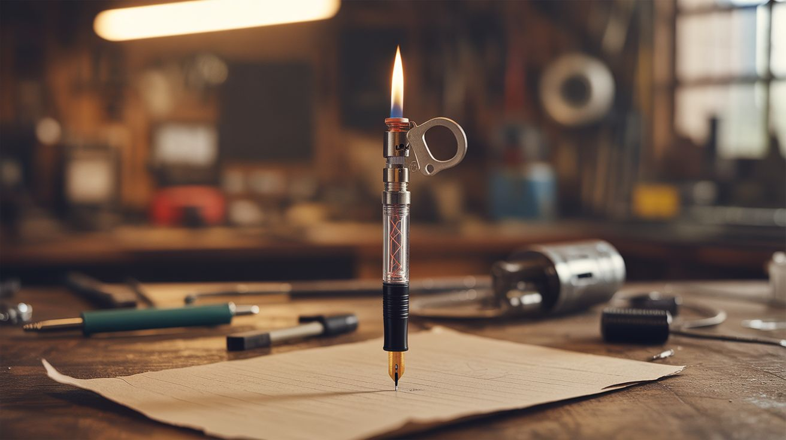

# #256 — Piezo Shock Pen

  

> BBQ lighter piezo igniter crammed inside a pen barrel. Click to write, get zapped instead.

## Ratings

     

## 🧪 What Is It?

A piezoelectric igniter — the clicker mechanism inside a BBQ lighter or gas stove starter — generates a high-voltage spark when you press the button. The voltage is impressive (several thousand volts), but the current is negligibly low (microamps) and the discharge duration is microseconds. It stings like a static shock from a doorknob, it startles, and it's completely harmless. The entire mechanism fits inside a fat pen barrel or marker body. When an unsuspecting person clicks the "pen" to write, the piezo fires and zaps their thumb. The pen looks completely normal from the outside.

The victim's reaction follows a script that never varies: a yelp, a confused look at the pen, a glance at their hand, and then — this is the best part — clicking it again because they can't believe a pen just bit them. It gets them twice every time. The second click always produces a louder yelp because now they know something is wrong but they still can't resist testing it. It's Pavlov's experiment in reverse.

This is the simplest prank build in the entire collection. No programming, no batteries, no circuits. Just a mechanical hammer striking a piezoelectric crystal inside a pen body. The crystal converts mechanical impact into electrical discharge. It's the same physics behind quartz watches, sonar transducers, and precision sensors — except here you're using it to make your coworker's hand involuntarily spasm while they're trying to sign a birthday card.

<strong>🧰 Ingredients</strong>

- [ ] Piezoelectric igniter — from a dead BBQ lighter, click-start stove lighter, or grill igniter *(junk drawer, dollar store lighter — $1 or free)*
- [ ] Fat pen barrel or marker body — needs to be wide enough to house the piezo mechanism; Sharpie bodies, dry-erase markers, and cigar-tube pens work well *(office supply drawer, $0-1)*
- [ ] Thin wire — to route the spark electrode to the grip area *(electronics scrap, paperclip)*
- [ ] Small piece of copper tape or aluminum foil — for the contact pad where skin touches *(junk drawer)*
- [ ] Hot glue or epoxy — to secure the piezo mechanism inside the pen body *(craft supplies)*
- [ ] Optional: a real pen ink cartridge that still writes — for extra credibility *(office supplies)*

## 🔨 Build Steps

1. **Harvest the piezo igniter.** Disassemble a BBQ lighter or click-start gas stove lighter. Inside you'll find the piezo unit: a small crystal element in a housing with a spring-loaded hammer and two output wires (or a wire and a ground strap). The hammer cocks when you press the button and releases to strike the crystal, generating the spark. Keep the entire assembly intact — you need the hammer mechanism, the spring, the crystal, and both output leads.

2. **Test the igniter.** Hold the two output wires (or wire + ground) about 1-2mm apart and press the button. You should see and hear a small spark jump the gap. If no spark, the crystal may be cracked or the hammer spring may be weak. Try another lighter — the dollar store sells them cheap.

3. **Size the pen body.** Remove all the innards from your chosen marker or pen body. Slide the piezo mechanism inside to check the fit. It should sit snugly with the button accessible from one end. If the pen body is too narrow, try a larger marker. If it's too wide, wrap the piezo unit in a layer of foam or tape to take up the slack and prevent rattling.

4. **Position the click button.** Orient the piezo so its trigger button aligns with the pen's click end, cap end, or twist mechanism — whatever matches how a normal user would actuate the pen. When someone clicks the "pen" with their thumb, the motion should depress the piezo hammer naturally. You may need a small spacer, dowel stub, or folded piece of plastic to bridge the gap between the pen's external click surface and the piezo button.

5. **Route the shock contacts.** This is the critical step. Run one output wire to a small metal contact pad (copper tape, foil strip, or a thin band of wire) on the outside of the pen body where the user's thumb naturally rests during clicking. Run the second wire to a matching contact pad on the opposite side of the grip — where the index or middle finger wraps around. The spark must travel through the user's skin between two contact points. One contact per side of the grip ensures the discharge path goes through their hand.

6. **Insulate and secure.** Hot glue or epoxy the piezo mechanism in place inside the pen body. Glue down the wires along the inner wall so they don't shift or rattle. Make sure the external contact pads are smooth and flush with the pen surface — any bumps, exposed wire ends, or visible foil edges will tip off the victim before they click. The pen should look and feel completely normal in the hand.

7. **Optional: add a real ink cartridge.** If your pen body can accommodate both the piezo mechanism and a shortened ink cartridge, the pen actually writes. This adds a devastating layer of credibility. The victim clicks, gets zapped, but the pen also deploys an ink tip — making them question whether the shock came from the pen at all or if they imagined it.

8. **Test on yourself first.** Click the pen while holding it in a natural writing grip. You should feel a sharp snap — a quick sting identical to a winter doorknob static shock. If you don't feel it, the contact pads aren't making good skin contact. Adjust their position, size, or material. If the shock is too weak, make sure the hammer has full travel when the button is pressed — a partially blocked hammer gives a weak strike.

9. **Deploy.** Leave the pen somewhere it'll be picked up and used naturally. On a sign-in sheet. Next to a crossword puzzle. In the communal pen cup at work. On the counter next to a tip jar. Wait nearby. Film if possible. The double-take when they click it a second time is the payoff.

## ⚠️ Safety Notes

- Piezo shocks are harmless to healthy individuals but must not be used on people with pacemakers, implanted defibrillators, or other electronic medical devices. The voltage spike is brief but high, and could theoretically interfere with sensitive implanted electronics. Ask before deploying in any environment where someone might have a medical device.
- The shock is startling but essentially painless. However, the startle reflex causes people to drop things, throw things, and jerk their hands. Don't deploy near hot beverages, delicate electronics, sharp objects, or high places.
- Keep the contacts clean. Dirty or corroded contact pads increase resistance, which means the spark has to jump through air instead of traveling through skin — this can produce a visible/audible spark at the contact point that looks alarming even though it's equally harmless.

## 🔗 See Also

- [Invisible Bluetooth Speaker](254-invisible-speaker.md)
- [Motion-Activated Jump Scare](255-motion-jump-scare.md)
- [Self-Pouring Bottle](258-self-pouring-bottle.md)

**References:**

- [Appliance Teardown Guide](../../docs/reference/appliance-teardown-guide.md)
- [Technical Glossary](../../docs/reference/glossary.md)
