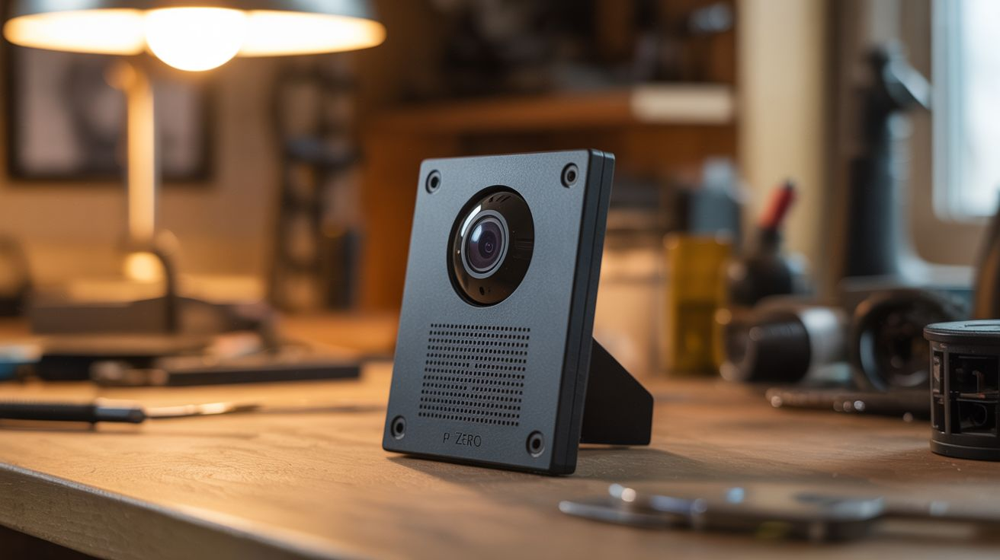

# #257 — Fake Security Camera That Roasts You

  

> Pi Zero + camera + speaker + face detection. Walk into the room, get personally insulted by a picture frame.

## Ratings

     

## 🧪 What Is It?

A Raspberry Pi Zero with a tiny camera module runs face detection software. When it spots a human face entering its field of view, it picks a random pre-recorded insult from its library and plays it through a hidden speaker. Mount the whole thing inside a picture frame, behind a decorative object, or on a shelf, and it roasts every single person who walks into the room. The camera module is smaller than a postage stamp. The Pi Zero is the size of a credit card. The speaker can be as small as the one in a phone. The entire system hides inside everyday objects and delivers personalized verbal abuse to anyone who dares to exist in its presence.

The face detection runs through OpenCV's Haar cascade classifier — it doesn't identify who someone is, just that a face-shaped object has appeared in the frame. It can't tell your mom from your roommate. But it doesn't need to. The insults are universal. "Oh. It's you again." "That outfit was certainly a choice." "You look like you need coffee. And probably therapy." "I've seen more enthusiasm at the DMV." When the voice comes from an unidentifiable location and addresses you specifically, the effect is somewhere between hilarious and deeply unsettling.

The first victim alerts everyone else in the house, and then every person has to come see it for themselves — which of course triggers it again with a fresh insult. It's a self-marketing prank. The only limit is how many insults you record and how creative you get with the hiding spot.

<strong>🧰 Ingredients</strong>

- [ ] Raspberry Pi Zero W — the W model has built-in WiFi for remotely updating insults *(electronics supplier, $10-15)*
- [ ] Pi Camera Module — v2 or compatible, with the Pi Zero ribbon cable adapter (the Zero uses a smaller connector) *(electronics supplier, $8-12)*
- [ ] Small speaker — 3W 4-ohm or 8-ohm, salvaged from an old laptop, tablet, or toy *(e-waste bin — free, or electronics supplier $2)*
- [ ] USB audio adapter or I2S DAC module — Pi Zero has no onboard audio jack *(electronics supplier, $3-5)*
- [ ] Micro SD card — 8GB+ flashed with Raspberry Pi OS *(junk drawer, or $5)*
- [ ] 5V power supply or USB battery bank — micro USB *(junk drawer)*
- [ ] Enclosure — picture frame, decorative box, fake plant, bookend, anything that can hide the components *(thrift store, $2-5)*
- [ ] Optional: PAM8403 mini amplifier board — if your speaker needs more volume *(electronics supplier, $1)*

## 🔨 Build Steps

1. **Flash and configure the Pi Zero.** Write Raspberry Pi OS Lite (no desktop needed) to the micro SD card using the Raspberry Pi Imager. Before first boot, enable SSH by placing an empty file called `ssh` in the boot partition. Create a `wpa_supplicant.conf` file in the boot partition with your WiFi credentials so it connects to your network on first boot. Boot the Pi, SSH into it, and run `sudo apt update && sudo apt upgrade`.

2. **Connect and test the camera.** Attach the camera ribbon cable to the Pi Zero's camera port — it's the smaller of the two flat connectors, not the display port. Enable the camera interface with `sudo raspi-config` under Interface Options. Test with `raspistill -o test.jpg` and verify you get an image. If the image is black, the ribbon cable isn't seated properly — those connectors are finicky. Reseat and try again.

3. **Set up audio output.** Plug in the USB audio adapter and connect your speaker to its 3.5mm jack (or wire the I2S DAC module if going that route). Test audio with `aplay /usr/share/sounds/alsa/Front_Center.wav`. If no sound, run `alsamixer` and verify the USB audio device is selected and volume is up. For more volume, wire a PAM8403 amplifier between the audio output and the speaker.

4. **Install OpenCV.** Install the Python OpenCV library: `sudo apt install python3-opencv`. This includes pre-trained Haar cascade classifiers for face detection. Test with a quick Python script that opens the camera, runs `cv2.CascadeClassifier` with `haarcascade_frontalface_default.xml`, and prints "Face detected!" when it sees one. If detection is sluggish, reduce the camera resolution to 320x240 — the Pi Zero is not fast, and face detection at full resolution will lag badly.

5. **Record your insult library.** Record 20-40 short audio clips. Keep each under 5 seconds for maximum punch. Save as WAV or MP3 files in a directory on the Pi. Organize by category for variety:
   - **Greetings:** "Welcome. I use that word loosely." / "Ah, you're back. Wonderful."
   - **Observations:** "You again?" / "I see you chose to leave the house looking like that."
   - **Existential:** "You look like a Monday." / "I'd compliment you but I was told not to lie."
   - **Confused:** "Wait, are you lost?" / "This is a restricted area. Restricted from you."

6. **Write the main detection script.** Create a Python script that: opens the camera feed in a loop, runs Haar cascade face detection on each frame, and when a face is detected, randomly selects and plays an insult clip using `pygame.mixer` or `subprocess` with `aplay`. Add a cooldown timer of 15-30 seconds after each trigger so it doesn't rapid-fire on the same person standing still. Add a random delay of 0.5-2 seconds before speaking — this makes the timing feel organic and unpredictable instead of mechanical.

7. **Handle edge cases in the code.** Add logic to prevent double-triggers: once a face triggers an insult, don't trigger again until the face disappears from frame and a new face enters. This prevents the camera from roasting someone who's just sitting in front of it every 15 seconds. Also add error handling for camera disconnects and audio failures — you want this thing to run unattended for hours.

8. **Create a startup service.** Write a systemd service file so the script launches automatically when the Pi boots. No keyboard, no monitor, no manual intervention — plug in power and it starts watching. Test by rebooting and walking in front of the camera after 30 seconds. The boot sequence takes about 20-30 seconds on a Pi Zero.

9. **Build the enclosure.** This is where creativity matters. A picture frame is classic — mount the camera behind a pinhole in the frame's matting, position the speaker behind the frame's backing (sound passes through cardboard easily), and hide the Pi behind the frame. A decorative box, fake plant, bookend, or stuffed animal all work. The camera lens needs a tiny opening (2-3mm) with a clear view of the entry path. The speaker needs a path for sound to escape — fabric, mesh, or perforated material in front of it.

10. **Position and aim.** Mount the enclosure at roughly head height, aimed at a doorway or the area where people enter the room. Face detection works best with good ambient lighting and faces within 3-8 feet of the camera at a relatively head-on angle. Profile views and extreme angles reduce detection reliability. Test by walking through the detection zone from multiple angles and distances. Adjust the camera's position until triggers are consistent.

11. **Deploy and enjoy.** Place it in a high-traffic area — kitchen doorway, living room entrance, bathroom mirror shelf (brutal), or office entry. The first person who gets roasted will tell everyone else, and everyone will come investigate, triggering a fresh insult for each of them. If you have WiFi access to the Pi, you can SSH in and swap out the insult library remotely for fresh material.

## ⚠️ Safety Notes

- This project processes camera input continuously. Be mindful of privacy laws in your jurisdiction — many locations require consent for audio or video recording, even in private homes with guests. Inform people about the camera if you're in a jurisdiction that requires it. The insults are the joke; an undisclosed recording device is not.
- Keep the insults fun, not cruel. "You look like Monday" is funny. Anything targeting someone's appearance, identity, weight, or personal insecurities is not a prank — it's just being mean. Write your insult library with the assumption that the most sensitive person you know will hear every single clip.
- The Pi Zero runs warm in an enclosed space with no airflow. Add ventilation holes in the enclosure or leave a gap for air circulation. The Pi's CPU throttles at 80C and can crash at higher temperatures, which means your insult machine goes silent and you have to physically reboot it.

## 🔗 See Also

- [Invisible Bluetooth Speaker](254-invisible-speaker/)
- [Self-Pouring Bottle](258-self-pouring-bottle/)
- [Motion-Activated Jump Scare](255-motion-jump-scare/)

