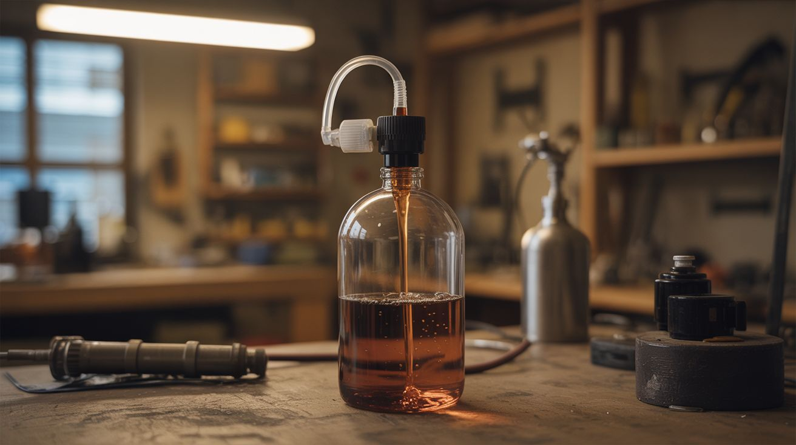

# #258 — Self-Pouring Bottle

  

> Hidden pump + tubing inside a bottle. Tilt it and liquid flows on its own. Looks like straight-up witchcraft.

## Ratings

     

## 🧪 What Is It?

A wine bottle or liquor bottle sits on the table. Nobody touches it. Liquid slowly rises from a glass and flows upward into the bottle, defying gravity. Or the reverse — liquid streams out of a perfectly upright, untouched bottle into a glass below. The secret is a small submersible pump hidden in the base or inside the bottle, connected to thin silicone tubing that runs through the liquid. The pump is whisper quiet — ambient conversation or background music covers it completely. The tubing is nearly invisible in dark liquids like red wine, cola, or coffee. A small battery pack and wireless remote trigger hidden under the table let you activate the pour from across the room.

To everyone watching, liquid just decided to ignore the laws of physics. It's the kind of trick that makes people set down their own drink, lean forward, and stare in silence for a full five seconds before saying "What the..." The visual is so wrong — liquid flowing upward with no visible mechanism — that the brain genuinely struggles to process it. It looks like a video playing in reverse, except it's happening live on the dinner table.

This build combines the elegance of a stage magic prop with the accessibility of aquarium parts. Everything you need is available at a pet store and a hardware store. The hardest part is drilling a clean hole in glass, and even that can be skipped if you use a bottle with a removable base or build the pump into an external display stand.

<strong>🧰 Ingredients</strong>

- [ ] Small submersible water pump — 3-6V DC, aquarium dosing pumps are ideal for the slow, steady flow rate *(pet store aquarium section, or electronics supplier — $5-8)*
- [ ] Clear silicone tubing — match the pump's outlet diameter, typically 4-6mm outer diameter *(pet store aquarium section, hardware store — $2)*
- [ ] Wine bottle or dark liquor bottle — opaque or dark-colored glass hides the tubing best *(recycling bin — free)*
- [ ] Glass or cup — the "receiving" or "source" vessel *(kitchen — free)*
- [ ] Small battery pack — 4xAA holder or 3.7V lithium pouch cell *(electronics supplier, $2)*
- [ ] Miniature toggle switch or wireless RF relay module — for remote triggering *(electronics supplier, $2-5)*
- [ ] Diamond-tipped drill bit — for drilling through glass, 6-8mm *(hardware store, $5)*
- [ ] Hot glue or clear silicone sealant — for waterproofing the hole *(craft supplies)*
- [ ] Dark liquid — red wine, grape juice, cola, cold brew coffee *(kitchen)*
- [ ] Optional: decorative base or wooden wine coaster — to hide the pump and battery *(thrift store, $1)*

## 🔨 Build Steps

1. **Drill the bottle base.** You need a small hole (6-8mm) in the bottom of the bottle for the tubing to pass through. Use a diamond-tipped drill bit at low speed (400-600 RPM) with running water as a coolant — a constant stream from a faucet or a wet sponge underneath. Glass cracks from heat and pressure, so go painfully slow, press lightly, and let the diamond do the work. Drill through the punt (the dimple in the bottom of wine bottles) where the glass is thinnest. Alternatively, skip the drilling entirely: use a bottle with a cork or screw cap, run the tubing through the neck opening, and hide the pump inside a decorative base that the bottle sits on.

2. **Thread the tubing.** Feed silicone tubing up through the hole in the bottom and out through the neck of the bottle. The tube should reach from below the bottle (where it connects to the pump) all the way up and out the top. If using a dark bottle and dark liquid, the tubing will be invisible inside the bottle.

3. **Seal the base hole.** Apply clear silicone sealant or hot glue around where the tubing exits the bottom of the bottle. This must be completely watertight — any leak ruins the illusion and makes a mess. Let the sealant cure fully (24 hours for silicone) before testing with liquid.

4. **Mount the pump.** Attach the submersible pump to the external end of the tubing, below the bottle. The pump can be hidden inside a decorative wine coaster, a wooden base, or simply underneath the table. Connect the pump's intake to a short piece of tubing that sits in the glass (the source of liquid), or position the pump inline so it pushes liquid up from the glass into the bottle.

5. **Wire the trigger circuit.** Connect the battery pack to the pump through your switching mechanism. A simple toggle switch under the table works, but for maximum showmanship, use a small wireless RF relay — the kind with a key-fob remote for $3-5 online. This lets you trigger the pour from across the room while looking as surprised as everyone else.

6. **Set the scene.** Fill the glass with dark liquid. Position the bottle next to it with the tubing's upper end submerged in the glass, hidden by the liquid's opacity. The bottle should look perfectly normal sitting on the table — an unopened wine bottle next to a glass of wine. No visible wires, no visible tubing, no visible mechanism.

7. **Test the flow rate.** Trigger the pump and watch the liquid travel. Adjust flow speed by varying the pump voltage — lower voltage means slower, more mesmerizing flow. Too fast looks mechanical and artificial. Too slow tests everyone's patience. A gentle, steady stream that takes about 5 seconds to visibly fill is the sweet spot. Watch for air bubbles in the tubing — they break the illusion. Prime the tubing by running the pump until all air is purged.

8. **Reverse the direction (optional).** To make the bottle pour into the glass instead of the glass filling the bottle, reverse the pump (swap the power wires for DC pumps, or physically flip the pump orientation). Now liquid flows downward from the bottle through the concealed tubing into the glass below. The bottle slowly empties without being tilted. This version is even more baffling because there's no visible stream — the glass just fills from the bottom up.

9. **Performance tips.** Wait for a natural pause in conversation when attention is near the table but nobody's staring directly at the bottle. Trigger the pump. By the time someone notices, liquid is already flowing the wrong direction and they've missed the start. Act confused. "Hey, is that bottle... did you see that?" Let someone else be the first to point it out — if you call attention to it yourself, people suspect you immediately.

## ⚠️ Safety Notes

- If using this with actual beverages people will drink, use only food-safe silicone tubing (aquarium-grade is food-safe) and clean the entire tubing and pump system thoroughly with hot water before and after each use. Stagnant liquid in tubing grows bacteria fast.
- Drilling glass produces sharp edges and fine glass dust. Wear safety glasses and work gloves. Drill under running water to suppress glass dust — inhaling glass particles is a serious respiratory hazard. Work outdoors if possible.
- Keep all battery connections and switch wiring away from liquid. The pump is submersible by design, but exposed battery terminals and relay boards near spilled wine will short circuit.

## 🔗 See Also

- [Invisible Bluetooth Speaker](254-invisible-speaker/)
- [Magnetic Levitating Display Stand](259-magnetic-levitating-display/)
- [Fake Security Camera That Roasts You](257-insult-camera/)

