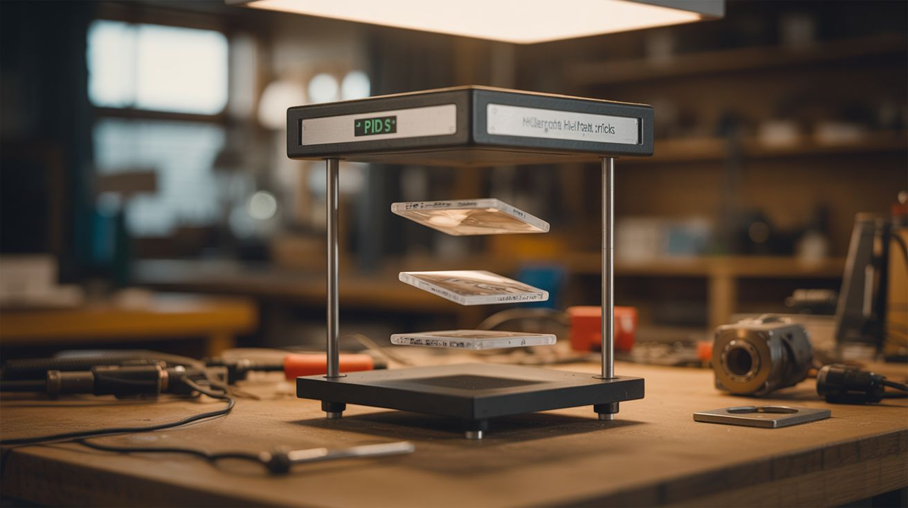

# #259 — Magnetic Levitating Display Stand

  

> Electromagnet + hall sensor + PID feedback loop. Objects float in mid-air with no strings, no supports, no tricks.

## Ratings

     

## 🧪 What Is It?

An electromagnet mounted above pulls upward on a permanent magnet embedded in a floating object. A hall effect sensor reads the magnetic field strength, which tells the system exactly how far away the floating object is. A PID (Proportional-Integral-Derivative) controller running on an Arduino adjusts the electromagnet's current thousands of times per second: object drifts too close, reduce current; object drops too far, increase current. The result is stable electromagnetic levitation. The object hangs in mid-air with no strings, no supports, no visible mechanism. It just floats.

Earnshaw's theorem (1842) mathematically proved that stable levitation is impossible using only static magnetic fields — permanent magnets alone will always either snap together or repel to instability. But Earnshaw never imagined feedback control. With a sensor that reads position and a controller that adjusts force in real time, you cheat the theorem. The system isn't static — it's dynamically balancing the object thousands of times per second, making micro-corrections faster than the eye can see. The floating object appears perfectly still, but it's actually being caught and released and caught again at kilohertz rates.

You can levitate anything that has a magnet embedded in it: a globe, a light bulb (with wireless power — that's a whole other build), a small potted plant, a figurine, a shoe, a can of beer. The display effect is genuinely stunning. Commercial levitation displays sell for $50-200. This one costs about $15-25 in parts and teaches you control theory that's used in maglev trains, magnetic bearings, and spacecraft attitude control.

<strong>🧰 Ingredients</strong>

- [ ] Electromagnet — large solenoid or hand-wound coil of magnet wire on a soft iron core *(salvaged from a relay, solenoid valve, pinball machine, or door lock — free; or wind your own with 200+ turns of 20-gauge magnet wire on a large bolt — $5)*
- [ ] Hall effect sensor — SS49E or A1302 linear analog output *(electronics supplier, $1)*
- [ ] Arduino Nano or Uno *(electronics supplier, $5-15)*
- [ ] N-channel MOSFET — IRFZ44N or similar, rated for 5A+ *(electronics supplier, $1-2)*
- [ ] Flyback diode — 1N4007 across the electromagnet coil *(electronics supplier or salvaged — $0.10)*
- [ ] Neodymium magnet — small but strong, N42 or N52 grade *(electronics supplier, $2-3; or harvest from a dead hard drive — free)*
- [ ] 12-24V DC power supply — 2-5A depending on electromagnet size *(old laptop charger, bench supply — free to $10)*
- [ ] Object to float — lightweight, with space to embed the magnet *(foam ball, 3D-printed shell, hollowed figurine, small pot)*
- [ ] Mounting arm or bracket — rigid, to hold the electromagnet above the levitation zone *(scrap wood, L-bracket, metal shelf bracket — free)*
- [ ] 10K resistor, 100nF capacitor — for sensor filtering *(electronics bin)*
- [ ] Hookup wire, soldering supplies *(toolbox)*

## 🔨 Build Steps

1. **Build or salvage the electromagnet.** You need an electromagnet strong enough to support the weight of your floating object from 1-3 inches away. Salvage a large solenoid from an old pinball machine, door lock, or vending machine mechanism. Or wind your own: wrap 200-400 turns of 20-gauge magnet wire tightly around a soft iron core (a large carriage bolt works well). More turns = more force at a given current, but also more resistance and inductance. Test its pull: power it at 12V and see if it can hold a small neodymium magnet at 1-2 inches distance.

2. **Build the mounting structure.** The electromagnet must point downward from a rigid arm or bracket above the levitation zone. Any wobble or flex in the mount translates directly to wobble in the floating object. Use a thick L-bracket, a wooden arm bolted to a heavy base, or a metal shelf bracket. The mounting point should be adjustable in height — you'll need to fine-tune the gap during calibration.

3. **Position the hall effect sensor.** Mount the hall sensor at the bottom of the electromagnet assembly, facing downward toward where the object will float. The sensor needs to measure the field from the floating magnet, not the electromagnet itself. Offset the sensor slightly from the electromagnet's center axis, or position it just below the core where the floating magnet's field is dominant. Some builders mount the sensor on a small arm that extends below the electromagnet core.

4. **Wire the sensor to the Arduino.** Connect the hall sensor: VCC to 5V, GND to GND, analog output to pin A0. Add a 100nF capacitor between the output and GND to filter noise. Read the analog value in a loop — it should change smoothly as you move a magnet closer and farther from the sensor. Note the reading at your desired float height (about 1-2 inches below the electromagnet). This becomes your PID setpoint.

5. **Wire the MOSFET driver circuit.** Connect the MOSFET: gate to Arduino PWM pin 9, source to GND, drain to one terminal of the electromagnet. Connect the other electromagnet terminal to the positive rail of the power supply. Negative rail of the power supply connects to the Arduino's GND (shared ground is essential). Add the 1N4007 flyback diode across the electromagnet — cathode toward the positive supply, anode toward the MOSFET drain. This diode absorbs the voltage spike when the MOSFET switches off. Without it, the spike will destroy the MOSFET.

6. **Write the PID controller.** The core algorithm is simple but the tuning takes patience. Read the hall sensor value, calculate the error (difference between the reading and your setpoint), and compute a PWM output:
   - **P (proportional):** output = Kp * error. This is the main force. Object too far away (error positive) = increase current. Too close (error negative) = decrease current.
   - **D (derivative):** output += Kd * (error - lastError). This dampens oscillation by opposing the direction of change. Without D, the object bounces up and down endlessly.
   - **I (integral):** Usually not needed for levitation. Skip it initially.
   Start with Kp = 1.0 and Kd = 0.5. Write the PWM value to pin 9 using `analogWrite()`. Constrain the output to 0-255.

7. **First levitation test — bare magnet.** Before embedding the magnet in anything, test with the bare neodymium magnet. Hold the magnet under the electromagnet (correct pole facing up — the pole that's attracted to the electromagnet) and gently release. Three things can happen: it snaps upward and sticks to the electromagnet (Kp is too high — reduce it), it falls immediately (Kp is too low — increase it), or it oscillates up and down rapidly (increase Kd to add damping). You want it to hover with minimal visible vibration.

8. **Tune the PID gains.** This is the most time-consuming step and the most satisfying when it works. Adjust Kp and Kd in small increments. The object should respond quickly to disturbances (push it gently and it returns to position) without oscillating. If it vibrates at high frequency, increase Kd. If it responds sluggishly, increase Kp. If it overshoots when disturbed, you need more Kd relative to Kp. Some builders add sensor averaging (read A0 multiple times and average) to reduce noise, which can make tuning much easier.

9. **Embed the magnet in your display object.** Once bare-magnet levitation is stable, embed the neodymium magnet in your chosen floating object. Hot glue works for prototyping. For a polished build, press-fit the magnet into a drilled hole in a wooden or foam sphere, recess it into a 3D-printed shell, or glue it inside a hollow figurine. The magnet must be oriented with the same pole facing up as during testing. Mark it before embedding.

10. **Re-tune with the display object.** The added weight and distance from embedding changes the dynamics. The PID gains from bare-magnet testing are a starting point, not the final values. Readjust Kp upward (more weight needs more force) and tweak Kd until the object hovers stably. If it won't levitate at all, the object is too heavy for your electromagnet — either reduce weight or increase the electromagnet's power (more turns, higher voltage, bigger core).

11. **Build the final display.** Hide all electronics in a base pedestal or box below. Run the mounting arm up from the base and out over the levitation zone. Route all wires through the arm or behind it. Add LED strips or a spotlight from below for dramatic effect — a floating object lit from underneath in a dark room is genuinely jaw-dropping. Power on, place the floating object under the electromagnet, release carefully, and let the PID controller take over.

## ⚠️ Safety Notes

- The electromagnet draws significant continuous current and generates heat during operation. Use appropriately rated wire, connectors, and power supply. Add a heatsink to the MOSFET if it gets hot. If the electromagnet itself gets too hot to touch, reduce the maximum PWM duty cycle in the code to limit average current.
- Neodymium magnets are dangerously strong. N52-grade magnets can pinch skin hard enough to draw blood and shatter into sharp fragments if two magnets collide. Handle with care and keep them far from credit cards, hard drives, pacemakers, and other magnets.
- If the control loop crashes (code bug, power glitch, sensor failure), the floating object will either snap up to the electromagnet or fall. Design the display height so a falling object won't break anything valuable. Keep fragile items out of the drop zone.
- The flyback diode across the electromagnet is not optional. Without it, inductive kickback when the MOSFET switches will generate voltage spikes that destroy the MOSFET, and potentially the Arduino, within seconds.

## 🔗 See Also

- [Self-Pouring Bottle](258-self-pouring-bottle.md)
- [Laser Spirograph](../laser-lab/271-laser-spirograph.md)
- [Invisible Bluetooth Speaker](254-invisible-speaker.md)

**References:**
- [Electronics & Microcontrollers Guide](../../reference/electronics-and-microcontrollers.md)
