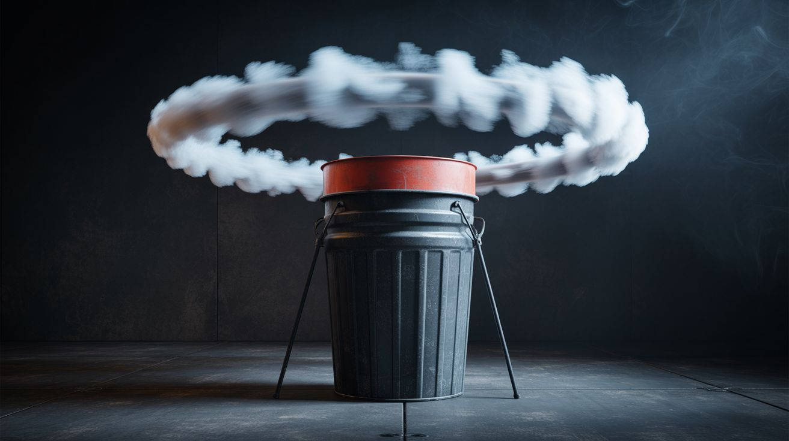

# #319 — Vortex Smoke Ring Cannon

  

> A trash can, rubber membrane, and fog machine produce room-crossing smoke rings that knock cups off tables 20 feet away.

## Ratings

     

## 🧪 What Is It?

A vortex cannon turns any bucket or trash can into a device that launches perfectly formed smoke rings across a room. Cut a circular hole in the bottom of a trash can, stretch a rubber membrane (shower curtain, exercise band, or even a garbage bag) tightly over the open top, fill the inside with fog, and slap the membrane. A perfect toroidal vortex ring launches out of the hole, holds its shape for 20+ feet, and hits with enough force to blow out candles, knock over cups, or ruffle someone's hair from across the room. The build takes five minutes. The effect looks like a physics simulation escaped into reality.

The magic is in the toroidal vortex itself — a donut-shaped spinning mass of air that is self-reinforcing. When you slap the membrane, you push a column of air through the hole. The air at the edges of the hole experiences friction and rolls inward, creating a ring that spins around its own axis like a rotating donut. This spinning motion creates a low-pressure zone at the core of the ring that pulls surrounding air inward, keeping the structure stable as it travels. The ring doesn't dissipate like a normal puff of air — it holds together because the rotation keeps feeding itself. Without smoke, you can't see it happening, but you can feel it — aim at your face from across the room and you'll feel a focused puff of wind that hits like a small fist. With smoke, the ring becomes visible and the effect is jaw-dropping: a ghostly white donut gliding silently through the air, engulfing anything in its path.

The size and speed of the ring depend on two variables: the hole diameter and the slap force. A bigger hole produces a fatter, slower ring that hangs in the air and drifts dramatically. A smaller hole produces a tighter, faster ring that crosses the room in a second and hits harder. The sweet spot for most builds is a 4-6 inch hole in a standard kitchen trash can. Scale it up with a 30-gallon drum and you get rings large enough to engulf a person's entire head. Scale it down with a Pringles can and you get tiny, rapid-fire rings that look like someone is shooting ghost bullets. Either way, this is the single best ratio of build effort to spectacle in this entire collection.

<strong>🧰 Ingredients</strong>

- [ ] Trash can or 5-gallon bucket — the cannon body; rigid sides work best *(curbside, dollar store — free to $5)*
- [ ] Rubber sheet or shower curtain — for the membrane; needs to stretch slightly and snap back *(dollar store, ~$1)*
- [ ] Fog machine — the smoke source; a cheap Halloween fog machine is ideal *(thrift store or seasonal clearance, ~$10-20)*
- [ ] Duct tape — for securing the membrane to the cannon body *(junk drawer)*
- [ ] Scissors or box cutter — for cutting the hole and trimming the membrane *(toolbox)*
- [ ] Optional: bungee cord or large rubber band — for a tighter membrane seal *(hardware store, ~$2)*
- [ ] Optional: dry ice + warm water — alternative smoke source if you don't have a fog machine *(grocery store dry ice, ~$3)*

## 🔨 Build Steps

1. **Cut the hole.** Turn the trash can or bucket upside down. Trace a circle on the bottom — 4-6 inches in diameter for a standard kitchen trash can, proportionally larger for bigger containers. Cut along the line with scissors, a box cutter, or a jigsaw depending on the material. Smooth any rough edges. This is the muzzle. The rounder and cleaner the hole, the cleaner the vortex rings.

2. **Stretch the membrane.** Cut a piece of rubber sheet, shower curtain, or heavy-duty garbage bag large enough to cover the open top of the trash can with several inches of overhang on all sides. Stretch it taut across the opening — you want a drum-like tension, tight enough to snap back when pulled and released, but not so tight that it's rigid. Secure it with duct tape wrapped around the rim, pulling the material tight as you go. For a more durable seal, wrap a bungee cord or large rubber band around the outside of the rim on top of the tape.

3. **Test the air pulse.** Before adding smoke, aim the hole at a candle or a stack of paper cups from 10 feet away. Slap the membrane firmly with an open palm. You should see the candle flicker or the cups move. If nothing happens, the membrane is too loose (tighten it) or the hole is too big (cover part of it with tape to reduce the diameter). Adjust until you get a solid, focused air pulse at distance.

4. **Fill with fog.** Point a fog machine into the hole and fill the cannon with dense fog. Alternatively, drop a chunk of dry ice into warm water inside the cannon — the fog will pool and fill the interior. You want the cannon completely filled with thick, opaque fog so the vortex ring is clearly visible when launched.

5. **Aim and fire.** Point the hole at your target. Slap the membrane with a firm, quick strike — a flat palm works, but a cupped hand or even a drumstick hit gives a sharper, faster pulse. A perfect smoke ring will launch out of the hole, travel in a straight line, and hold its donut shape for 15-25 feet before dissipating. The first few tries may produce shapeless puffs — adjust your slap technique until you get clean rings. Quick, sharp hits produce the best results. Slow pushes just squirt fog without forming a vortex.

6. **Tune the hole size.** If the rings are too fat and slow, cover part of the hole with tape to reduce the diameter. If they're too tight and dissipate quickly, enlarge the hole slightly. The optimal ratio is roughly a hole diameter that's one-third the diameter of the cannon body, but experimentation is half the fun.

7. **Scale up for maximum impact.** A 30-gallon trash can with a rubber exercise band membrane and a 10-inch hole produces rings the size of a basketball that travel 30+ feet. Fill it with dense fog machine output and you get room-crossing smoke donuts that look like something out of a movie. At parties, line up a row of candles across the room and blow them all out with a single ring from 20 feet away.

## ⚠️ Safety Notes

- Fog machine fluid can irritate eyes and airways in poorly ventilated spaces. Use in well-ventilated areas or outdoors. People with asthma should stay upwind.
- The air pulse from a large cannon is surprisingly powerful at close range — don't aim directly at someone's face from under 5 feet. It won't injure, but it's startling and can blow debris into eyes.
- If using dry ice as a fog source, handle it with gloves or tongs. Dry ice causes frostbite on skin contact. Never seal dry ice in an airtight container — the pressure buildup can cause an explosion.
- If using candles for demonstration targets, keep them on stable surfaces away from anything flammable. The fog itself is not flammable (standard fog machine fluid is glycol-based), but the air pulse can blow a candle flame sideways onto nearby materials.

## 🔗 See Also

- [Invisible Bluetooth Speaker](254-invisible-speaker.md)
- [Motion-Activated Jump Scare](255-motion-jump-scare.md)
- [Propane Vortex Cannon](../fire-and-plasma/003-propane-vortex-cannon.md)

**References:**
- [Appliance Teardown Guide](../../docs/reference/appliance-teardown-guide.md)
- [Technical Glossary](../../docs/reference/glossary.md)
