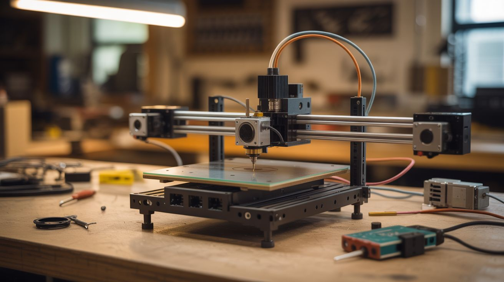

# #069 — Printer Stepper CNC

  

> Three stepper motors from dead printers, some threaded rod, and an Arduino. Build a CNC machine that engraves, mills, or routes.

## Ratings

| Jaw Drop Rating | Brain Melt Level | Wallet Damage | Spicy Level | Clout Potential | Time to Build |
|---|---|---|---|---|---|
| ⭐⭐⭐⭐ | ⭐⭐⭐⭐ | ⭐⭐ | ⭐ | ⭐⭐⭐⭐ | ⭐⭐⭐⭐ |

## What Is It?

Every printer contains precision stepper motors designed for exact, repeatable movement — perfect for CNC (Computer Numerical Control) machines. Salvage three stepper motors (one per axis: X, Y, Z), combine them with threaded rod or lead screws for linear motion, add an Arduino running GRBL firmware and a CNC shield, and you've built a machine that follows precise toolpaths from a computer. Mount a Dremel as the spindle and you can engrave wood, cut PCBs, mill soft metals, or route plastic. Reuse the printer's own linear rails and guide rods for even better precision. People have built CNC machines from printers that rival $300+ commercial kits.

## Ingredients

- [ ] 3 stepper motors — NEMA 17 size preferred, salvage from 2-3 dead printers *(e-waste bin)*
- [ ] Arduino Uno or Nano *(~$5, electronics supplier)*
- [ ] CNC shield V3 + A4988 stepper drivers *(~$8, electronics supplier)*
- [ ] Threaded rod (M8) or lead screws — for linear motion on each axis *(hardware store)*
- [ ] Linear guide rods + bearings — salvage from printers, or buy 8mm smooth rod + LM8UU bearings *(e-waste bin or ~$10)*
- [ ] Plywood or aluminum plate — for the frame *(hardware store)*
- [ ] Flexible shaft couplers — connect stepper shafts to threaded rods *(~$3, hardware store)*
- [ ] Rotary tool (Dremel) or DC spindle motor — as the cutting/engraving tool *(already own or ~$15)*
- [ ] 12V power supply — 5A+ recommended *(old PC power supply or laptop charger)*
- [ ] Nuts, bolts, brackets, zip ties *(hardware store)*

## Build Steps

1. **Harvest stepper motors and linear components.** Disassemble 2-3 dead printers. Extract all stepper motors (usually 2-4 per printer), timing belts, pulleys, linear guide rods, and bearings. Keep the motor wiring harnesses attached — you'll need to identify coil pairs later.
2. **Design the frame.** Sketch a simple 3-axis frame. The X axis moves the tool left/right, Y moves the workpiece front/back, Z moves the tool up/down. Build from plywood for a first version. Use the salvaged linear rods as guide rails — two parallel rods per axis with linear bearings sliding on them.
3. **Install lead screws.** Mount threaded rod or lead screws parallel to each axis's guide rods. Attach anti-backlash nuts (or regular nuts with spring tension) to the moving platform on each axis. When the stepper turns the rod, the platform moves linearly.
4. **Mount the stepper motors.** Attach each stepper motor to one end of its axis's lead screw using a flexible shaft coupler. The coupler absorbs slight misalignment between motor and screw. Secure the motors firmly to the frame.
5. **Build the Z-axis tool mount.** The Z axis carries the cutting tool. Build a vertical platform that rides on Z-axis guide rods, with a clamp or bracket sized to hold your rotary tool or spindle motor. Ensure the tool is rigidly mounted — any wobble becomes cutting error.
6. **Wire the electronics.** Stack the CNC shield on the Arduino. Plug stepper drivers into X, Y, and Z slots. Connect each stepper motor's 4 wires to the correct driver (identify coil pairs with a multimeter — two wires that show low resistance are one coil). Connect the 12V power supply.
7. **Flash GRBL firmware.** Upload GRBL to the Arduino — it's the industry-standard open-source CNC controller. Configure steps-per-mm for your lead screw pitch and stepper motor specs. This translates G-code commands into precise stepper movements.
8. **Install control software.** Use Universal G-Code Sender, Candle, or bCNC on your computer. These send G-code to GRBL, provide manual jog controls, and let you visualize toolpaths before cutting.
9. **Calibrate and test.** Jog each axis manually. Verify travel distance matches commanded distance (if it moves 9mm when you say 10mm, adjust steps-per-mm). Check for binding, skipping, or backlash. Square the axes so X and Y are truly perpendicular.
10. **Run your first job.** Start with a simple engraving in soft wood. Generate G-code from a vector design using software like Inkscape + gcodetools plugin or Easel. Set conservative feed rates and shallow cut depths. Increase speed and depth as you learn the machine's limits.

## Safety Notes

- A spinning rotary tool or spindle can catch loose clothing, hair, or fingers. Wear safety glasses, tie back hair, and keep hands clear of the cutting area while the machine is running. Never reach into the work area during operation.
- CNC machines throw chips and dust. Enclose the machine or wear safety glasses. Wood dust is a health hazard — use dust collection or a respirator when cutting wood.
- Ensure emergency stop capability. Wire a large, accessible kill switch into the power supply line so you can cut power instantly if something goes wrong.

## See Also

- [DVD Laser Engraver](071-dvd-laser-engraver.md)
- [Pen Plotter](072-pen-plotter.md)

**References:**
- [Appliance Teardown Guide](../../reference/appliance-teardown-guide.md)
- [Technical Glossary](../../reference/glossary.md)
- [Electronics & Microcontrollers Guide](../../reference/electronics-and-microcontrollers.md)
