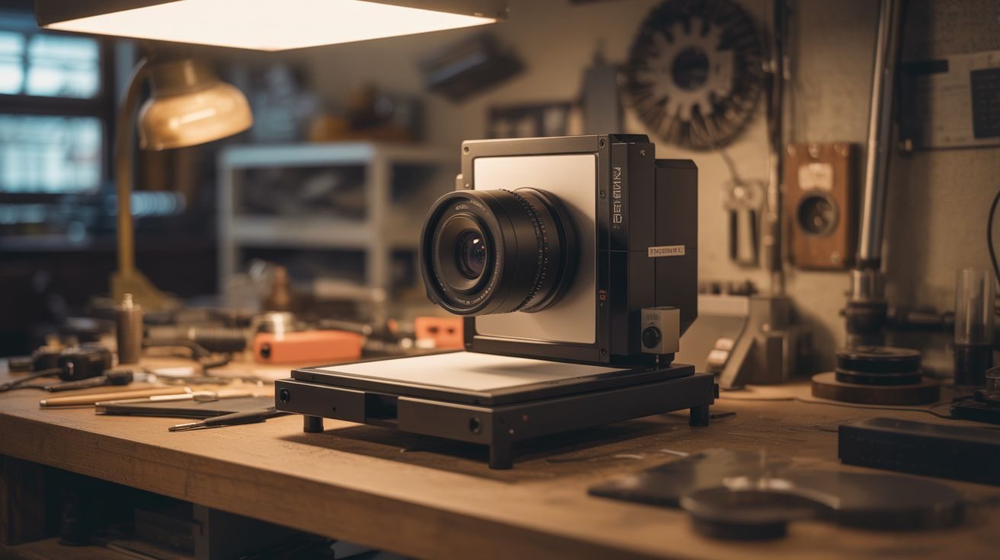

# #070 — Scanner Camera

  

> A flatbed scanner is a giant linear CCD sensor. Add a lens and a light-tight box, and it becomes an ultra-high-resolution camera. Artists use these.

## Ratings

| Jaw Drop Rating | Brain Melt Level | Wallet Damage | Spicy Level | Clout Potential | Time to Build |
|---|---|---|---|---|---|
| ⭐⭐⭐⭐ | ⭐⭐⭐ | ⭐ | ⭐ | ⭐⭐⭐⭐ | ⭐⭐⭐ |

## What Is It?

A flatbed scanner uses a linear CCD sensor — a single row of thousands of photosites that sweeps across the document. That "sweep" is essentially a very slow, very high-resolution exposure, capturing one line of pixels at a time. At 4800 DPI across 8.5 inches, that's over 40,000 pixels wide. Build a light-tight box with a lens (pinhole or glass) focusing an image onto the scanner glass, and each "scan" becomes a photograph with resolution that makes even professional cameras jealous. The exposure takes 10-30 seconds (the scan time), so moving subjects create surreal motion blur streaks, while still subjects are captured in insane detail. Fine art photographers actually use this technique for large-format-style images.

## Ingredients

- [ ] Flatbed scanner — CCD type preferred over CIS; older scanners often have better CCD sensors *(thrift store, e-waste bin)*
- [ ] Large lens — magnifying glass, old projector lens, or camera lens with adapter *(thrift store, ~$5)*
- [ ] Black foam board or cardboard — for building the light-tight box *(dollar store)*
- [ ] Black tape — gaffer tape or electrical tape, for sealing light leaks *(hardware store)*
- [ ] Matte black spray paint — for inside surfaces of the box *(hardware store)*
- [ ] Computer with scanner software — for controlling scans *(already own)*
- [ ] Tripod or stable mount — the whole assembly needs to be still during long exposures *(already own)*

## Build Steps

1. **Test the scanner.** Connect the scanner to your computer and verify it works with scanning software (VueScan, NAPS2, or the manufacturer's software). Do a test scan to confirm the CCD sensor is functional and note the maximum DPI setting.
2. **Determine focal length.** Measure the distance from your lens to the point where it focuses a distant object to a sharp image. This is the focal length, and it determines how tall your box needs to be. A magnifying glass is typically 100-200mm; a camera lens will have the focal length printed on it.
3. **Build the camera body.** Construct a box from black foam board or cardboard. The box sits on top of the scanner with the open bottom facing the scanner glass. The height should equal the lens's focal length. The top of the box has a hole for the lens.
4. **Mount the lens.** Cut a hole in the top of the box sized to hold your lens snugly. The lens should face outward (toward the scene) and focus the incoming image downward onto the scanner glass. For a pinhole camera version, skip the lens and poke a tiny hole (0.3-0.5mm) in aluminum foil taped over the opening.
5. **Seal all light leaks.** The interior must be completely dark except for light entering through the lens. Paint all interior surfaces matte black. Seal every seam and edge with black tape. Even a tiny light leak will show up as a bright streak in the scan.
6. **Set up the scanner software.** Configure for maximum DPI (4800 or 6400 if available). Set to color mode. Disable any auto-exposure or auto-color correction — you want raw sensor data. Preview scan to see what the lens is projecting.
7. **Aim and focus.** Point the lens at a well-lit scene (outdoor daylight works best for the first test). The image on the scanner glass will be upside-down and reversed, like a view camera. Adjust the lens height in the box to achieve sharp focus. Bright scenes work best because the scanner CCD has limited sensitivity.
8. **Scan.** Hit scan at maximum resolution. The CCD sweeps across the glass over 10-30 seconds, capturing the projected image one line at a time. The result is a massive image file with extraordinary detail.
9. **Post-process.** The raw scan will need rotation (180 degrees to flip the inverted image), color correction, and possibly cropping. The resolution will be enormous — a typical scan at 4800 DPI produces images of 100+ megapixels.
10. **Experiment with motion.** Photograph moving subjects — the line-by-line capture creates distinctive motion distortion. A person walking past becomes elongated or compressed depending on direction relative to the scan sweep. This is a feature, not a bug.

## Safety Notes

- Scanner lamps (especially on older CCD scanners) get very hot during extended scanning sessions. Let the scanner cool between scans and don't block ventilation.
- The assembled camera box can be top-heavy when mounted on the scanner. Secure it to prevent tipping, especially if using a heavy glass lens.

## See Also

- [DIY 3D Scanner](074-diy-3d-scanner.md)
- [Laptop Screen Light Table](../computer-and-phone/062-laptop-screen-light-table.md)
