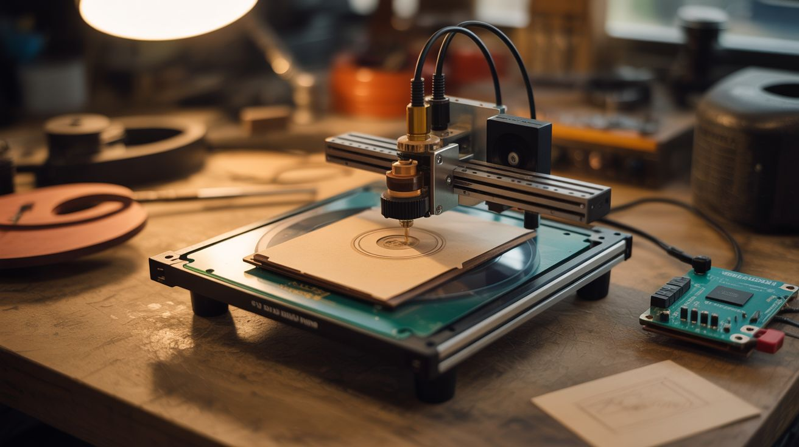

# #071 — DVD Laser Engraver

  

> Two DVD drive sleds plus an Arduino. The DVD burner's laser etches wood, leather, and paper with incredible detail. Tiny but mighty.

## Ratings

| Jaw Drop Rating | Brain Melt Level | Wallet Damage | Spicy Level | Clout Potential | Time to Build |
|---|---|---|---|---|---|
| ⭐⭐⭐⭐ | ⭐⭐⭐ | ⭐ | ⭐⭐ | ⭐⭐⭐⭐ | ⭐⭐⭐ |

## What Is It?

DVD burner drives contain two valuable things: a precision stepper-driven sled mechanism (designed to position a laser to micron accuracy) and a laser diode powerful enough to permanently alter physical media. Two DVD drive sleds mounted perpendicular to each other create X and Y axes with ~40mm travel each. Mount the laser diode from one of the drives, add an Arduino with GRBL firmware and stepper drivers, and you have a tiny laser engraver that can etch detailed images into wood, leather, paper, and dark plastic. The work area is small (about 40x40mm) but the resolution is incredible — finer than most commercial hobby engravers because the DVD sled positioning is absurdly precise.

## Ingredients

- [ ] 2 DVD/Blu-ray drives with burner capability — the burner laser is stronger than a reader *(e-waste bin, old PCs)*
- [ ] Arduino Uno or Nano *(~$5, electronics supplier)*
- [ ] 2x A4988 or DRV8825 stepper drivers *(~$3, electronics supplier)*
- [ ] Laser driver module (LM317 constant-current circuit or commercial laser driver board) *(~$2, electronics supplier)*
- [ ] 5V and 12V power supply *(old PC power supply)*
- [ ] Small heatsink — for the laser diode *(salvage from old electronics)*
- [ ] Laser safety goggles — rated for the laser wavelength (usually 650nm red or 405nm violet) *(~$8, safety supplier)*
- [ ] Small nuts, bolts, and standoffs — for frame assembly *(hardware store)*
- [ ] Base plate — small piece of plywood, acrylic, or aluminum *(hardware store)*

## Build Steps

1. **Extract the sled assemblies.** Open both DVD drives by removing their cover screws. Inside, find the laser sled — a small carriage on guide rails driven by a tiny stepper motor via a worm gear. Carefully remove the entire sled assembly from each drive, keeping the stepper motor, guide rails, and carriage intact.
2. **Extract the laser diode.** From one of the drives (preferably a Blu-ray or DVD burner — they have stronger lasers), remove the laser diode from the optical pickup assembly. It's a small metal can with 3 pins. Handle with care — the lens on the front is fragile and the pins can be damaged by static.
3. **Build the X-Y frame.** Mount one sled on the base plate (this is the Y axis). Mount the second sled perpendicular on top of the first sled's moving carriage (this is the X axis). The X sled's carriage carries the laser. Use small L-brackets or 3D-printed adapters to connect the sleds at right angles.
4. **Mount the laser diode.** Attach the laser diode to a small heatsink, then mount it on the X-axis carriage pointing downward toward the work surface. Focus is critical — adjust the height so the laser focal point is exactly at the work surface level. Some DVD laser assemblies include a focusing lens you can reuse.
5. **Wire the stepper motors.** Connect each sled's stepper motor to a stepper driver. Connect the drivers to the Arduino. Identify the stepper coil pairs with a multimeter if the wire colors aren't labeled.
6. **Wire the laser driver.** Build a constant-current driver circuit using an LM317 regulator or use a commercial laser driver board. Connect to the Arduino's spindle/laser output pin on the CNC shield. The laser must be current-limited — DVD diodes die instantly from overcurrent.
7. **Flash GRBL.** Upload GRBL firmware to the Arduino. Configure the steps-per-mm to match the DVD sled's gear ratio (typically very high, since the sled was designed for micron positioning). Enable laser mode in GRBL settings.
8. **Install and configure software.** Use LaserGRBL (free, Windows) or LightBurn (paid, cross-platform) to convert images into G-code. Set the work area to match your sled travel (~40x40mm). Start with simple line art before attempting photo engraving.
9. **Focus the laser.** Place a test piece of wood or dark paper on the work surface. Jog the laser to the center. Pulse the laser briefly while adjusting the focal height until you get the smallest, brightest dot. Lock the height in place.
10. **Run your first engraving.** Load a simple design, set conservative power and speed settings. The laser should visibly darken wood or paper along its path. Adjust power, speed, and resolution to dial in quality. Dark materials absorb more laser energy and engrave better.

## Safety Notes

- DVD burner lasers can cause permanent eye damage in a fraction of a second. ALWAYS wear laser safety goggles rated for your laser's wavelength when the laser is powered. Never look at the dot or its reflection. Never point the laser at anyone.
- Laser engraving produces smoke and fumes, especially from wood and leather. Work in a well-ventilated area or add a small fan to blow fumes away from the work area. A PC fan works well.
- The laser diode is extremely sensitive to static electricity and overcurrent. Always use a proper constant-current driver, never connect directly to a voltage source. Ground yourself before handling the bare diode.

## See Also

- [Printer Stepper CNC](069-printer-stepper-cnc.md)
- [Pen Plotter](072-pen-plotter.md)
