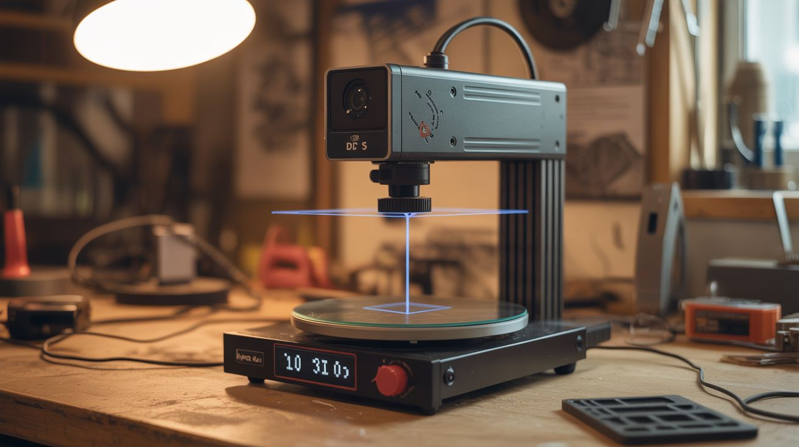

# #074 — DIY 3D Scanner

  

> Microwave turntable motor + webcam + $3 laser line module. Software reconstructs a 3D model from the laser profile. Scan objects, 3D print copies. $10 build.

## Ratings

     

## 🧪 What Is It?

A laser line module projects a thin vertical line of light. When that line hits a 3D object, it curves and bends following the object's surface contour. A camera viewing from a fixed angle sees these curves, and software (triangulation math) converts the curve shape into depth information. Put the object on a turntable (a microwave turntable motor spins at exactly the right speed), rotate 360 degrees while capturing frames, and software stitches together a full 3D point cloud of the object. Export as an STL file and 3D print an exact copy. The entire setup costs under $10 if you salvage the turntable motor and webcam — commercial 3D scanners start at $300.

<strong>🧰 Ingredients</strong>

- [ ] Microwave turntable motor (synchronous AC motor, ~3 RPM) *(dead microwave)*
- [ ] Webcam or old phone as camera — higher resolution = more detail *(junk drawer)*
- [ ] Laser line module — 650nm red, $3 *(electronics supplier)*
- [ ] Turntable platform — microwave glass plate or a flat disc of wood/acrylic *(salvage or cut)*
- [ ] Base/frame — piece of plywood or cardboard to mount everything at fixed positions *(hardware store)*
- [ ] Computer with scanning software — FreeLSS, FabScan, or Horus/Ciclop *(already own)*
- [ ] Optional: Arduino — for controlling the turntable motor and triggering camera frames *(~$5)*
- [ ] Optional: stepper motor — for more precise turntable rotation instead of the synchronous motor *(salvage from printer)*

## 🔨 Build Steps

1. **Salvage the turntable motor.** Remove the turntable drive motor from a dead microwave. It's a small synchronous AC motor (usually 21V AC, 3-4 RPM) mounted under the floor of the microwave cavity. Keep the motor coupling that connects to the glass plate.
2. **Build the turntable.** Mount the motor vertically on your base board. Attach a flat platform (the microwave glass plate works, or cut a circle of plywood) to the motor shaft. The platform should spin smoothly and level — check with a small level while it rotates.
3. **Mount the camera.** Fix the webcam (or phone in a mount) to the base board at a specific position: pointing at the turntable center, level with the platform surface, at a distance of about 15-20cm. The camera angle relative to the laser line determines depth resolution — a wider angle gives more depth sensitivity.
4. **Mount the laser line module.** Fix the laser module to the base board so it projects a vertical line onto the turntable area. The laser should be offset from the camera by 15-30 degrees around the turntable. Power the laser from USB or batteries. Adjust focus so the line is sharp and thin at the turntable distance.
5. **Calibrate positions.** The relative positions of camera, laser, and turntable center must be measured precisely — the software needs these measurements for accurate triangulation. Measure and record: distance from camera to turntable center, distance from laser to turntable center, and the angle between camera and laser lines-of-sight.
6. **Install scanning software.** FreeLSS (runs on Raspberry Pi), FabScan Pi, or Horus (for Ciclop scanner design) are all free and open source. Install on your computer and enter the calibration measurements.
7. **Set up the scanning environment.** Darken the room — ambient light interferes with laser line detection. Place an object on the turntable. The object should be matte (shiny surfaces reflect the laser unpredictably). Dust objects with talcum powder if they're glossy.
8. **Run the scan.** Start the turntable motor and begin capturing frames. The software detects the laser line in each frame, calculates the surface contour, and builds up a 3D point cloud as the object rotates through 360 degrees. A full rotation at 3 RPM takes about 20 seconds.
9. **Process the scan.** The raw point cloud may have noise, gaps, or alignment errors. Use MeshLab (free) to clean the point cloud: remove outlier points, smooth the surface, fill small holes, and generate a solid mesh.
10. **Export and use.** Export the cleaned mesh as an STL file. Open in a 3D printing slicer to print a physical copy, or import into Blender or CAD software for further modification. Compare the scan to the original object to assess accuracy.

## ⚠️ Safety Notes

- The laser line module is typically Class 2 or 3R (under 5mW). Do not stare directly into the laser beam. While brief accidental exposure is generally safe, prolonged direct viewing can damage the retina. Keep the laser pointed at the turntable, not at eye level.
- Microwave turntable motors run on AC power (typically 21V AC from a small transformer, or mains voltage in some models). If wiring directly, use appropriate insulation and never handle live AC connections. Using a low-voltage adapter or an Arduino-controlled stepper motor is much safer.

## 🔗 See Also

- [Scanner Camera](070-scanner-camera.md)
- [Printer Stepper CNC](069-printer-stepper-cnc.md)

**References:**
- [Appliance Teardown Guide](../../docs/reference/appliance-teardown-guide.md)
- [Technical Glossary](../../docs/reference/glossary.md)
- [Electronics & Microcontrollers Guide](../../docs/reference/electronics-and-microcontrollers.md)
