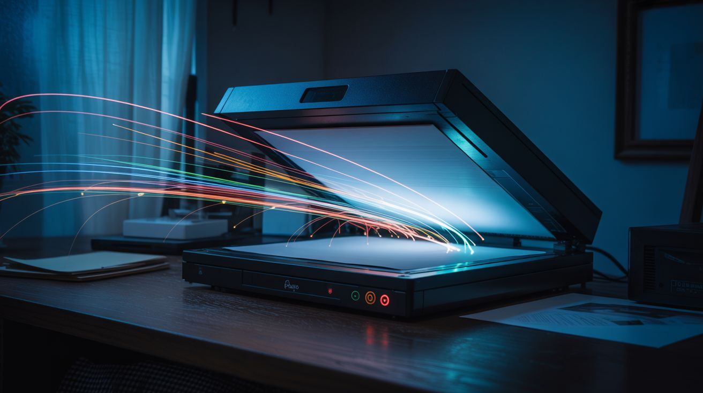

# #323 — Scanner Light Painting

  

> Lock a flatbed scanner open, wave light sources across the glass during a scan — the slow sweep captures long-exposure light trails as art.

## Ratings

     

## 🧪 What Is It?

A flatbed scanner captures images by dragging a narrow line sensor slowly across the scanning surface, one pixel row at a time. A typical scan takes 15-30 seconds to sweep from one end of the glass to the other. If you remove the lid, darken the room, and move light sources across the glass during the scan, each column of the output image corresponds to a different moment in time. The result is a long-exposure light painting — but instead of capturing the entire scene at once like a camera, the scanner records it slice by slice, column by column, left to right. Move an LED smoothly across the glass as the scan head approaches and you get a clean, luminous trail. Shake the light rapidly and you get a textured band of oscillating brightness. Swirl it in circles and you get spirals that distort and stretch as time unfolds across the horizontal axis.

The scanner's resolution is what makes this technique extraordinary. A cheap flatbed scanner captures at 600-1200 DPI — that's orders of magnitude more detail than any camera sensor. A single scan produces an image with millions of pixels of precise, tack-sharp light trail data. The colors are vivid because the scanner's CCD line sensor captures each pixel with controlled exposure, not fighting the dynamic range problems that plague camera-based light painting. Small LEDs produce hair-thin trails. A phone screen displaying a color gradient creates a flowing ribbon of shifting hues. Fiber optic wands produce bundles of parallel threads. Sparklers produce chaotic, organic textures. Every light source creates a distinct visual signature, and because each scan takes 15-30 seconds, you have time to compose your movements deliberately.

The most mind-bending application is scanner portraiture: place your face on the glass (or hover just above it), illuminate yourself from above with a small light, and hold still during the scan. Any movement — a blink, a smile, a head turn — creates surreal distortions because the scan head captures different parts of your face at different moments. Turn your head slowly during the scan and your face stretches or compresses. Blink and one eye appears closed while the other is open. The result is something between a photograph and a time-lapse, with a quality that's impossible to achieve any other way. This is the most boring piece of e-waste in existence — the flatbed scanner everyone has in a closet and never uses — turned into a fine art tool with zero modification and zero cost.

<strong>🧰 Ingredients</strong>

- [ ] Flatbed scanner — any working USB or old parallel-port scanner; the older and cheaper the better *(thrift store, ~$3; or free from a closet, garage sale, or office cleanout)*
- [ ] Computer with scanning software — the scanner's bundled software, or free alternatives like VueScan, NAPS2, or GIMP's scanner plugin *(already own)*
- [ ] Small LED flashlights — the primary light painting tool *(junk drawer — free)*
- [ ] Phone or tablet — the screen makes a versatile, controllable light source with adjustable color *(already own)*
- [ ] Individual colored LEDs + coin cell batteries — for fine, hair-thin light trails *(electronics supplier, ~$2)*
- [ ] LED strip or fairy lights — for multi-point trails and textured patterns *(dollar store, ~$1)*
- [ ] Dark room — the scanner must be in complete darkness for clean results *(close the blinds)*
- [ ] Optional: fiber optic toy or wand — produces bundles of parallel light trails *(dollar store, ~$2)*
- [ ] Optional: colored gel filters or cellophane — for tinting light sources *(craft store, ~$2)*
- [ ] Optional: sparklers — for chaotic, organic light textures *(seasonal/hardware store, ~$3)*
- [ ] Optional: translucent objects — leaves, feathers, fabric scraps, glass beads — for backlit silhouettes *(nature, junk drawer — free)*

## 🔨 Build Steps

1. **Set up the scanner.** Connect the scanner to your computer via USB. Install drivers if needed — most modern operating systems recognize scanners automatically. Open your scanning software and confirm the scanner works with a normal test scan of any document. Remove or prop open the scanner lid so the glass is exposed and accessible from above. The lid's hinge usually lets it stay open at 90 degrees, or remove it entirely by popping it off the hinges.

2. **Darken the room completely.** Light leaks produce a gray or colored wash across the image that drowns out the subtlety of your light trails. Close blinds, cover windows, stuff towels under doors. The room doesn't need to be perfectly dark — scanner glass is only sensitive to light hitting it directly — but ambient light reflecting off the glass surface creates unwanted background glow. Test by running a scan in darkness with no light sources: the result should be a solid black image. If it's not, find and block the light leak.

3. **Configure scanner settings.** Set the resolution to the maximum your scanner supports (600 DPI minimum, 1200+ DPI is better). Set color mode to full color (24-bit or 48-bit). Set brightness and contrast to default — you'll adjust in post-processing. Use the "full scan" mode, not "preview" — preview scans are faster but lower resolution and the timing is harder to work with. Note the scan direction: most scanners sweep from one end to the other. Watch the scan head move during a test scan to confirm which direction it travels.

4. **Practice the timing.** Start a scan and watch the scan head move. It typically takes 15-30 seconds to traverse the full glass surface. Your light painting needs to happen in the zone where the scan head currently is — light painted on glass the scan head has already passed won't be captured, and light painted far ahead of the scan head will have faded by the time it arrives (unless you're using a persistent source pressed against the glass). The sweet spot is moving your light source just slightly ahead of or directly over the scan head position. Do a few practice runs with a simple LED to get the timing and spatial coordination down.

5. **Create your first light painting.** Start a scan. As the scan head begins moving, wave a small LED flashlight across the glass in a smooth arc, keeping pace with the scan head. A slow, deliberate movement produces a clean, bright trail. A fast zigzag produces a textured band. Try circles, spirals, figure-eights, and random scribbling. After the scan completes, view the result. Your first few attempts will likely be too dim (move the light closer to the glass), too blurry (the light source is too large — use a smaller, point-source LED), or poorly timed (you painted in a zone the scan head hadn't reached yet). Iterate.

6. **Experiment with different light sources.** Each source produces a dramatically different aesthetic. A phone screen displaying a solid color creates a wide, smooth ribbon — try slowly changing the color during the scan for a gradient trail. Individual colored LEDs taped to coin cell batteries produce sharp, thin lines. A fiber optic wand creates parallel bundles of fine threads. A candle (held carefully above the glass) produces a warm, flickering, organic trail. LED fairy lights draped across the glass and wiggled during the scan create a constellation effect. Try combining multiple sources in one scan.

7. **Try scanner portraiture.** Place your face gently on the scanner glass (or hover 1-2 inches above it). Have someone hold a dim light source above you to illuminate your features, or use your phone as a fill light. Start the scan and hold perfectly still. The result is an ultra-high-resolution, slightly surreal portrait with the characteristic flatbed-scanner look: extreme close-up detail, shallow depth of field, and perfectly even lighting. Now try it again but slowly turn your head during the scan — the temporal distortion stretches and warps your features in ways that are genuinely artistic, not just glitchy.

8. **Backlit object scans.** Place translucent objects directly on the scanner glass — leaves, flower petals, thin fabric, sliced fruit, feathers, glass beads. Instead of using the scanner's built-in light bar (which illuminates from below), darken the room and illuminate the objects from above with a handheld light during the scan. Move the light at different angles to create shadows and highlights that shift across the image as the scan progresses. The result is a hybrid between a scan and a photograph, with the scanner's extraordinary resolution capturing every vein in a leaf, every fiber in a feather.

9. **Post-process and print.** The raw scans often benefit from contrast and brightness adjustment. Open in any image editor, boost contrast, adjust levels, and crop to the most interesting section. The files are enormous (a 1200 DPI full-bed scan is 100+ megapixels) — perfect for large-format printing. Frame your favorites. Each scan is unique and unrepeatable, making these genuine one-of-one art prints.

## ⚠️ Safety Notes

- There is no electrical, chemical, or mechanical hazard. Flatbed scanners operate at USB voltage levels and the scanning lamp is an LED or cold-cathode fluorescent — neither poses any risk.
- If using sparklers or candles as light sources near the scanner glass, exercise normal fire caution. Don't let molten wax or sparks land on the glass — they can scratch or crack it. Hold them above the glass, not resting on it.
- Don't press your face hard against the scanner glass — it's not designed to support weight. Hover just above or rest gently.
- Scanner lamps are safe to look at but can be bright in a dark room. Don't stare directly at the scan head lamp during operation if you've adapted to darkness.

## 🔗 See Also

- [Scanner Camera](070-scanner-camera.md)
- [Pen Plotter](072-pen-plotter.md)
- [Light Painting Robot](../light-and-visual/178-light-painting-robot.md)
