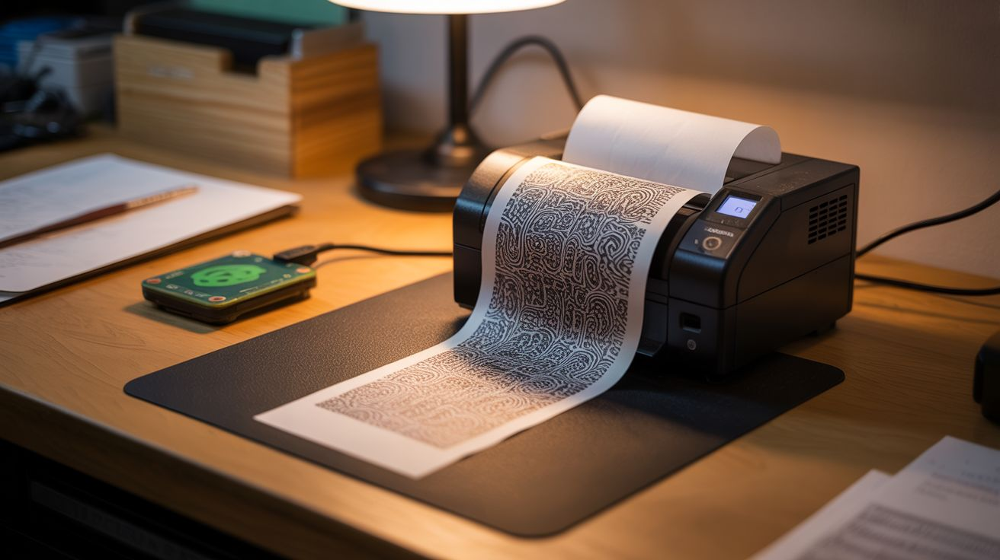

# #324 — Thermal Printer Art Station

  

> Generative algorithmic art printed continuously on receipt paper. A never-ending gallery from a $5 printer.

## Ratings

| Jaw Drop Rating | Brain Melt Level | Wallet Damage | Spicy Level | Clout Potential | Time to Build |
|---|---|---|---|---|---|
| ⭐⭐⭐⭐ | ⭐⭐⭐ | ⭐ | ⭐ | ⭐⭐⭐⭐ | ⭐⭐ |

## What Is It?

A salvaged thermal receipt printer — the kind from cash registers, gas station pumps, point-of-sale systems, and parking meters — connected to a Raspberry Pi or Arduino that feeds it a continuous stream of generative algorithmic art. The printer outputs unique patterns onto receipt paper: fractals, cellular automata, Perlin noise landscapes, mathematical spirals, flow fields, dithered photographs, and random geometric compositions. Each print is generated from a random seed, so no two outputs are ever identical. Mount the printer on a wall with the paper cascading downward, and you have a never-ending art installation that grows longer by the minute — an algorithmic gallery that literally prints itself into existence.

Thermal printers are the ideal medium for generative art because they require no ink, no toner, and no cartridges. The print head contains a row of tiny heating elements that selectively activate to darken the thermal coating on the paper. The only consumable is the paper itself, and 58mm thermal receipt rolls cost about 30 cents each. Ten rolls for $3 gives you hundreds of feet of printable surface. The prints are monochrome — black on white — which forces the algorithms to work with contrast, dithering, and composition rather than relying on color. The constraint produces strikingly graphic results. Cellular automata (like Rule 30 or Rule 110) are particularly compelling: a single row of pixels generates the next row based on simple rules, and the pattern grows downward one line at a time — perfectly matched to the thermal printer's line-by-line output. The result is a complex, fractal-like triangular structure that emerges from trivially simple rules, printed in real-time as the algorithm computes each new row.

The setup doubles as a functional utility station. Between art sessions, the same printer can output daily to-do lists pulled from a task API, weather forecasts, daily quotes, mini-newspapers with headlines scraped from RSS feeds, or QR codes linking to whatever you want. A physical button on the Raspberry Pi housing can switch between modes: press once for generative art, press twice for today's weather, press three times for a random Wikipedia summary. The thermal printer becomes a single-function physical interface — no screen, no app, no notifications, just a strip of paper with exactly what you asked for. The art mode is the showstopper, but the utility mode is what keeps you using it daily. And the whole thing runs on a $5 printer that was destined for a landfill.

## Ingredients

- [ ] Thermal receipt printer — 58mm or 80mm width, with serial (TTL) or USB interface *(salvaged from dead POS system, cash register, gas pump, parking meter — free to $5 on eBay)*
- [ ] Raspberry Pi (any model with GPIO) — the brains; a Pi Zero W is perfect for this *(electronics supplier, ~$10; or use an Arduino Mega for simpler setups)*
- [ ] Thermal paper rolls — 58mm or 80mm width to match the printer *(office supply or online, ~$3 for 10 rolls)*
- [ ] USB cable or TTL serial adapter — for connecting the printer to the Pi *(junk drawer or electronics supplier, ~$2)*
- [ ] 5V power supply, 2A — for the printer (separate from the Pi's power) *(old phone charger — free)*
- [ ] Scrap wood or mounting bracket — for wall-mounting the printer *(scrap bin — free)*
- [ ] Momentary push button — for triggering prints and switching modes *(electronics supplier, ~$0.50)*
- [ ] Wire + connectors — for button and serial wiring *(junk drawer)*
- [ ] Optional: 3D-printed or cardboard enclosure — to house the Pi and wiring cleanly *(scrap bin or 3D printer)*
- [ ] Optional: real-time clock module (DS3231) — for time-based prints if the Pi isn't networked *(electronics supplier, ~$1)*

## Build Steps

1. **Identify the printer interface.** Open the printer or check its label for model information. Most thermal receipt printers use one of three interfaces: TTL serial (a 3-pin or 5-pin connector with TX, RX, and GND — common on small receipt printers), USB (appears as a serial device or printer class device), or RS-232 serial (a DB-9 connector, needs a level shifter to talk to the Pi's 3.3V GPIO). For TTL serial, connect TX from the printer to RX on the Pi GPIO and vice versa — cross the lines. For USB, just plug it in.

2. **Power the printer.** Thermal printers draw significant current during printing — 1-2A at 5V for small models, more for 80mm printers. They need their own power supply, separate from the Pi. Use any 5V adapter rated for 2A+ (old phone chargers, tablet chargers). Connect the printer's power input to this supply. Connect the printer's ground to the Pi's ground as well so the serial signals have a common reference.

3. **Test basic printing.** Install the printer library on the Pi. For Python, use `python-escpos` (pip install python-escpos) for USB printers or the `thermalprinter` library for serial. For Arduino, use the Adafruit Thermal Printer library. Send a simple text string: "Hello World" followed by a feed command. The printer should print the text and advance the paper. If nothing happens, check baud rate (common defaults: 9600, 19200, 115200), wiring (TX/RX swapped?), and power (printer may need to be powered on before the Pi sends data).

4. **Print a test image.** Thermal printers accept 1-bit bitmap images — black or white, no grayscale. Convert any image to a 1-bit bitmap at the printer's native width (384 pixels for 58mm, 576 pixels for 80mm) using Python's Pillow library or ImageMagick. Send it to the printer via the ESC/POS image command. The dithering algorithm you use (Floyd-Steinberg, ordered, random) dramatically affects the visual quality — Floyd-Steinberg produces the most photographic results, ordered dithering gives a halftone-screen look, and random dithering creates a grainy, textured aesthetic.

5. **Write cellular automata generators.** Start with elementary cellular automata — specifically Rule 30 and Rule 110. Initialize a row of 384 (or 576) pixels with a single black pixel in the center. Apply the rule to generate the next row from the current row. Print each row as it's generated. The pattern grows downward one line at a time, producing complex triangular structures from a single-pixel seed. Let it run — a 30-foot roll of receipt paper covered in Rule 30 is mesmerizing. Try different rules (there are 256 elementary rules, each producing a different pattern), different initial conditions (random starting row vs. single pixel), and different widths.

6. **Add Perlin noise landscapes.** Generate a 2D Perlin noise field and threshold it at different levels to create contour-line landscapes — like topographic maps of imaginary terrain. Each row of the printout is one horizontal slice through the noise field, with the vertical axis representing the length of the paper. Slowly shift the noise parameters as you move down the paper so the landscape evolves organically. The result looks like a continuous cross-section through mountains, valleys, and plains — an infinite landscape unrolling from the printer.

7. **Build a flow field visualizer.** Generate a 2D vector field from Perlin noise or mathematical functions (sine waves, spirals, attractors). Drop virtual particles at random positions and trace their paths through the field. Plot each particle position as a black pixel on the print line corresponding to its vertical position. The result is a field of curved, flowing lines that converge, diverge, and swirl — reminiscent of iron filings around magnets or wind maps. Each random seed produces a completely different composition.

8. **Create a playlist system.** Write a main loop that cycles through your generative algorithms, running each for 2-5 minutes (or a configurable number of printed lines) before switching to the next. Add a header line between each algorithm naming what's printing. The printer becomes a continuous, auto-rotating gallery — leave it running and come back to find a 6-foot cascade of varied algorithmic art hanging from the wall.

9. **Add a physical button.** Wire a momentary push button to a GPIO pin on the Pi. Program it with multiple functions: single press starts/stops printing, double press cycles to the next algorithm, long press triggers a special print (today's date, a random quote, a QR code). The button makes the station feel like a physical appliance rather than a computer project — press for art, tear off what you like.

10. **Mount and display.** Attach the printer to a wall, shelf edge, or custom bracket with the paper exit pointing downward. The paper should cascade freely as it prints — gravity keeps it straight and the growing curtain of art is the visual spectacle. Tuck the Raspberry Pi and wiring behind the printer or in a small enclosure. Feed new paper rolls through the top. Tear off finished sections, trim them, and frame the ones you love. Thermal prints fade over time in sunlight (months to years depending on exposure), so frame behind UV-protective glass or scan your favorites for archival digital copies.

## Safety Notes

- The thermal print head reaches temperatures high enough to darken thermal paper — about 70-80 degrees Celsius. Don't touch the print head during or immediately after printing. It cools quickly once printing stops, but give it 30 seconds.
- Thermal paper rolls are chemically coated (BPA or BPS in some formulations). Wash your hands after handling large quantities. Don't eat while handling thermal paper. For prolonged art sessions, this is a minor concern — for daily receipts at a gas station, less so.
- The Raspberry Pi operates at 5V — no shock hazard. Ensure the printer's power supply is properly rated and not a damaged unit with exposed wiring.
- If wall-mounting, secure the printer firmly — a falling printer with a dangling paper trail is a tripping hazard and a mess.

## See Also

- [Pen Plotter](072-pen-plotter.md)
- [Generative Art Plotter](../python-projects/142-generative-art-plotter.md)
- [Inkjet Bioprinter](073-inkjet-bioprinter.md)

**References:**
- [Electronics & Microcontrollers Guide](../../reference/electronics-and-microcontrollers.md)
