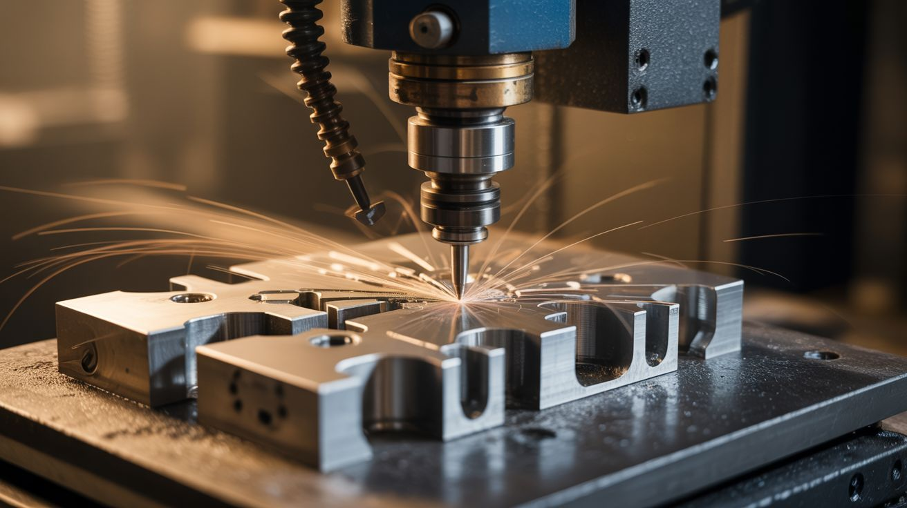

# 🖨️ Printer & Scanner

  

  

> Printers are the most underrated source of precision motion components on the planet.

Inside every dead inkjet or laser printer are stepper motors, precision linear rails, timing belts, optical encoders, and high-resolution sensors. Scanners contain massive linear CCD arrays capable of capturing more detail than most cameras. DVD drives pack tiny stepper-driven laser sleds with micron-level positioning. These components were engineered for exact, repeatable motion — and that makes them perfect for CNC machines, laser engravers, pen plotters, 3D scanners, and even bioprinters.

The printer that jammed for the last time? It's about to become the most precise tool in your shop.

---

## Builds

<a class="cat-card" href="069-printer-stepper-cnc.md">
#069Printer Stepper CNC

Jaw

Brain

Wallet

Spicy

Clout

Time

</a>
<a class="cat-card" href="070-scanner-camera.md">
#070Scanner Camera

Jaw

Brain

Wallet

Spicy

Clout

Time

</a>
<a class="cat-card" href="071-dvd-laser-engraver.md">
#071DVD Laser Engraver

Jaw

Brain

Wallet

Spicy

Clout

Time

</a>
<a class="cat-card" href="072-pen-plotter.md">
#072Pen Plotter

Jaw

Brain

Wallet

Spicy

Clout

Time

</a>
<a class="cat-card" href="073-inkjet-bioprinter.md">
#073Inkjet Bioprinter

Jaw

Brain

Wallet

Spicy

Clout

Time

</a>
<a class="cat-card" href="074-diy-3d-scanner.md">
#074DIY 3D Scanner

Jaw

Brain

Wallet

Spicy

Clout

Time

</a>
<a class="cat-card" href="323-scanner-light-painting.md">
#323Scanner Light Painting

Jaw

Brain

Wallet

Spicy

Clout

Time

</a>
<a class="cat-card" href="324-thermal-printer-art-station.md">
#324Thermal Printer Art Station

Jaw

Brain

Wallet

Spicy

Clout

Time

</a>

---

### Suggested Build Order

Start with zero-modification hacks, progress toward precision CNC:

1. **[#323 — Scanner Light Painting](323-scanner-light-painting.md)** — Zero mod. Open the lid, wave lights, get art.
2. **[#070 — Scanner Camera](070-scanner-camera.md)** — Repurpose scanner optics for photography.
3. **[#072 — Pen Plotter](072-pen-plotter.md)** — Your first CNC motion project.
4. **[#074 — DIY 3D Scanner](074-diy-3d-scanner.md)** — Laser + turntable + camera.
5. **[#324 — Thermal Printer Art Station](324-thermal-printer-art-station.md)** — Generative art on receipt paper.
6. **[#071 — DVD Laser Engraver](071-dvd-laser-engraver.md)** — Precision laser from DVD drives.
7. **[#069 — Printer Stepper CNC](069-printer-stepper-cnc.md)** — Full CNC from printer parts.
8. **[#073 — Inkjet Bioprinter](073-inkjet-bioprinter.md)** — Print conductive traces. The endgame.

### Related Categories

- [Art & Installation](../art-and-installation/) — When precision motion makes art
- [Power Tools Remixed](../power-tools-remixed/) — More tool repurposing
- [Python Projects](../python-projects/) — Software-driven fabrication

---

## 📚 Reference Guides

- [Appliance Teardown Guide](../../docs/reference/appliance-teardown-guide.md)
- [Tools Needed](../../docs/reference/tools-needed.md)
- [Sourcing Guide](../../docs/reference/sourcing-guide.md)
- [Difficulty & Ratings Guide](../../docs/reference/difficulty-guide.md)
