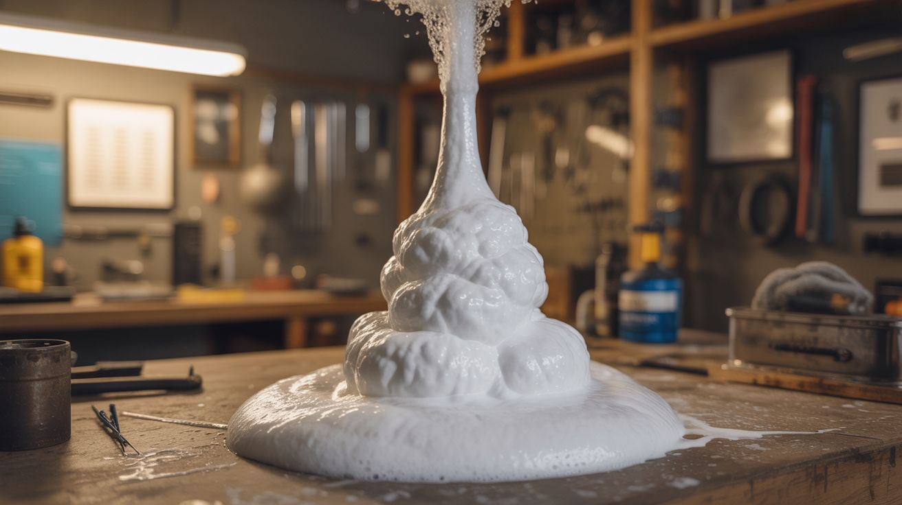

# #102 — Elephant Toothpaste

  

> Hydrogen peroxide meets a catalyst and erupts into a 10-foot tower of steaming foam.

## Ratings

| Jaw Drop Rating | Brain Melt Level | Wallet Damage | Spicy Level | Clout Potential | Time to Build |
|---|---|---|---|---|---|
| ⭐⭐⭐⭐⭐ | ⭐ | ⭐⭐ | ⭐⭐ | ⭐⭐⭐⭐⭐ | ⭐ |

## What Is It?

Hydrogen peroxide naturally decomposes into water and oxygen gas, but it does it slowly — a bottle of the stuff lasts months in your medicine cabinet. Add potassium iodide as a catalyst and dish soap as a foaming agent, and the decomposition happens all at once. The oxygen gas inflates the soap into a massive column of warm foam that erupts out of whatever container you use. With 12% salon-grade peroxide in a narrow-necked bottle, you can get eruptions over 10 feet tall. It's exothermic (the foam is warm to the touch), completely non-toxic, and the single most reliable crowd-pleaser in all of kitchen chemistry.

## Ingredients

- [ ] Hydrogen peroxide 12% (40-volume) — salon/beauty supply grade *(beauty supply store, online)*
- [ ] Potassium iodide powder — the catalyst *(chemistry supplier, online)*
- [ ] Dish soap — Dawn or similar *(grocery store)*
- [ ] Food coloring — multiple colors for striped effect *(grocery store)*
- [ ] Narrow-necked bottle or flask — taller = taller eruption *(dollar store, lab supply)*
- [ ] Warm water *(tap)*
- [ ] Small cup for mixing catalyst *(kitchen)*
- [ ] Safety goggles *(hardware store)*
- [ ] Rubber gloves *(pharmacy)*
- [ ] Tarp or outdoor area — this makes a mess *(garage, yard)*

## Build Steps

1. **Set up the mess zone.** Lay a tarp on the ground outdoors or in a garage. The foam expands rapidly and goes everywhere. This is not an indoor-on-the-kitchen-counter experiment. Place your bottle in the center of the tarp.
2. **Prepare the bottle.** Pour 1 cup (240 mL) of 12% hydrogen peroxide into the bottle. Add a generous squirt of dish soap — about 2 tablespoons. Add food coloring if desired. For a striped effect, drizzle different colors down the inside walls of the bottle before adding peroxide.
3. **Mix the catalyst.** In a separate small cup, dissolve 1 tablespoon of potassium iodide in 3 tablespoons of warm water. Stir until dissolved. This is your trigger solution.
4. **Clear the blast zone.** Make sure nobody is standing directly over the bottle. The eruption is fast and tall. Goggles on. Gloves on.
5. **Pour the catalyst in one motion.** Dump the entire potassium iodide solution into the bottle quickly and step back. The reaction starts within 1-2 seconds.
6. **Watch the eruption.** Foam rockets out of the bottle and keeps going. A narrow-necked bottle focuses the stream upward. A wide container creates a spreading blob. The foam is warm (exothermic reaction) and safe to touch.
7. **Scale it up.** For truly massive eruptions, use a 5-gallon bucket, a full liter of 30% peroxide (industrial grade), and proportionally more catalyst. This is how the viral YouTube videos get 30+ foot columns.
8. **Clean up.** The foam is just soapy water with dissolved iodide. Hose it off the tarp. It's safe for grass and drains.

## Safety Notes

- Hydrogen peroxide above 12% can cause chemical burns on skin and will bleach clothing on contact. Wear gloves and goggles. If it contacts skin, flush immediately with water.
- The reaction is exothermic — the foam comes out warm, around 100-130°F. Not dangerous but surprising if you stick your hand in the column mid-eruption.
- Never seal hydrogen peroxide in a closed container. Decomposition produces oxygen gas, and a sealed container becomes a pressure bomb.

## See Also

- [Dry Ice Bubble Cauldron](120-dry-ice-bubble-cauldron.md)
- [Chemiluminescent Fountain](111-chemiluminescent-fountain.md)

**References:**
- [Appliance Teardown Guide](../../reference/appliance-teardown-guide.md)
- [Technical Glossary](../../reference/glossary.md)
- [Chemicals Reference](../../reference/chemicals.md)
