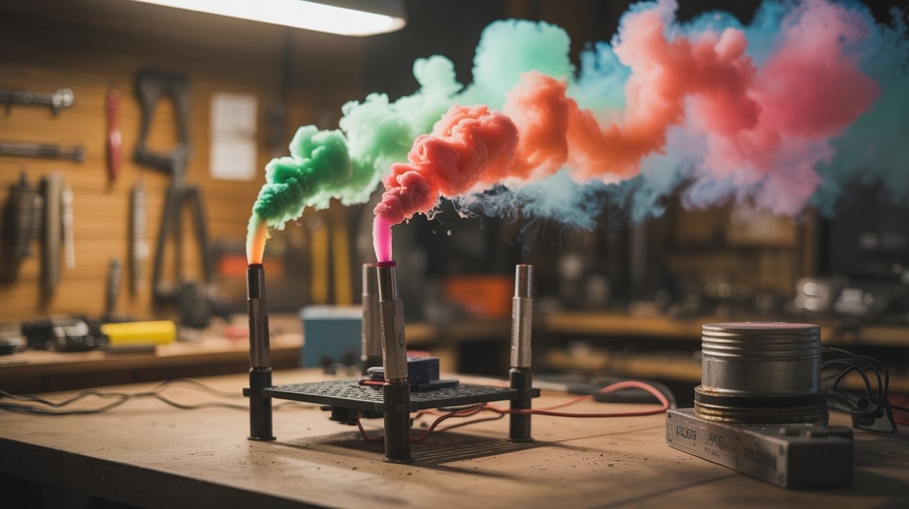

# #103 — Smoke Bomb Array

  

> KNO3 and sugar fused into smoke bombs, sequenced with a Pi controller for synchronized color eruptions.

## Ratings

| Jaw Drop Rating | Brain Melt Level | Wallet Damage | Spicy Level | Clout Potential | Time to Build |
|---|---|---|---|---|---|
| ⭐⭐⭐⭐ | ⭐⭐ | ⭐⭐ | ⭐⭐⭐ | ⭐⭐⭐⭐⭐ | ⭐⭐ |

## What Is It?

Potassium nitrate (stump remover from the hardware store) mixed with sugar creates a smoke composition that burns slowly and produces thick, voluminous smoke. Add organic dye powder and the smoke takes on vivid color. Build multiple smoke bombs in different colors, wire them with nichrome igniter wire to a relay board, and program a Raspberry Pi to fire them in sequence. Timed to music, fired in choreographed patterns — this is how professionals create smoke effects for film, photography, and gender reveals. Except you built it for $20 instead of paying $200.

## Ingredients

- [ ] Potassium nitrate (KNO3) — sold as stump remover (Spectracide brand) *(hardware store)*
- [ ] Plain white sugar *(grocery store)*
- [ ] Organic dye powder — red, blue, green, purple, orange *(craft supply, candle dye suppliers)*
- [ ] Cardboard tubes — toilet paper rolls or similar *(recycling bin)*
- [ ] Nichrome wire — for electric ignition *(vape supply, online)*
- [ ] Raspberry Pi (any model) *(electronics supplier)*
- [ ] Relay module — 4 or 8 channel *(electronics supplier)*
- [ ] Fuse wire or cotton string *(craft store)*
- [ ] Aluminum foil *(kitchen)*
- [ ] Old saucepan — dedicated, never use for food again *(thrift store)*

## Build Steps

1. **Cook the smoke composition.** Mix 3 parts KNO3 to 2 parts sugar by weight in an old saucepan over LOW heat. Stir constantly. The sugar melts first, then the mixture turns into a thick brown paste resembling peanut butter. Do this OUTDOORS on a hot plate or camp stove. Never use your kitchen stove.
2. **Add the dye.** Once the mixture reaches peanut butter consistency, remove from heat and quickly stir in organic dye powder — about 1-2 tablespoons per batch. Work fast; it starts to harden as it cools.
3. **Pack the tubes.** Spoon the mixture into cardboard tubes. Press it down firmly with a dowel but don't pack it so tight that air can't flow through. Leave about 1/2 inch at the top.
4. **Insert the ignition wire.** Push a small loop of nichrome wire into the top of each smoke bomb. The wire leads should extend out at least 6 inches for connection to your relay board. Alternatively, insert a cotton fuse.
5. **Seal and cure.** Wrap the outside of each tube in aluminum foil, leaving the top open for smoke output. Let them cure for 24 hours in a cool, dry place.
6. **Wire the relay board.** Connect each pair of nichrome wire leads to a relay channel on your relay module. Wire the relay module to a 12V power supply (an old laptop charger works). Connect the relay control pins to the Pi's GPIO pins.
7. **Write the sequence program.** Python script on the Pi that activates each relay in sequence with programmable delays. Start simple: fire one every 5 seconds. Then get creative — fire three at once, alternate sides, build to a grand finale.
8. **Set up the array.** Place smoke bombs in a line or pattern outdoors. Run wires back to the Pi (at a safe distance). Verify each relay clicks before connecting the power supply to nichrome wires.
9. **Fire the sequence.** Run the script. Each relay sends current through its nichrome wire, which heats red-hot and ignites the smoke composition. Colored smoke billows up in programmed sequence.
10. **Film it.** Set up a camera at a safe distance. Slow-motion captures the smoke beautifully. Sunset light behind smoke creates insane backlit color effects.

## Safety Notes

- Cook the KNO3/sugar mixture OUTDOORS only. If the mixture ignites during cooking (rare but possible if heated too fast), do not pour water on it. Let it burn out in the saucepan. Have a fire extinguisher nearby.
- Potassium nitrate is an oxidizer. Store it away from flammable materials. Do not store assembled smoke bombs near heat sources.
- Nichrome wire gets extremely hot when current flows through it. Never touch it while the system is armed. Always have a master kill switch (physical toggle) between the power supply and relay board.

## See Also

- [Fireworks Sequencer](../pi-and-arduino/121-fireworks-sequencer.md)
- [Colored Fire](101-colored-fire.md)

**References:**
- [Appliance Teardown Guide](../../reference/appliance-teardown-guide.md)
- [Technical Glossary](../../reference/glossary.md)
- [Chemicals Reference](../../reference/chemicals.md)
- [Electronics & Microcontrollers Guide](../../reference/electronics-and-microcontrollers.md)
