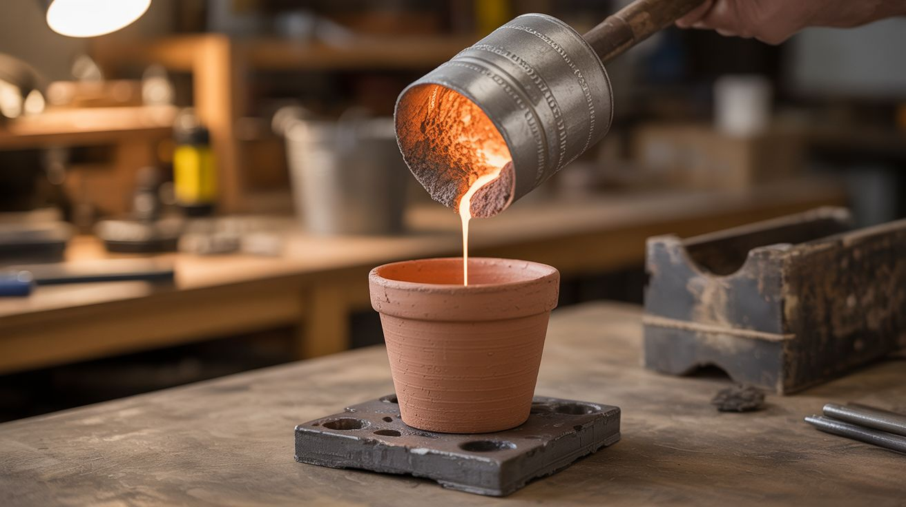

# #105 — Thermite Flower Pot

  

> Iron oxide and aluminum powder react at 4000°F, dripping molten iron through a clay pot into a mold below.

## Ratings

| Jaw Drop Rating | Brain Melt Level | Wallet Damage | Spicy Level | Clout Potential | Time to Build |
|---|---|---|---|---|---|
| ⭐⭐⭐⭐⭐ | ⭐⭐ | ⭐⭐ | ⭐⭐⭐⭐⭐ | ⭐⭐⭐⭐⭐ | ⭐ |

## What Is It?

Thermite is a mixture of iron oxide (rust) and aluminum powder. When ignited, the aluminum steals the oxygen from the iron oxide in a violently exothermic reaction that produces molten iron at over 4000°F — hotter than lava. Suspend a clay flower pot above a sand mold, pack it with thermite, light it with a magnesium ribbon, and watch as white-hot molten iron drips through the drain hole into the mold below. When it cools, you have a solid iron casting made from two powders and a flower pot. This is foundational metallurgy — literally smelting metal from oxide — done in the most dramatic way possible.

## Ingredients

- [ ] Iron oxide (rust) powder — fine red/black iron oxide, Fe2O3 *(online, art supply stores, or make by soaking steel wool in vinegar)*
- [ ] Aluminum powder — fine mesh, 200-325 mesh *(online pyro suppliers)*
- [ ] Clay flower pot — with drain hole in the bottom *(garden center)*
- [ ] Magnesium ribbon — for ignition, thermite needs ~3000°F to start *(online, chemistry supplier)*
- [ ] Sand bucket — play sand in a steel bucket for the mold and catch basin *(hardware store)*
- [ ] Steel bucket or fire-safe container — for mounting the pot above the mold *(hardware store)*
- [ ] Cinder blocks or steel frame — to elevate the pot *(hardware store)*
- [ ] Long-handled lighter or road flare *(hardware store)*
- [ ] Safety goggles — shade 5 or welding goggles, the reaction is BRIGHT *(hardware store)*
- [ ] Fire-resistant gloves *(hardware store)*

## Build Steps

1. **Choose your location.** This must be done outdoors on bare dirt, concrete, or gravel. NEVER on a wood deck, near grass, or near structures. Clear a 15-foot radius. This is the real deal — 4000°F molten metal.
2. **Build the support structure.** Stack cinder blocks or weld a steel frame to hold the clay pot about 18-24 inches above the sand mold. The pot must be stable and the drain hole centered over the mold cavity.
3. **Prepare the mold.** Pack damp sand into the steel bucket. Carve your desired shape into the sand — a simple bowl, ingot, or decorative form. The molten iron will fill this mold. Make sure it's deep enough to contain all the iron produced.
4. **Mix the thermite.** Combine iron oxide and aluminum powder at a ratio of roughly 8:3 by weight (Fe2O3:Al). Mix thoroughly but GENTLY in a plastic container. Never use metal containers or metal tools for mixing — a spark could ignite it. Use a wooden stick or plastic spoon.
5. **Load the flower pot.** Place a small square of tissue paper or thin cardboard over the drain hole inside the pot (to prevent powder from falling through before ignition). Pour the thermite mixture into the pot.
6. **Set the igniter.** Push a 6-inch length of magnesium ribbon into the top of the thermite. The ribbon should stick up so you can light it from arm's length. Magnesium burns at ~3100°F, which is hot enough to start the thermite reaction.
7. **Clear everyone back.** Minimum 15-foot distance for spectators. Welding goggles or shade 5 safety glasses required — the reaction produces intense UV light that can damage eyes, just like arc welding.
8. **Ignite.** Light the magnesium ribbon with a long-handled lighter or road flare. Step back immediately. The magnesium burns bright white for a few seconds, then the thermite catches — you'll know because it goes from bright to BLINDING. Molten iron drips through the drain hole into the sand mold below.
9. **Let it cool.** The reaction lasts 30-60 seconds. Let everything cool for at least 30 minutes before approaching. The iron casting and pot will remain dangerously hot long after the visible reaction stops.
10. **Retrieve your casting.** Dig the cooled iron out of the sand mold. Clean off the sand. You now have a solid iron casting made from rust, aluminum, and a flower pot.

## Safety Notes

- Thermite produces molten iron at 4000°F+ and intense UV radiation. NEVER look directly at the reaction without welding-grade eye protection (shade 5 minimum). It is brighter than arc welding.
- Molten iron spatters can travel several feet. Wear long sleeves, closed shoes, and fire-resistant gloves. Keep skin fully covered. Do not stand over the pot when lighting.
- Thermite cannot be extinguished with water. Water hitting molten thermite causes a steam explosion that sprays molten metal in all directions. If something goes wrong, step back and let it burn out. It's self-limiting — once the mixture is consumed, the reaction stops.

## See Also

- [Permanganate Auto-Ignition](115-permanganate-auto-ignition.md)
- [Colored Fire](101-colored-fire.md)

**References:**
- [Chemicals Reference](../../reference/chemicals.md)
