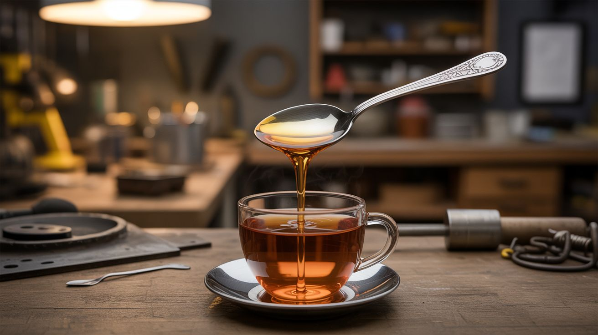

# #106 — Gallium Melting Spoon

  

> Cast a spoon from gallium — a metal that melts at 86°F. Stir your hot tea and watch the spoon dissolve.

## Ratings

     

## 🧪 What Is It?

Gallium is a metal with a melting point of just 86°F (29.8°C) — below body temperature. It looks and feels like aluminum when solid, but hold it in your hand and it literally melts. Cast it into a spoon mold, hand the spoon to an unsuspecting friend, ask them to stir their hot coffee, and watch their face as the spoon turns to liquid and pools at the bottom of the mug. It's the purest magic trick in chemistry because there's no sleight of hand — it's real physics. The metal is non-toxic and can be reused endlessly. Melt, cast, prank, repeat.

<strong>🧰 Ingredients</strong>

- [ ] Gallium metal — 50-100 grams, 99.99% pure *(online, ~$20-30 for 50g)*
- [ ] Silicone spoon mold — or make one from food-safe silicone molding putty *(craft store, online)*
- [ ] Small saucepan or container for melting *(kitchen — gallium is food-safe)*
- [ ] Hot water — just above 86°F to melt the gallium *(tap)*
- [ ] Popsicle stick or stir stick *(craft store)*

## 🔨 Build Steps

1. **Melt the gallium.** Place your gallium chunks in a small container and set it in a bowl of hot tap water. Gallium melts at just 86°F, so hot water from the faucet (around 120°F) works perfectly. Within a few minutes, you'll have a puddle of liquid metal.
2. **Prepare the mold.** If using a silicone spoon mold, make sure it's dry. If making your own, press a real metal spoon into two-part silicone molding putty to create a negative. Let the mold cure according to the putty instructions.
3. **Pour the casting.** Slowly pour the liquid gallium into the spoon mold. Tap the mold gently to release air bubbles. Gallium has high surface tension, so it may need a little encouragement to fill thin areas like the handle.
4. **Cool and solidify.** Place the mold in the refrigerator for 30 minutes. Gallium solidifies into a shiny, metallic spoon that looks and feels like real silverware. It even has a satisfying metallic ring when tapped.
5. **Demold carefully.** Flex the silicone mold to pop out the spoon. Gallium is somewhat brittle when solid, so don't bend the thin handle too aggressively. If any rough edges exist, smooth them with fine sandpaper.
6. **Set the prank.** Place the gallium spoon alongside regular silverware. When someone uses it to stir a hot drink (coffee, tea, hot cocoa), the spoon begins melting within seconds. The handle droops, the bowl detaches, and liquid metal pools at the bottom of the mug.
7. **Recover the gallium.** Let the drink cool. The gallium solidifies at the bottom and can be fished out, remelted, and recast infinitely. Nothing is consumed in this prank.

## ⚠️ Safety Notes

- Gallium is non-toxic and safe to handle, but it stains aluminum permanently. Liquid gallium causes aluminum to crumble by disrupting its grain boundaries. Keep gallium away from aluminum cookware, cans, and foil.
- While gallium itself is safe, don't actually drink a beverage that had gallium melted in it. The prank is for the visual — pour the drink out and reclaim the gallium.
- Gallium can stain skin and surfaces with a gray residue. Wash hands with soap after handling. The residue comes off skin easily but can mark fabric.

## 🔗 See Also

- [Bismuth Crystal Garden](107-bismuth-crystal-garden/)
- [Instant Ice Sculpture](108-instant-ice-sculpture/)

