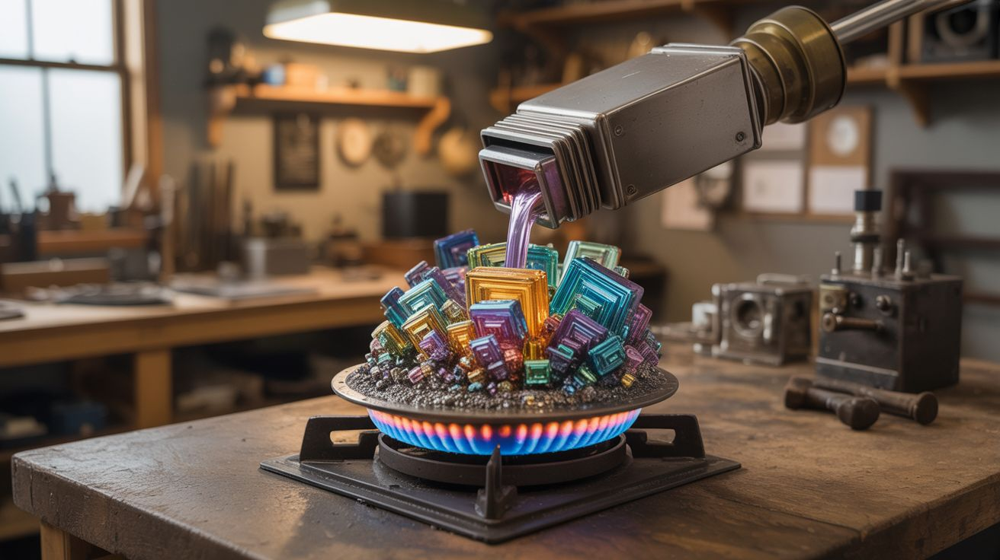

# #107 — Bismuth Crystal Garden

  

> Melt bismuth on the stove, slow-cool it, and pull out rainbow-colored hopper crystals worth $20-50 each.

## Ratings

     

## 🧪 What Is It?

Bismuth melts at 520°F — hot, but achievable on a kitchen stove. When it cools, it doesn't form boring lumps. It grows geometric "hopper" crystals: staircase-shaped cubes and rectangles that look like alien architecture. As the crystals cool in air, a thin oxide layer forms on the surface that refracts light into iridescent rainbow colors — blues, purples, golds, pinks. Every crystal is unique. People sell individual bismuth crystals on Etsy for $20-50, and a pound of raw bismuth costs about $15. The profit margin is absurd for something this beautiful.

<strong>🧰 Ingredients</strong>

- [ ] Bismuth metal — 1-2 pounds of ingots or chunks, 99.99% pure *(online metal suppliers, ~$15/lb)*
- [ ] Steel saucepan — dedicated, never use for food again *(thrift store)*
- [ ] Steel ladle or large spoon — for skimming and pouring *(thrift store)*
- [ ] Pliers or tweezers — for pulling crystals *(workshop)*
- [ ] Heat-resistant gloves *(hardware store)*
- [ ] Safety goggles *(hardware store)*
- [ ] Hot plate or stove — needs to reach ~550°F *(kitchen or workshop)*

## 🔨 Build Steps

1. **Melt the bismuth.** Place bismuth chunks in a steel saucepan on medium-high heat. Bismuth melts at 520°F. It will transition from solid to a shiny silver liquid. Stir occasionally with the steel ladle. The melt takes 10-15 minutes.
2. **Skim the dross.** A thin gray oxide layer forms on top of the molten bismuth. Carefully scrape this off with the ladle and discard it on a fire-safe surface. You want the liquid surface as clean as possible — dross interferes with crystal formation.
3. **Begin the slow cool.** Reduce heat to the lowest setting. Crystal formation requires slow, controlled cooling. If the bismuth cools too fast, you get small, messy crystals. Too slow and nothing interesting forms. The sweet spot is about 1-2 degrees per minute.
4. **Watch for crystal formation.** As the bismuth cools, you'll see the surface start to solidify at the edges first. Small geometric shapes begin to appear on the surface — these are the crystal tops. This is your window.
5. **Pull the crystals.** When the surface is about half-solidified (roughly 5-15 minutes of cooling), grab the forming crystals with pliers and slowly lift them out of the melt. Liquid bismuth drains off, leaving the crystal structure behind. The longer you wait, the larger the crystals but the higher the risk of the whole pot solidifying.
6. **Let the colors develop.** Set the pulled crystals on a heat-safe surface and let them cool in air. The iridescent oxide layer forms as they cool — this is where the rainbow colors come from. Different cooling rates produce different color patterns.
7. **Harvest remaining crystals.** Once the pot has fully solidified, you can sometimes crack it open to reveal crystals that formed inside the mass. These interior crystals often have the most dramatic geometric shapes.
8. **Remelt and repeat.** Any bismuth that didn't form good crystals goes back in the pot for the next round. Bismuth is infinitely reusable. Each batch teaches you more about timing and temperature.

## ⚠️ Safety Notes

- Molten bismuth is over 500°F. Splashes cause serious burns. Wear long sleeves, heat-resistant gloves, and safety goggles. Never add wet or cold objects to the melt — steam explosions can splatter molten metal.
- Work in a well-ventilated area. While bismuth itself is non-toxic (it's the active ingredient in Pepto-Bismol), the oxide fumes at high temperature can be irritating.
- The saucepan and any tools used with molten bismuth are permanently retired from food use. Label them clearly.

## 🔗 See Also

- [Gallium Melting Spoon](106-gallium-melting-spoon.md)
- [Copper Crystal Tree](../chemical-electronic/161-copper-crystal-tree.md)

**References:**
- [Chemicals Reference](../../reference/chemicals.md)
