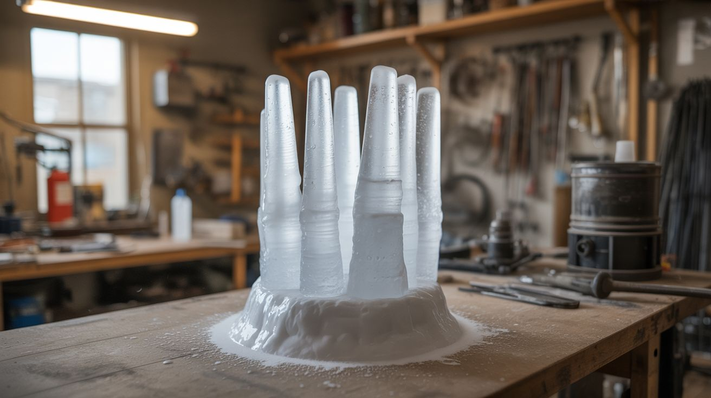

# #108 — Instant Ice Sculpture

  

> Supersaturated sodium acetate crystallizes the instant it's triggered — hot ice towers form in seconds.

## Ratings

     

## 🧪 What Is It?

Sodium acetate can be dissolved in hot water far beyond its normal saturation point. When this supersaturated solution cools, it stays liquid — but it's unstable, just waiting for a trigger. Drop a single crystal of sodium acetate into it, and the entire solution crystallizes in a chain reaction that spreads from the trigger point outward. Pour the solution slowly onto a seed crystal and it builds an ice-like tower upward as it crystallizes in real time. The crystals are warm to the touch (the reaction is exothermic), which is why it's called "hot ice." It looks like time-lapse ice formation happening in real-time. The crystals can be remelted and reused indefinitely.

<strong>🧰 Ingredients</strong>

- [ ] Sodium acetate trihydrate — or make it from vinegar + baking soda *(chemistry supplier, or kitchen)*
- [ ] White vinegar — if making sodium acetate from scratch *(grocery store)*
- [ ] Baking soda — if making sodium acetate from scratch *(grocery store)*
- [ ] Saucepan *(kitchen)*
- [ ] Clean glass bowl or container — must be VERY clean, no scratches *(kitchen)*
- [ ] Plastic wrap *(kitchen)*
- [ ] Seed crystal — a single dry grain of sodium acetate *(saved from your batch)*

## 🔨 Build Steps

1. **Make the sodium acetate (if not using pre-made).** Slowly add baking soda to vinegar in a saucepan. It foams vigorously — add slowly to avoid overflow. Use roughly 4 cups vinegar to 3 tablespoons baking soda. Keep adding baking soda until the fizzing stops completely. You now have sodium acetate solution.
2. **Concentrate the solution.** Boil the sodium acetate solution down on the stove until you see a thin film forming on the surface. You want to remove most of the water, creating a highly concentrated syrup. This takes 30-60 minutes of gentle boiling.
3. **Transfer to a clean container.** Pour the hot concentrated solution into a perfectly clean glass bowl. The container MUST be pristine — any dust, scratches, or residue can trigger premature crystallization. Wash the bowl with soap, rinse thoroughly, then rinse once more with hot water.
4. **Cover and cool.** Cover the bowl tightly with plastic wrap so no dust can fall in. Let it cool to room temperature undisturbed. This takes several hours. Do not move, jostle, or peek at it during cooling.
5. **Prepare the seed crystal.** Save a tiny amount of solution on a plate and let it dry. The dried crystals are your trigger seeds. You only need a single grain.
6. **Trigger the crystallization.** Drop one seed crystal into the supersaturated solution. Crystallization explodes outward from the seed point, converting the entire bowl of liquid into solid crystal within seconds. The bowl gets noticeably warm — the exothermic reaction releases the heat energy that was stored during dissolution.
7. **Build ice towers.** For the tower effect, place a seed crystal on a flat surface and slowly pour the supersaturated solution onto it. As the liquid contacts the seed, it crystallizes instantly, building a tower upward as fast as you pour. Control the pour speed to control the tower shape.
8. **Reset and reuse.** To reuse, put the crystallized mass back in the saucepan, add a splash of water, and reheat until fully dissolved. Cool again in a clean container. The sodium acetate is infinitely reusable.

## ⚠️ Safety Notes

- The crystallization reaction is exothermic — the crystals get warm (around 130°F). Not hot enough to burn, but warm enough to be surprising. Handle with care immediately after triggering.
- Sodium acetate is non-toxic (it's the chemical name for salt and vinegar), but don't eat your lab materials. Keep them labeled and separate from food supplies.
- Boiling down the solution requires attention. If you boil it too long, the concentrated solution can crystallize in the saucepan while still hot, which is messy but not dangerous.

## 🔗 See Also

- [Supercooled Water](../chemical-electronic/170-supercooled-water.md)
- [Gallium Melting Spoon](106-gallium-melting-spoon.md)

**References:**
- [Chemicals Reference](../../reference/chemicals.md)
