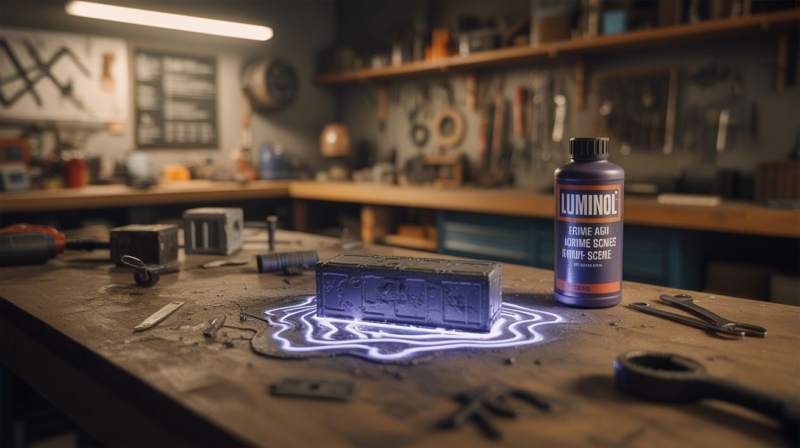

# #109 — Luminol Crime Scene

  

> Luminol reacts with iron to produce an eerie blue glow — build fake crime scenes for Halloween and escape rooms.

## Ratings

| Jaw Drop Rating | Brain Melt Level | Wallet Damage | Spicy Level | Clout Potential | Time to Build |
|---|---|---|---|---|---|
| ⭐⭐⭐⭐ | ⭐⭐ | ⭐⭐ | ⭐ | ⭐⭐⭐⭐ | ⭐ |

## What Is It?

Luminol is the chemical forensic investigators spray at crime scenes to reveal traces of blood. When luminol contacts iron (the iron in hemoglobin, or any iron compound), it produces a striking blue chemiluminescent glow in the dark. You don't need actual blood — any iron-containing solution works. Dissolve a rusty nail in water, paint it on surfaces, spray with luminol, and kill the lights. Glowing blue handprints, footprints, splatter patterns, and cryptic messages appear from nowhere. Perfect for Halloween haunted houses, escape rooms, or the most over-the-top murder mystery party ever.

## Ingredients

- [ ] Luminol powder — 5-10 grams *(chemistry supplier, online)*
- [ ] Hydrogen peroxide 3% — the activator *(pharmacy)*
- [ ] Sodium hydroxide (lye) — makes the luminol solution alkaline *(hardware store as drain opener)*
- [ ] Iron source — rusty nails soaked in water, or iron sulfate *(hardware store, garden supply)*
- [ ] Spray bottles — one for luminol solution, one for iron solution *(dollar store)*
- [ ] Dark room — the darker the better *(any room with blackout curtains)*
- [ ] Distilled water *(grocery store)*
- [ ] Measuring spoons and cups *(kitchen)*

## Build Steps

1. **Make the iron solution.** Soak rusty nails or steel wool in warm water with a splash of vinegar for 24 hours. The resulting rust-colored water contains dissolved iron. Strain out the solids. This is your "blood substitute."
2. **Paint the crime scene.** Using brushes, sponges, or your hands (gloves recommended — iron solution stains), apply the iron solution to surfaces. Paint handprints on walls, drip trails on the floor, write messages, create splatter patterns. Let everything dry completely. Once dry, the marks become nearly invisible.
3. **Mix the luminol solution.** Dissolve 0.5 grams of luminol in 500 mL of distilled water. Add 5 grams of sodium hydroxide and stir until dissolved. Just before use, add 10 mL of 3% hydrogen peroxide. The solution is ready when fully mixed.
4. **Pour into spray bottles.** Transfer the luminol solution to a clean spray bottle. A fine mist setting works best for even coverage. Make extra — you'll want to spray liberally.
5. **Set the scene.** Arrange the room for maximum creep factor. Furniture knocked over, a chalk body outline on the floor, scattered props. The iron patterns you painted earlier are invisible in normal light — guests won't know they're there.
6. **Kill the lights.** The room must be as dark as possible. Even small amounts of ambient light wash out the glow. Blackout curtains, tape over indicator LEDs, block light under doors.
7. **Spray and reveal.** Spray the luminol solution across the surfaces where you applied the iron. An eerie blue glow appears instantly wherever iron is present. The glow lasts 30-60 seconds before fading, but you can spray again for another round.
8. **Layer the reveals.** For escape rooms, put different clues in different locations. Guests discover them as they spray different walls and surfaces. A message on the ceiling they didn't think to check. Footprints leading to a hidden compartment.

## Safety Notes

- Sodium hydroxide (lye) is caustic and can cause chemical burns. Wear gloves and goggles when mixing the luminol solution. If it contacts skin, flush immediately with water.
- Luminol solution can stain clothing and surfaces blue. Protect floors and furniture you don't want stained. The stains fade with washing but can be persistent on porous surfaces.
- Use in well-ventilated areas. The spray creates a mist that contains hydrogen peroxide and lye in dilute concentrations — not dangerous in open air but irritating in enclosed spaces.

## See Also

- [Chemiluminescent Fountain](111-chemiluminescent-fountain.md)
- [Fluorescein Blacklight Fountain](118-fluorescein-blacklight-fountain.md)
