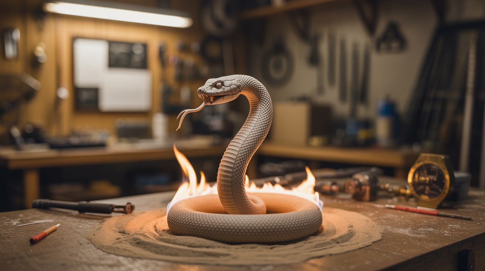

# #110 — Pharaoh's Serpent

  

> Sugar, baking soda, and lighter fluid on sand — a massive carbon snake grows from the flames.

## Ratings

     

## 🧪 What Is It?

When sugar burns in the presence of baking soda, the heat causes the baking soda to decompose and release CO2 gas. The CO2 inflates the burning sugar into a long, snaking column of porous carbon that looks like a black serpent rising from the flames. It's called the Pharaoh's Serpent because it looks like it's alive — twisting and growing from a small pile of powder into a creature a foot or more long. The ingredients are all in your kitchen right now. The setup takes 60 seconds. The result looks like dark magic. This is the gateway demo that gets people hooked on chemistry.

<strong>🧰 Ingredients</strong>

- [ ] Sugar — plain white granulated, 4 tablespoons *(kitchen)*
- [ ] Baking soda — 1 tablespoon *(kitchen)*
- [ ] Lighter fluid or isopropyl alcohol — as the fuel source *(hardware store, pharmacy)*
- [ ] Sand — a mound about 6 inches across *(hardware store play sand, or beach)*
- [ ] Fireproof surface — metal tray, concrete, dirt *(workshop, outdoors)*
- [ ] Long lighter or matches *(hardware store)*

## 🔨 Build Steps

1. **Build the sand mound.** Pile sand into a mound about 6 inches in diameter and 3 inches tall on your fireproof surface. Press a shallow bowl-shaped depression into the top. The sand insulates the reaction and keeps the fuel contained.
2. **Soak the sand.** Pour lighter fluid generously over the sand mound, focusing on the depression at the top. Let it soak in for a minute. The sand acts as a wick to keep the fuel burning evenly.
3. **Mix the powder.** In a small bowl, mix 4 tablespoons of sugar with 1 tablespoon of baking soda. Stir until evenly combined. The ratio matters — too much baking soda makes a crumbly snake, too little makes a short one.
4. **Pack the mixture.** Pour the sugar/baking soda mixture into the depression on top of the fuel-soaked sand. Press it down gently into a compact pile. A denser starting pile produces a taller, more solid snake.
5. **Light it up.** Use a long lighter or match to ignite the lighter fluid on the sand around the powder mixture. The fuel burns and heats the sugar/baking soda mixture from below and around the edges.
6. **Watch the serpent grow.** Within 30 seconds, the sugar begins to caramelize and darken. Then the baking soda starts decomposing, releasing CO2 that inflates the carbonizing sugar into a growing black snake. It pushes upward and outward, sometimes curling and twisting. The snake can grow 12-18 inches from a small pile.
7. **Let it burn out.** The reaction continues until all the fuel is consumed. Don't touch the snake while it's hot — it's fragile and the interior can still be glowing. Once cool, the carbon snake is lightweight and crumbly.
8. **Scale up for bigger snakes.** Double or triple the ingredients for a proportionally larger serpent. Multiple fuel sources arranged in a circle with powder mounds on each create multiple snakes that grow toward each other.

## ⚠️ Safety Notes

- Lighter fluid is flammable and its vapors can ignite. Pour it BEFORE lighting, never add fuel to an active fire. Keep the can well away from the lit demonstration.
- Perform outdoors on a non-flammable surface. The burning sugar drips and can ignite surfaces below. Concrete, dirt, or a metal tray on gravel are all good bases.
- The carbon snake and sand remain hot for several minutes after the flames go out. Don't touch or pick up the snake until it's fully cooled.

## 🔗 See Also

- [Colored Fire](101-colored-fire.md)
- [Permanganate Auto-Ignition](115-permanganate-auto-ignition.md)

**References:**
- [Chemicals Reference](../../reference/chemicals.md)
