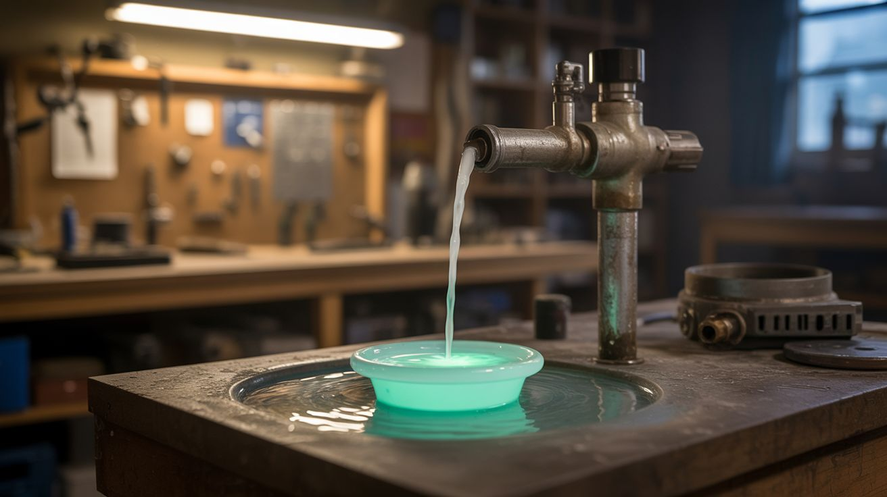

# #111 — Chemiluminescent Fountain

  

> Glowing liquid pumped through a fountain in complete darkness — luminol chemistry meets plumbing.

## Ratings

| Jaw Drop Rating | Brain Melt Level | Wallet Damage | Spicy Level | Clout Potential | Time to Build |
|---|---|---|---|---|---|
| ⭐⭐⭐⭐⭐ | ⭐⭐⭐ | ⭐⭐⭐ | ⭐ | ⭐⭐⭐⭐⭐ | ⭐⭐ |

## What Is It?

Luminol and glow stick chemistry produce light without heat — chemiluminescence. Now imagine that glowing liquid pumped through a fountain, cascading down tiers, splashing into a basin, all in total darkness. No external lights. The liquid itself is the light source. Using a dishwasher pump salvaged from a dead appliance, you circulate the glowing solution through fountain tubing and nozzles. The effect is otherworldly — a flowing, splashing light source that looks like something from an alien planet. Mix multiple colors from different chemiluminescent reactions for a multi-hued display.

## Ingredients

- [ ] Luminol or glow stick fluid — multiple colors; crack glow sticks open or buy luminol powder *(party supply, chemistry supplier)*
- [ ] Hydrogen peroxide 3% — activator for luminol *(pharmacy)*
- [ ] Sodium hydroxide — for luminol solution *(hardware store)*
- [ ] Dishwasher circulation pump — salvaged from dead dishwasher *(e-waste, appliance graveyard)*
- [ ] Clear vinyl tubing — 1/2 inch diameter *(hardware store)*
- [ ] Fountain nozzle or drilled cap — shapes the flow *(hardware store, online)*
- [ ] Basin or bowl — catches and recirculates the liquid *(thrift store)*
- [ ] 12V power supply — to run the pump *(old laptop charger, junk drawer)*
- [ ] Dark room or outdoor night setting *(any dark space)*
- [ ] Copper sulfate solution — catalyst to boost luminol glow (optional) *(hardware store)*

## Build Steps

1. **Salvage the pump.** Pull the circulation pump from a dead dishwasher. It's typically located at the bottom of the unit, connected to the spray arms. You need the pump motor, impeller housing, and inlet/outlet fittings. Clean it thoroughly.
2. **Build the fountain frame.** Create a tiered structure using bowls, plates, or custom-built shelves. The liquid needs to flow from a high nozzle point down through tiers back into a bottom basin where the pump recirculates it. The structure should be stable and leak-proof.
3. **Plumb the system.** Connect vinyl tubing from the pump outlet up to the fountain nozzle at the top. The pump inlet connects to the bottom basin. All connections should be snug — use hose clamps to prevent leaks. Test the plumbing with plain water first.
4. **Mix the glow solution.** For luminol: dissolve 0.5g luminol and 5g sodium hydroxide in 500mL water, then add 10mL of 3% hydrogen peroxide. For glow stick fluid: carefully cut open multiple glow sticks of the same color and collect the fluid. Luminol glows blue; glow sticks come in many colors.
5. **Charge the system.** Pour the glowing solution into the basin. There needs to be enough volume to keep the pump submerged and the fountain flowing continuously — typically 1-2 gallons depending on your fountain size.
6. **Test in daylight first.** Run the pump and verify flow rates, check for leaks, adjust the nozzle angle. Fix any problems now while you can see what you're doing.
7. **Kill all lights.** The effect only works in near-total darkness. Block windows, cover LEDs, close doors. Your eyes need 5-10 minutes to fully adjust to the darkness before the full effect is visible.
8. **Run the fountain.** Power on the pump and watch glowing liquid arc from the nozzle, cascade down the tiers, and splash into the basin. The turbulence of splashing actually intensifies the glow by mixing the reactants.
9. **Maintain the glow.** Luminol glow fades as the reactants are consumed (typically 30-60 minutes). Have extra hydrogen peroxide ready to add to the basin to refresh the reaction. Glow stick fluid fades more slowly but cannot be refreshed.

## Safety Notes

- Sodium hydroxide (lye) is caustic. Wear gloves when mixing and handling the luminol solution. If the fountain splashes, the dilute solution is not dangerous but should be washed off skin and clothes promptly.
- Glow stick fluid contains chemicals that can irritate skin and eyes. The glass ampule inside glow sticks can cut fingers when cracking them open. Wear gloves and crack over a container, not your hands.
- The pump runs on electricity near water. Use a GFCI outlet or battery power. Ensure all electrical connections are above the water line and sealed from splashes.

## See Also

- [Luminol Crime Scene](109-luminol-crime-scene.md)
- [Fluorescein Blacklight Fountain](118-fluorescein-blacklight-fountain.md)
