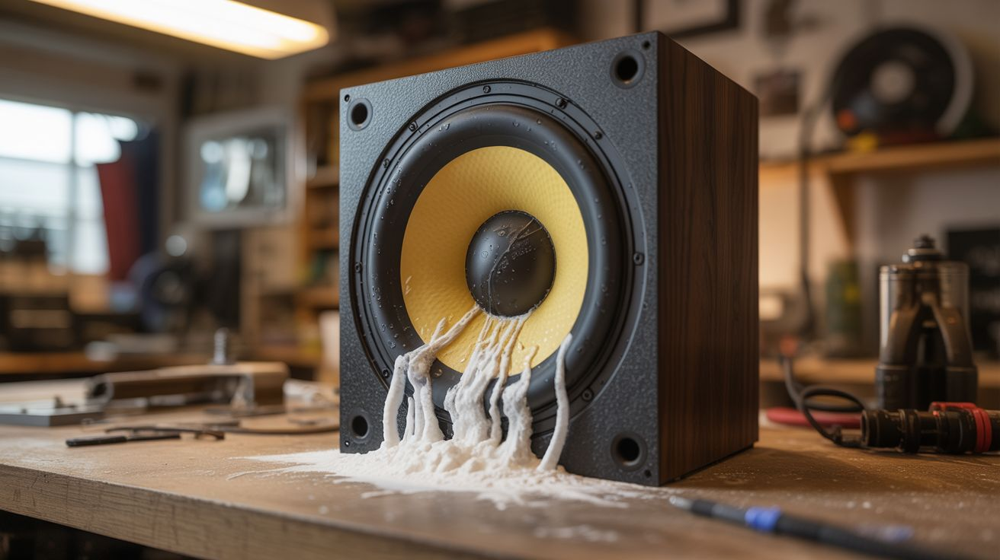

# #112 — Non-Newtonian Speaker

  

> Cornstarch and water on a subwoofer — bass frequencies make alien tentacles dance on the speaker cone.

## Ratings

     

## 🧪 What Is It?

Mix cornstarch and water at the right ratio and you get a non-Newtonian fluid — a liquid that acts solid under impact. Hit it and it resists. Let it sit and it flows. Now put that fluid on a subwoofer, crank the bass, and watch it come alive. At certain frequencies (typically 30-60 Hz), the vibration causes the fluid to form standing wave patterns that look like fingers, tentacles, and alien creatures crawling across the speaker surface. Sweep through frequencies slowly and the shapes morph, split, merge, and dance. Add food coloring for visual pop. This costs essentially nothing and creates content that goes mega-viral.

<strong>🧰 Ingredients</strong>

- [ ] Cornstarch — 1-2 boxes *(grocery store)*
- [ ] Water *(tap)*
- [ ] Subwoofer — bigger is better, 10-12 inch *(thrift store, old home theater system)*
- [ ] Amplifier — any amp that can drive the subwoofer *(thrift store, old stereo)*
- [ ] Tone generator — phone app or online frequency generator *(free)*
- [ ] Plastic wrap — to protect the speaker cone *(grocery store)*
- [ ] Food coloring — multiple colors (optional) *(grocery store)*
- [ ] Mixing bowl and spoon *(kitchen)*

## 🔨 Build Steps

1. **Mix the non-Newtonian fluid.** Combine roughly 2 parts cornstarch to 1 part water by volume. Mix by hand — it should feel solid when you squeeze it and flow like liquid when you release. The ratio is critical: too thin and it won't form shapes, too thick and it won't flow. Adjust until you can punch it and your fist bounces off the surface.
2. **Protect the speaker.** Stretch plastic wrap tightly over the subwoofer cone. The wrap should be taut and smooth, forming a waterproof barrier. Secure it around the edges with tape. You can also use a large plastic bag. The goal is to keep the cornstarch mixture off the speaker cone itself.
3. **Position the subwoofer.** Lay the subwoofer face-up on a stable surface. It needs to be perfectly level so the fluid doesn't run to one side. Use a level if needed.
4. **Add the fluid.** Pour a thin layer of the non-Newtonian mixture onto the plastic-wrapped speaker cone. Start with about 1/4 inch depth. You can add more once you find the sweet spot.
5. **Connect the tone generator.** Hook up your phone or computer to the amplifier, and the amplifier to the subwoofer. Open a tone generator app that lets you dial in specific frequencies.
6. **Find the magic frequency.** Start at 20 Hz and slowly sweep upward. Around 30-60 Hz, the fluid will start to vibrate visibly. At certain resonant frequencies, the standing wave patterns form distinct finger-like protrusions that appear to crawl across the surface. Each speaker has different sweet spots — spend time exploring.
7. **Add color.** Drop different food coloring in different spots on the fluid surface. As the vibrations mix the fluid, the colors swirl and blend in patterns that follow the wave forms.
8. **Experiment with amplitude and frequency.** Higher volume = taller tentacles. Different frequencies = different patterns. Try a slow frequency sweep for morphing shapes. Try audio from actual bass-heavy music for chaotic organic movement.

## ⚠️ Safety Notes

- Keep the amplifier volume reasonable. Overdriving a subwoofer at sustained low frequencies can overheat the voice coil and damage or destroy the speaker. Start low and increase gradually.
- Cornstarch mixture will absolutely destroy an unprotected speaker. Make sure your plastic wrap barrier is leak-proof before adding the fluid. Check for tears before each run.
- Clean up immediately after use. Cornstarch dries into a rock-hard mess that's very difficult to remove from surfaces. Wipe everything down while the fluid is still wet.

## 🔗 See Also

- [Music Visualizer LED Wall](../python-projects/145-music-visualizer-led-wall.md)
- [Elephant Toothpaste](102-elephant-toothpaste.md)

**References:**

- [Chemicals Reference](../../docs/reference/chemicals.md)
