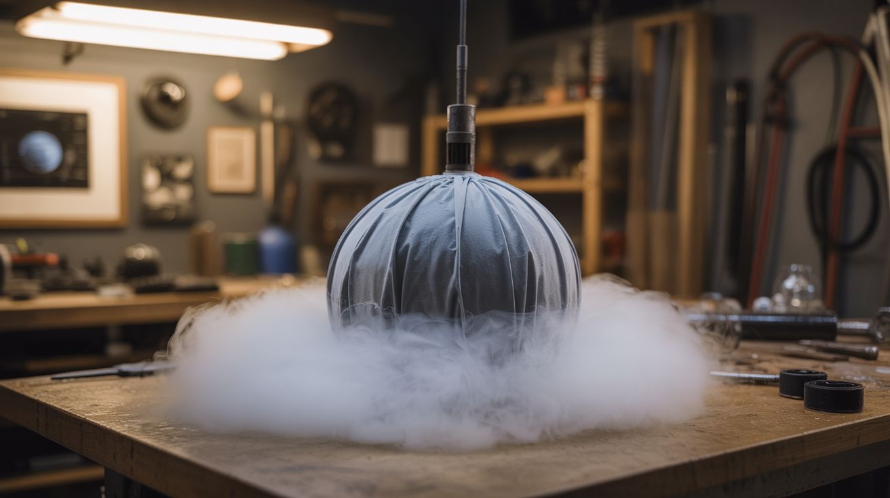

# #114 — Dry Ice Comet Balls

  

> Dry ice wrapped in fabric and dipped in water trails dense fog — add LEDs at night for meteor effects.

## Ratings

     

## 🧪 What Is It?

Dry ice sublimates at -109°F, turning directly from solid to gas. When it contacts water, it creates dense, low-lying fog. Wrap chunks of dry ice in mesh fabric, dip them in water to start the fog rolling, then toss or swing them through the air. They leave long trails of fog behind them like comets streaking through the atmosphere. At night, tuck a bright LED inside the fabric wrap, and the fog trail glows from within. The effect looks like meteorites falling through the dark. Swing them on strings for glowing fog spirals. Roll them across the ground for creeping fog machines. The most atmospheric effect you can create for basically zero dollars.

<strong>🧰 Ingredients</strong>

- [ ] Dry ice — 5-10 pounds *(grocery store, ice cream shops, welding supply)*
- [ ] Mesh fabric or cheesecloth — to wrap the dry ice *(craft store, grocery store)*
- [ ] Warm water — accelerates sublimation *(tap)*
- [ ] LED throwies — bright LEDs with coin cell batteries *(electronics supplier, dollar store)*
- [ ] String or rope — for swinging *(hardware store)*
- [ ] Insulated gloves — leather or thick fabric, NEVER bare hands *(hardware store)*
- [ ] Bucket — for dipping *(hardware store)*
- [ ] Cooler — to store dry ice *(already own)*

## 🔨 Build Steps

1. **Handle dry ice safely.** Always use insulated gloves when handling dry ice. Never touch it with bare skin — it causes instant frostbite. Store it in a cooler with the lid slightly open (never sealed, or pressure builds).
2. **Prepare the LED cores.** Tape bright LEDs (red, blue, green, white) to coin cell batteries. Wrap in a small piece of clear plastic to waterproof them. These go inside the fabric wrap to make the fog glow from within.
3. **Cut fabric wraps.** Cut mesh fabric or cheesecloth into squares roughly 12 inches on each side. You need one per comet ball. Attach string to the corners for swinging, or leave as pouches for tossing.
4. **Wrap the dry ice.** Place an LED core in the center of a fabric square. Place a chunk of dry ice (fist-sized or smaller) on top of the LED. Gather the fabric corners and tie them shut, enclosing the dry ice and LED in a mesh ball.
5. **Dip to activate.** Dunk the wrapped dry ice ball into a bucket of warm water for 3-5 seconds. The warm water supercharges the sublimation, and the ball immediately starts pouring fog.
6. **Deploy the comets.** Toss the fog balls across a dark yard — they leave fog trails behind them. Swing them on strings in circles for glowing fog spirals. Roll them across the ground for creeping mist. Set them on surfaces as stationary fog generators.
7. **Refresh as needed.** Dry ice is consumed as it sublimates. Each ball produces fog for 5-15 minutes depending on the chunk size. Re-dip in warm water when the fog output slows. Replace the dry ice when consumed.
8. **Layer the effects.** Multiple comet balls in different LED colors create an incredible night scene. Add a fog machine at ground level for a base layer of mist, then fly the comet balls through it for depth.

## ⚠️ Safety Notes

- Dry ice causes instant frostbite on bare skin. Always use insulated gloves. Never put dry ice in your mouth, sealed containers, or enclosed vehicles. Sublimation produces CO2 gas which displaces oxygen in enclosed spaces.
- Never throw dry ice comet balls AT people. Even wrapped in fabric, the dry ice inside is -109°F and can cause frostbite through thin material on impact. These are for visual effect, not projectiles.
- Use dry ice outdoors only. In enclosed spaces, the CO2 from sublimation can accumulate at floor level and displace breathable air, creating a suffocation hazard.

## 🔗 See Also

- [Dry Ice Bubble Cauldron](120-dry-ice-bubble-cauldron.md)
- [Colored Fire](101-colored-fire.md)

**References:**
- [Chemicals Reference](../../docs/reference/chemicals.md)
