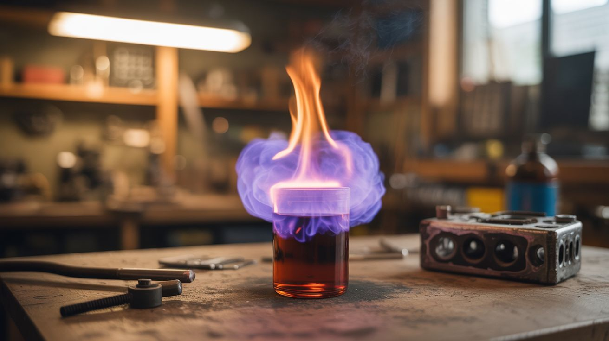

# #115 — Permanganate Auto-Ignition

  

> Potassium permanganate meets glycerin — 30 seconds of anticipation, then spontaneous purple flames.

## Ratings

     

## 🧪 What Is It?

Potassium permanganate is a powerful oxidizer. Glycerin is a thick, syrupy fuel. When you pour glycerin onto a pile of potassium permanganate powder, nothing happens immediately. Then, after a 30-60 second delay, the exothermic oxidation reaction reaches ignition temperature and the mixture spontaneously bursts into vivid purple-tinged flames. No spark, no match, no lighter — just two liquids/powders meeting and chemistry taking its course. The delay is what makes it spectacular. You pour the glycerin, step back, and wait. The anticipation builds. Then — fire from nothing. It's the most dramatic demonstration of chemical auto-ignition you can do with hardware store ingredients.

<strong>🧰 Ingredients</strong>

- [ ] Potassium permanganate (KMnO4) — purple crystals *(water treatment supplier, online, some hardware stores)*
- [ ] Glycerin (glycerol) — pharmaceutical grade *(pharmacy, craft store — sold as soap-making ingredient)*
- [ ] Fireproof surface — ceramic plate, metal tray, concrete *(workshop, outdoors)*
- [ ] Long-handled pipette or squeeze bottle — for applying glycerin from a distance *(pharmacy, online)*
- [ ] Safety goggles *(hardware store)*
- [ ] Fire-resistant gloves *(hardware store)*

## 🔨 Build Steps

1. **Set up outdoors.** This must be done on a non-flammable surface in an outdoor area. Use a ceramic plate, metal tray, or concrete pad. Clear the area of any flammable materials within a 5-foot radius.
2. **Create the permanganate mound.** Pour a tablespoon of potassium permanganate into a small mound on the fireproof surface. Shape a small well or depression in the center of the mound to hold the glycerin.
3. **Position yourself for the pour.** Use a long-handled pipette, squeeze bottle, or simply a cup held at arm's length. You want to pour the glycerin and step back, because the ignition timing is not perfectly predictable — it can range from 20 seconds to over a minute depending on temperature and particle size.
4. **Add the glycerin.** Pour approximately 1 teaspoon of glycerin into the well in the permanganate mound. Do not stir. Step back immediately to at least 5 feet.
5. **Watch and wait.** The glycerin begins reacting with the permanganate immediately, but slowly. You'll see the mixture darken and start to smoke. The reaction accelerates as it heats up — it's autocatalytic, meaning the heat produced speeds up the reaction, which produces more heat.
6. **Observe the auto-ignition.** After 30-60 seconds, the mixture reaches ignition temperature and bursts into flame. The flames are tinged purple from the potassium, and the reaction produces considerable smoke. The flame is vigorous but brief — it burns out in about 10-15 seconds.
7. **Experiment with variables.** Finer permanganate powder ignites faster. Warmer ambient temperature shortens the delay. More glycerin produces a larger flame. The delay can be extended by using less glycerin or coarser crystals.
8. **Film in slow motion.** The moment of auto-ignition — where smoke transitions to flame — is incredibly cinematic in slow motion. Set up a camera at a safe distance before pouring the glycerin.

## ⚠️ Safety Notes

> **Spicy Level 4 build.** Read the [Safety Guide](../../docs/safety/README.md) and [Chemical Safety](../../docs/safety/chemicals.md), [Fire & Pyro Safety](../../docs/safety/fire-and-pyro.md) before starting.

- Potassium permanganate is a powerful oxidizer and stains everything it contacts a deep purple/brown. Wear gloves and old clothes. The stains on skin fade in a few days but are nearly impossible to remove from fabric.
- The auto-ignition delay is variable and unpredictable. Never lean over the mixture to check on it. Always step back after adding glycerin and observe from a safe distance. On hot days, ignition can occur in under 20 seconds.
- Potassium permanganate is harmful if ingested and irritating to eyes and respiratory tract. Handle in well-ventilated areas. Store away from all organic materials (wood, paper, cloth) as it is an oxidizer that can spontaneously ignite flammable materials in concentrated form.

## 🔗 See Also

- [Thermite Flower Pot](105-thermite-flower-pot.md)
- [Pharaoh's Serpent](110-pharaohs-serpent.md)

**References:**

- [Appliance Teardown Guide](../../docs/reference/appliance-teardown-guide.md)
- [Technical Glossary](../../docs/reference/glossary.md)
- [Chemicals Reference](../../docs/reference/chemicals.md)
