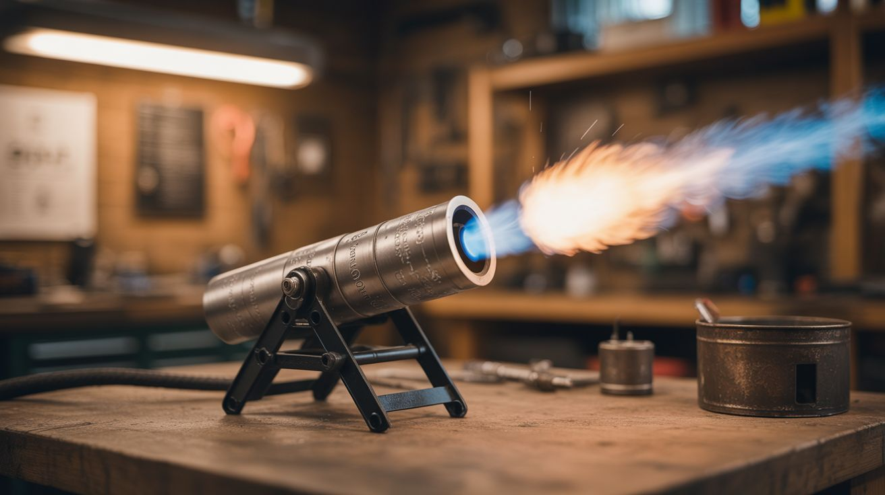

# #116 — Calcium Carbide Cannon

  

> Calcium carbide and water produce acetylene gas — contain it, ignite it, and get a massive bang with a flame jet.

## Ratings

| Jaw Drop Rating | Brain Melt Level | Wallet Damage | Spicy Level | Clout Potential | Time to Build |
|---|---|---|---|---|---|
| ⭐⭐⭐⭐ | ⭐⭐ | ⭐⭐ | ⭐⭐⭐⭐ | ⭐⭐⭐⭐ | ⭐ |

## What Is It?

Calcium carbide is a gray rock that reacts violently with water to produce acetylene gas — the same gas used in welding torches. In an enclosed chamber with a small nozzle, the acetylene builds up pressure. Ignite it and you get a thunderous BANG and a jet of flame. Old-school "carbide cannons" were traditional toys in parts of Europe, used to celebrate New Year's. A PVC or metal tube, some carbide chunks, a splash of water, and a spark source is all you need. The gas builds for 30-60 seconds, you hit the igniter, and the report echoes off buildings. It's primitive, loud, and enormously satisfying.

## Ingredients

- [ ] Calcium carbide — chunks/granules *(welding supply, online, cave/mining supply)*
- [ ] PVC pipe — 3-4 inch diameter, 12-18 inches long with one end cap *(hardware store)*
- [ ] PVC end cap — for the closed end *(hardware store)*
- [ ] Spark igniter — piezo igniter from a dead grill lighter or lantern *(junk drawer, hardware store)*
- [ ] Water — just a splash *(tap)*
- [ ] Drill — to make igniter hole *(workshop)*
- [ ] PVC cement — to seal the end cap permanently *(hardware store)*
- [ ] Ear protection — this is LOUD *(hardware store)*
- [ ] Safety goggles *(hardware store)*

## Build Steps

1. **Build the chamber.** Glue the PVC end cap onto one end of the pipe using PVC cement. This is the sealed end where the gas builds up. Let the cement cure fully according to instructions — a weak seal can fail under pressure.
2. **Install the igniter.** Drill a small hole in the PVC end cap or near the closed end of the tube, just large enough for the piezo igniter tip. Mount the piezo igniter so the spark gap is inside the tube. Seal around it with silicone to make it gas-tight. The igniter button should be accessible from outside.
3. **Test the spark.** Click the piezo igniter and verify you can see a spark inside the chamber. If not, adjust the gap or try a different igniter. No spark = no bang.
4. **Load the carbide.** Drop 2-3 small chunks (pea-sized) of calcium carbide into the open end of the tube. They should rest against the sealed end cap.
5. **Add water.** Pour in about a tablespoon of water. The water contacts the carbide and immediately begins producing acetylene gas. You'll hear fizzing and smell a garlicky odor (that's the acetylene).
6. **Seal the open end (optional for cannon effect).** For a louder report, cover the open end loosely with a plastic cap, tennis ball, or tape. The projectile flies off with a bang. For a simple flame jet without a projectile, leave the end open.
7. **Wait for gas buildup.** Give the acetylene 30-60 seconds to build up inside the tube. More gas = bigger bang, but too much pressure can be dangerous. Start with small carbide amounts and work up.
8. **Fire.** Point the open end in a SAFE direction, away from people, animals, and flammable objects. Click the piezo igniter. The acetylene detonates with a loud bang and a visible flame jet exits the open end.
9. **Reload.** Dump out the spent slurry, rinse the tube, and reload with fresh carbide and water. Each firing cycle takes about 2 minutes.

## Safety Notes

- Acetylene is explosive when mixed with air at concentrations between 2.5% and 81%. Never use this device indoors. Never hold your face over the open end of the tube. Never try to increase the pressure by using a tighter seal — you're building a contained gas ignition device, not a pipe bomb.
- This is EXTREMELY loud — comparable to a gunshot. Wear ear protection. Alert neighbors before use. Be aware of local noise ordinances. Never fire near animals.
- Calcium carbide reacts with moisture, including humidity in air. Store it in a sealed, dry container. The reaction produces calcium hydroxide (lime), which is caustic. Wash hands after handling and avoid breathing the acetylene gas directly.

## See Also

- [Hydrogen Generator](../chemical-electronic/159-hydrogen-generator.md)
- [Smoke Bomb Array](103-smoke-bomb-array.md)

**References:**
- [Chemicals Reference](../../reference/chemicals.md)
