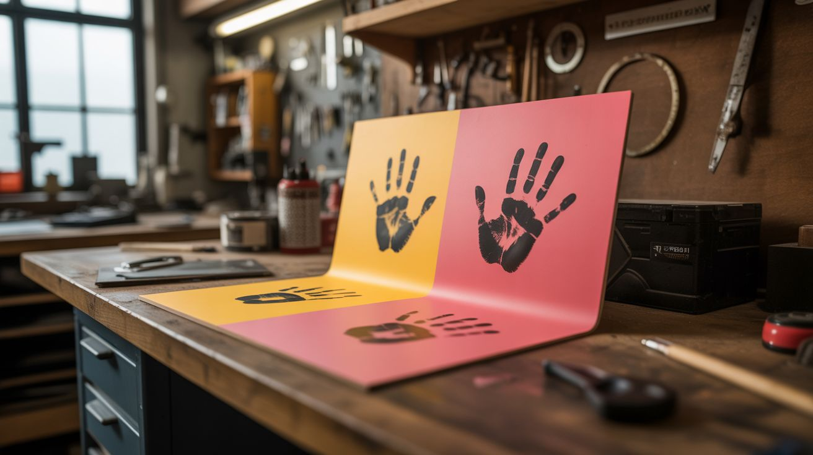

# #119 — Thermochromic Paint

  

> Paint that changes color with temperature — walls show handprints that fade, desks reveal hidden patterns from laptop heat.

## Ratings

| Jaw Drop Rating | Brain Melt Level | Wallet Damage | Spicy Level | Clout Potential | Time to Build |
|---|---|---|---|---|---|
| ⭐⭐⭐⭐ | ⭐ | ⭐⭐ | ⭐ | ⭐⭐⭐⭐ | ⭐⭐ |

## What Is It?

Thermochromic pigment changes color at a specific temperature. Below the activation temperature, the pigment is one color. Above it, it turns clear or shifts to another color. Mix this pigment into clear paint or acrylic medium, apply it to a surface, and that surface becomes temperature-reactive. Touch a wall and your handprint appears in vivid color, then fades as it cools. Set a hot coffee mug on a desk and a ring appears. Place a warm laptop on a table and hidden artwork is revealed by the heat pattern. The activation temperature is usually 86°F (body temperature) or 100-120°F (hot objects), depending on the pigment you buy. It's interactive art that responds to the physical world.

## Ingredients

- [ ] Thermochromic pigment powder — choose activation temperature (86°F for body heat, 100°F for hot objects) *(online specialty supplier)*
- [ ] Clear acrylic medium or clear latex paint — the carrier *(art supply, hardware store)*
- [ ] Mixing containers and stir sticks *(art supply)*
- [ ] Paint brushes or foam rollers *(hardware store)*
- [ ] Test surface — scrap wood, canvas, or small wall section *(workshop)*
- [ ] Base coat paint — a contrasting color that shows when the thermochromic layer turns clear *(hardware store)*
- [ ] Clear coat sealer — protects the thermochromic layer (optional) *(hardware store)*

## Build Steps

1. **Choose your effect.** Decide what you want to reveal. The thermochromic layer goes on TOP of a base color. When heat activates the thermochromic layer and it turns clear, the base color shows through. So: a blue thermochromic layer over a red base reveals red handprints on a blue wall.
2. **Apply the base coat.** Paint your surface with the base color (the color you want to appear when heated). Let it dry fully. This could be a hidden message, pattern, or simply a contrasting solid color.
3. **Mix the thermochromic paint.** Combine thermochromic pigment with clear acrylic medium at a ratio of about 1 part pigment to 5 parts medium. Stir thoroughly. The mixture should be opaque with color — it turns clear only when heated.
4. **Test on scrap material.** Brush a small amount on scrap wood or cardboard. Let it dry. Touch it with your warm hand (for 86°F pigment) or press a warm mug against it. The color should change within seconds. If the effect is weak, add more pigment to your mix.
5. **Apply the thermochromic layer.** Paint 2-3 thin coats of the thermochromic paint over the base coat. Let each coat dry fully between applications. Multiple thin coats give more vivid color and more complete opacity than one thick coat.
6. **Optional: add a clear coat.** A thin clear acrylic sealer protects the thermochromic layer from wear and cleaning. However, thick clear coats can insulate the surface and slow the temperature response. Apply sparingly.
7. **Create hidden designs.** For the most dramatic effect, paint hidden messages or art in the base coat layer (using stencils or freehand), then cover the entire surface with the uniform thermochromic layer. The hidden design is completely invisible until heat reveals it.
8. **Install and enjoy.** Mount the finished piece or apply to a wall/desk surface. Every touch, warm object, or heat source reveals the temperature-reactive layer. Handprints fade over 10-30 seconds as the surface cools.

## Safety Notes

- Thermochromic pigments can degrade with prolonged UV exposure (direct sunlight). For outdoor or sun-facing applications, use a UV-protective clear coat. Indoor applications last much longer.
- When mixing dry pigment powder, avoid inhaling the dust. Work in a ventilated area or wear a dust mask during the mixing step. Once mixed into the acrylic medium, it's safe to handle.
- Test the thermochromic paint on an inconspicuous area first. Some formulations may not adhere well to certain surfaces, and removal can be difficult once applied to walls.

## See Also

- [Thermochromic Mug](../chemical-electronic/168-thermochromic-mug.md)
- [pH Reactive Paint](../chemical-electronic/163-ph-reactive-paint.md)
