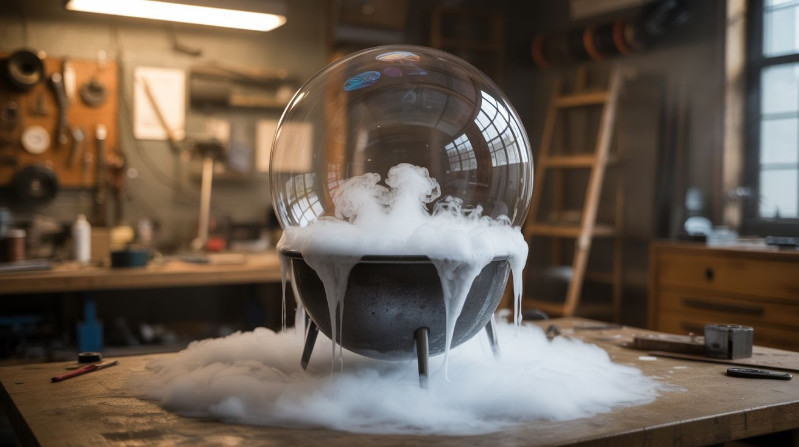

# #120 — Dry Ice Bubble Cauldron

  

> Dry ice fog trapped inside a giant soap bubble — it grows, trembles, and pops to release a cascade of fog.

## Ratings

     

## 🧪 What Is It?

Drop dry ice into warm water in a bowl or cauldron and it produces thick, low-lying fog. Now stretch a strip of fabric soaked in soapy water across the rim of the container. The fog can't escape — instead, it inflates the soap film into a giant bubble that grows and grows, filling with swirling white fog. The bubble trembles and wobbles as it expands, getting 2-3 feet in diameter before it finally pops, releasing a dramatic cascade of fog that rolls across the surface like a miniature avalanche. It's mesmerizing, endlessly repeatable, and gets a reaction from every single person who sees it. Kids lose their minds. Adults lose their minds. It's universally magical.

<strong>🧰 Ingredients</strong>

- [ ] Dry ice — 2-5 pounds *(grocery store, ice cream shops, welding supply)*
- [ ] Warm water *(tap)*
- [ ] Bowl, bucket, or cauldron — wide rim works best, 10-14 inch diameter *(thrift store, Halloween supply)*
- [ ] Dish soap — Dawn or similar *(grocery store)*
- [ ] Strip of fabric — cotton t-shirt material, about 2 inches wide and 2 feet long *(old t-shirt)*
- [ ] Small bowl for soap solution *(kitchen)*
- [ ] Insulated gloves — for handling dry ice *(hardware store)*
- [ ] Food coloring (optional) — to tint the bubble film *(grocery store)*

## 🔨 Build Steps

1. **Prepare the soap solution.** Mix a generous amount of dish soap with a small amount of warm water in a bowl. You want a thick, concentrated soap solution — more soap than water. This produces stronger bubble film that holds up longer under the weight of the fog. Add a drop of glycerin if available for even stronger bubbles.
2. **Soak the fabric strip.** Dip the fabric strip into the concentrated soap solution and work it through until the fabric is thoroughly saturated. Wring it slightly — it should be dripping with soap but not so wet that it dilutes the film.
3. **Set up the cauldron.** Place your bowl or cauldron on a stable surface at a height where spectators can watch the bubble grow from the side. A table or raised platform works well.
4. **Add warm water.** Fill the cauldron about 1/3 full with warm (not boiling) water. Warmer water produces more fog, faster. But too hot and the bubble pops immediately from the heat.
5. **Add dry ice.** Using insulated gloves, carefully place several large chunks of dry ice into the warm water. Fog immediately begins billowing from the surface. Work quickly now — you want to trap the fog before it escapes.
6. **Stretch the fabric across the rim.** Pull the soapy fabric strip across the top of the cauldron, creating a soap film membrane over the opening. The fog hits the film from below and begins inflating it upward.
7. **Watch the bubble grow.** The soap film stretches into a dome, then a sphere, growing larger as fog continuously fills it from below. The swirling fog inside the bubble is visible through the translucent soap film. The bubble can grow 2-3 feet across.
8. **Let it pop naturally, or pop it.** The bubble eventually pops on its own — from thinning, air currents, or vibration. When it pops, the trapped fog cascades downward in a dramatic waterfall effect, rolling across the table and floor. Alternatively, have someone gently touch the bubble to pop it on command.
9. **Repeat.** Re-soak the fabric strip and stretch it again. Each round works as long as the dry ice and warm water are still producing fog. Add more warm water as needed to keep the reaction vigorous.

## ⚠️ Safety Notes

- Handle dry ice with insulated gloves only. Never touch dry ice with bare skin — it causes instant frostbite. Tongs or thick gloves are essential.
- Perform in a well-ventilated area. The CO2 sublimating from dry ice displaces oxygen. In a small enclosed room, CO2 can accumulate at floor level to dangerous concentrations, especially since the fog is heavier than air and sinks.
- Do not seal dry ice in any airtight container. The sublimation pressure builds rapidly and can cause the container to burst. The cauldron must always have a vent — the soap film membrane provides this because it can rupture safely.

## 🔗 See Also

- [Dry Ice Comet Balls](114-dry-ice-comet-balls/)
- [Elephant Toothpaste](102-elephant-toothpaste/)

