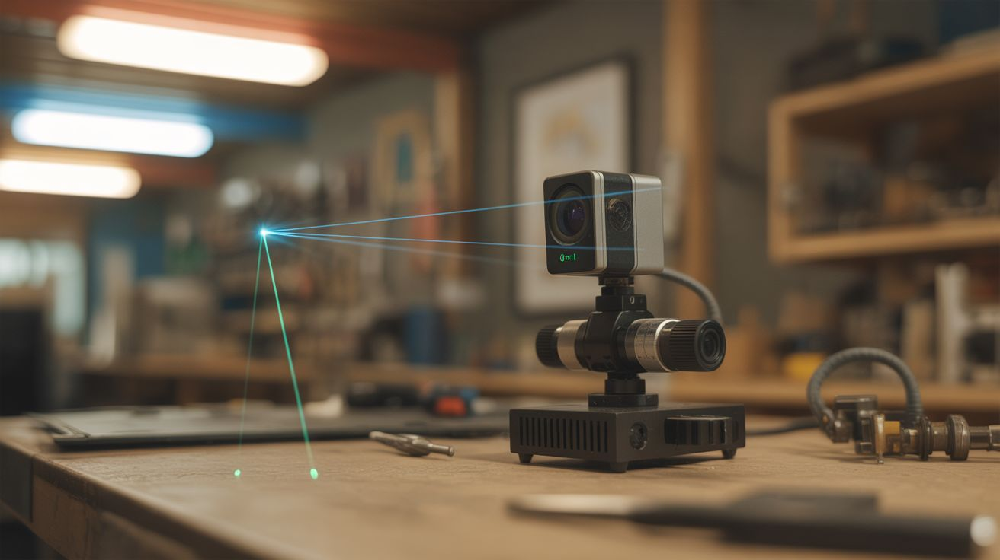

# #141 — Face Tracking Laser

  

> A webcam with OpenCV face detection controls servos aiming a laser pointer — the laser follows your face around the room.

## Ratings

     

## 🧪 What Is It?

OpenCV's face detection identifies faces in webcam frames in real time. Map the face's pixel position to servo angles, mount a laser pointer on the servo gimbal, and the laser tracks faces as they move through the room. Walk left, the laser follows. Lean forward, the laser adjusts. Multiple faces? Track the closest one, or cycle between them. It's equal parts impressive and unsettling — a laser dot following you around a room like a tiny red predator. The computer vision is straightforward (Haar cascades or MediaPipe face detection), and the servo control is basic GPIO. The combination is greater than the sum of its parts.

<strong>🧰 Ingredients</strong>

- [ ] Webcam — USB, any resolution *(junk drawer, thrift store)*
- [ ] Raspberry Pi 3 or 4 — needs enough power for OpenCV *(electronics supplier)*
- [ ] Servo motors — 2, for pan and tilt *(electronics supplier)*
- [ ] Pan/tilt servo bracket *(electronics supplier, 3D print)*
- [ ] Laser pointer module — 5mW, Class IIIa or lower *(electronics supplier)*
- [ ] Jumper wires *(electronics supplier)*
- [ ] Power supply — 5V for servos (separate from Pi) *(electronics supplier)*
- [ ] Mounting base — small piece of wood or 3D print *(workshop)*

## 🔨 Build Steps

1. **Set up OpenCV on the Pi.** Install Raspberry Pi OS and then OpenCV: `pip install opencv-python-headless`. Install pigpio for precise servo control: `sudo apt install pigpio`. Test the webcam with a basic Python capture script.
2. **Implement face detection.** Use OpenCV's Haar cascade classifier (`haarcascade_frontalface_default.xml`) or MediaPipe's face detection for better accuracy. Write a script that captures frames, detects faces, and draws rectangles around them. Verify detection works reliably at various distances and lighting.
3. **Calculate face center coordinates.** From the detected face rectangle, compute the center point (x, y) in pixel coordinates. This is the target the laser needs to point at.
4. **Map pixels to servo angles.** The webcam's field of view maps to a range of servo angles. If the webcam sees 60 degrees horizontally and the image is 640 pixels wide, each pixel represents about 0.094 degrees. Create a mapping function: pixel position -> servo angle.
5. **Wire the servos.** Connect the pan servo and tilt servo to GPIO pins via pigpio. Use a separate 5V power supply for the servos — driving servos from the Pi's 5V pin causes voltage drops and brownouts. Mount the servos in the pan/tilt bracket.
6. **Mount the laser.** Attach the laser pointer module to the tilt servo horn (the moving part). The laser should point in the same direction the camera sees. Align the laser's center position with the camera's center of view.
7. **Implement PID tracking.** A simple proportional controller moves the servos toward the face center, but overshoots and oscillates. Add derivative (D) control to dampen the movement. The PID loop reads the face position error, computes the correction, and updates servo angles at 30+ FPS.
8. **Calibrate alignment.** Adjust the pixel-to-angle mapping until the laser dot lands on the detected face at various positions. Fine-tune the zero offset (the laser and camera aren't in exactly the same position, so there's a parallax error to correct).
9. **Add multi-face handling.** When multiple faces are detected, choose the largest (closest) face, or cycle between faces every few seconds, or track the most recently appeared face.

## ⚠️ Safety Notes

- NEVER use a laser above Class IIIa (5mW). Higher-power lasers can cause permanent eye damage in a fraction of a second. This system points a laser AT faces — it MUST be eye-safe. Class IIIa lasers are visible but won't cause damage with brief exposure.
- Even with a low-power laser, don't aim at people's eyes deliberately. The tracking should target the forehead or chest area. Add an offset in the code to aim the laser below the detected face center.
- Test the servo range limits in software to prevent the servos from over-rotating and stripping their gears or aiming the laser at unintended areas.

## 🔗 See Also

- [Nerf Sentry Turret](../pi-and-arduino/138-nerf-sentry-turret.md)
- [AI Doorbell](../pi-and-arduino/130-ai-doorbell.md)

**References:**
- [Appliance Teardown Guide](../../docs/reference/appliance-teardown-guide.md)
- [Technical Glossary](../../docs/reference/glossary.md)
- [Electronics & Microcontrollers Guide](../../docs/reference/electronics-and-microcontrollers.md)
