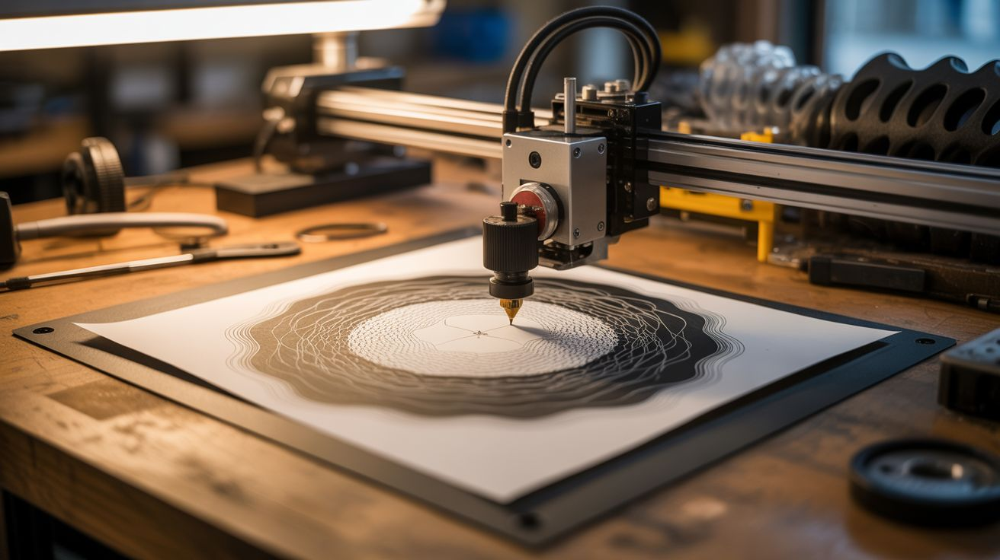

# #142 — Generative Art Plotter

  

> Python generates algorithmic art — flow fields, fractals, mathematical curves — then a pen plotter draws them with real ink on real paper.

## Ratings

     

## 🧪 What Is It?

Generative art is artwork created by algorithms — rules that produce patterns too complex and beautiful for a human to draw by hand. Flow fields, Perlin noise landscapes, fractal trees, Lissajous curves, spirographs, and mathematical roses. Python generates these as SVG or G-code, and a pen plotter (which can be built from printer parts — see Build #129) draws them with an actual pen on actual paper. The result is computed by code but rendered in physical ink, with the imperfections and character of a real drawing tool. Each piece is unique (randomized seeds), infinitely reproducible (same seed = same output), and can be sold as original art.

<strong>🧰 Ingredients</strong>

- [ ] Computer with Python installed *(already own)*
- [ ] Pen plotter — AxiDraw, salvaged printer conversion, or CNC build *(electronics supplier, or build from e-waste)*
- [ ] Fine-tip pens — Sakura Micron, Staedtler, or metallic pens *(art supply)*
- [ ] Quality paper — Bristol board, watercolor paper, or cardstock *(art supply)*
- [ ] Python libraries — numpy, noise (Perlin noise), svgwrite, vpype *(pip install)*
- [ ] USB cable — to connect plotter *(junk drawer)*

## 🔨 Build Steps

1. **Set up the Python environment.** Install Python and key libraries: `pip install numpy svgwrite noise vpype`. Svgwrite generates SVG files. Noise generates Perlin noise for organic patterns. Vpype optimizes plot paths for pen plotters.
2. **Generate your first pattern.** Start with a simple flow field: create a grid of angles using Perlin noise, then trace particles through the field. Each particle follows the angle at its position, creating smooth, organic curves. Export as SVG.
3. **Experiment with algorithms.** Try different generative techniques: fractal trees (recursive branching), Lissajous curves (parametric equations), circle packing (no overlaps), Voronoi diagrams (partitioned space), strange attractors (Lorenz, Rössler), and golden ratio spirals.
4. **Optimize for plotting.** Pen plotters are slow — they draw one line at a time. Use vpype to optimize the SVG: merge nearby paths, reorder paths to minimize travel distance, and remove duplicate lines. Well-optimized plots take minutes; unoptimized ones take hours.
5. **Configure the plotter.** Connect the plotter and install its software/drivers. Set the pen-up and pen-down heights. Adjust speed — slower speed produces smoother lines but takes longer. Test with a simple rectangle to verify alignment and pen pressure.
6. **Plot a test piece.** Load your optimized SVG and start the plot. Watch the machine draw — this is mesmerizing in itself. Check pen pressure (too heavy = torn paper, too light = skipped lines), alignment, and line quality.
7. **Iterate on the art.** Modify parameters in your Python script: change the noise scale, particle count, color (different pens), density, and randomization seed. Each combination produces unique art. The best generative art comes from extensive parameter exploration.
8. **Multi-color plots.** For multiple colors, generate separate SVG layers for each color. Plot one layer, pause, change the pen, and plot the next layer. Registration between layers must be precise — don't bump the paper or plotter between passes.
9. **Frame and sell.** Mount finished pieces in frames. Generative art plotted with real ink on quality paper sells well on Etsy, at art fairs, and in galleries. Each piece is computed but physically unique — a compelling selling point.

## ⚠️ Safety Notes

- Pen plotters have moving parts that can pinch fingers. Keep hands clear of the drawing arm during operation. Long hair should be tied back.
- Some plotting inks (especially archival and metallic inks) contain solvents. Work in a ventilated area and cap pens when not in use to avoid fume buildup.
- Plotters can run for hours unattended. Ensure the plotter is on a stable surface and won't walk off the edge from vibration. A plotter falling off a desk damages the machine and ruins the art.

## 🔗 See Also

- [Fractal Laser Engraver](150-fractal-laser-engraver.md)
- [Printer Robot Arm](../pi-and-arduino/129-printer-robot-arm.md)

**References:**
- [Electronics & Microcontrollers Guide](../../reference/electronics-and-microcontrollers.md)
