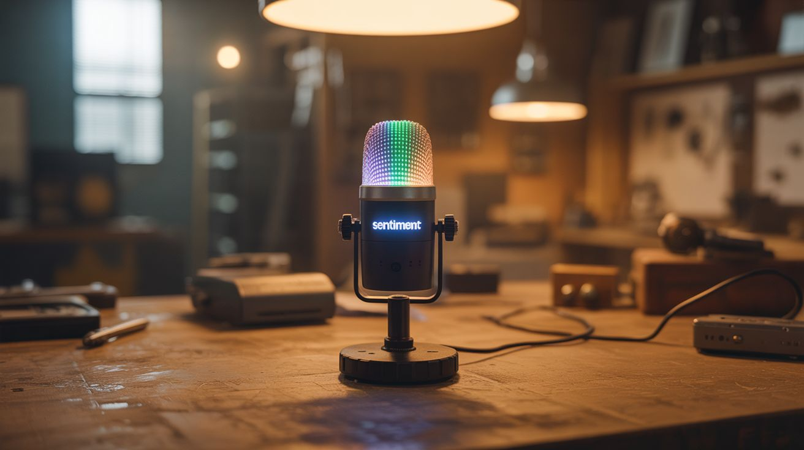

# #144 — Sentiment Room Lighting

  

> A microphone analyzes the emotional tone of conversation — LED lights shift color to match the mood of the room.

## Ratings

     

## 🧪 What Is It?

A microphone picks up conversation. Speech recognition converts it to text. Natural language processing analyzes the sentiment — positive, negative, excited, calm, angry. LED lights around the room change color to reflect the emotional tone: warm golden for happy conversation, cool blue for calm discussion, red pulses for heated arguments, green for agreement, purple for contemplative topics. The room literally responds to the emotional temperature of the people in it. It's part art installation, part ambient computing, and deeply weird to experience in person. Conversations become self-aware when the lighting starts shifting.

<strong>🧰 Ingredients</strong>

- [ ] Raspberry Pi 4 (for continuous speech processing) *(electronics supplier)*
- [ ] USB microphone — omnidirectional for room pickup *(electronics supplier)*
- [ ] Addressable LED strip — WS2812B or similar, enough to ring the room *(electronics supplier)*
- [ ] 5V power supply — sized for the LED strip length *(electronics supplier)*
- [ ] Level shifter — 3.3V Pi GPIO to 5V LED data *(electronics supplier)*
- [ ] Python with speech recognition and NLP libraries *(pip install)*
- [ ] WiFi smart bulbs — alternative to LED strips for simpler setup (optional) *(hardware store)*

## 🔨 Build Steps

1. **Set up speech recognition.** Install the SpeechRecognition library and Vosk (offline speech-to-text engine — no cloud required). Test by speaking into the USB mic and verifying accurate transcription. Vosk runs locally on the Pi, keeping all conversation data private.
2. **Implement sentiment analysis.** Install NLTK or TextBlob: `pip install textblob`. Feed transcribed text through the sentiment analyzer, which returns a polarity score (-1.0 negative to +1.0 positive) and subjectivity score. Test with sample sentences to verify scoring accuracy.
3. **Design the color mapping.** Map sentiment scores to colors. A simple mapping: polarity -1.0 = deep red (anger/negativity), -0.5 = orange (concern), 0.0 = neutral white, +0.5 = warm yellow (positive), +1.0 = bright green (very positive). Subjectivity affects saturation: objective = muted, subjective = vivid.
4. **Wire the LED strip.** Connect the WS2812B data line to the Pi through a level shifter (the Pi outputs 3.3V but the LEDs want 5V logic). Power the strip from a dedicated 5V supply, not the Pi. Install the rpi_ws281x library for Python LED control.
5. **Implement smooth transitions.** Don't snap between colors — crossfade smoothly over 2-3 seconds. Maintain a running average of the last 30 seconds of sentiment to prevent rapid flickering from individual words. The lighting should shift like a mood, not flash like a strobe.
6. **Add keyword detection.** Beyond pure sentiment, watch for specific keywords: laughter detection (audio analysis, not text), question marks (curiosity = blue shift), exclamation emphasis (intensity = brightness boost), names (personalization possibilities).
7. **Calibrate for the room.** Deploy the LED strip around the room perimeter (behind furniture, along crown molding, or under shelving). Adjust brightness to complement the room's existing lighting. Too bright and it's distracting; too dim and no one notices.
8. **Add ambient modes.** When no one is talking, the lights can slowly cycle through calming colors, respond to ambient noise level (louder = brighter), or display a time-of-day pattern (warm sunrise colors in morning, cool blue at night).
9. **Privacy mode.** Add a physical switch that disables the microphone and reverts to a static lighting mode. People need to be able to opt out of having their conversation analyzed, even locally.

## ⚠️ Safety Notes

- All speech processing should happen locally on the Pi. Never send conversation audio or text to cloud services — this system is in people's living spaces capturing private conversations. Privacy is non-negotiable.
- LED strips at full brightness draw significant current. A 5-meter strip of WS2812B LEDs can draw 15+ amps at full white. Ensure your power supply is rated appropriately and wiring is adequate gauge. Undersized wiring gets hot.
- Inform everyone in the space that the system is analyzing conversation for lighting effects. Even though it's local and fun, people deserve to know a microphone is active. The physical off switch is essential.

## 🔗 See Also

- [Music Visualizer LED Wall](145-music-visualizer-led-wall.md)
- [Voice Home Automation](149-voice-home-automation.md)

**References:**

- [Appliance Teardown Guide](../../docs/reference/appliance-teardown-guide.md)
- [Technical Glossary](../../docs/reference/glossary.md)
- [Electronics & Microcontrollers Guide](../../docs/reference/electronics-and-microcontrollers.md)
